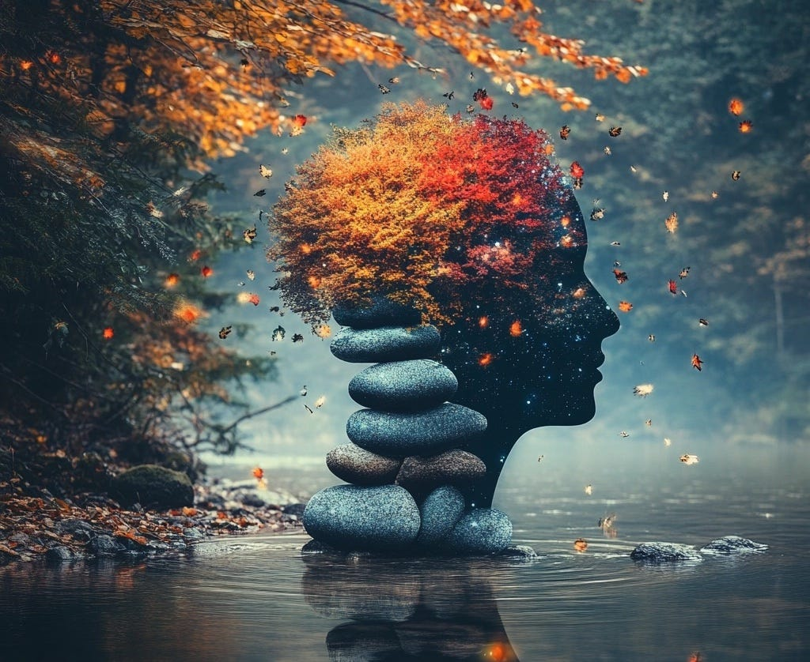

# The Thing You Are Expert at Will Be Your Career Downfall

*AI will disrupt some of us more than others.*

#### i.

#### Last year, I wrote 189,214 words.

Not because a boss demanded it, or a paycheck dangled at the finish line. I wrote these words for me. I *like* writing words; I fancy myself reasonably good at it. And I enjoy the feeling of total immersion trying to capture a sea of images and ideas within my mind.

It isn’t just words. The other week, itching to add some flair to Sundial’s [marketing page](https://sundial.so/), I rolled up my sleeves. My inbox and socials are practically overflowing with AI tools promising instant-ramen results. Instead, I spent hours nudging pixels like a gardener pruning bonsai. (My team eventually staged an intervention to gently tug the page edits away from my hands. Thank you ;)

I’m not alone. Recently I spoke with an exceptional engineer, someone whose output is easily that of an entire team’s. When I asked how much he used AI, he replied cautiously, "For the typical stuff — unit testing, boilerplate code. But I don't trust it on anything substantial."

On the surface, this is a story about love: how wonderful to express our hard-earned expertise, to pursue the pinnacle of our craft!

But as the movie rolls on, the seeds of our downfall are already sown. AI is nipping at our roles, identity, our very careers.

Those of us most likely to be disrupted are the one most attached to our work.

---

#### ii.

There are three main reasons why experts struggle to adapt to AI.

#### **1. Automatic comfort**

Most mornings, I brew coffee without thinking. My hands move like clockwork through the ritual. Those habitual neural pathways are worn smooth as river stones. There is where years of practice — writing that SQL query, manipulating that vector tool, drafting that Slack post — have ingrained our work inside of us. We don’t think hard as we do it; it feels so natural.

Doing something new like incorporating AI into our workflows demands conscious attention. We are rerouting rivers in our minds and it takes effort.

The Looking Glass is a reader-supported publication. To receive new posts and support my work, consider becoming a free or paid subscriber.

It’s not just the effort of making the change; there is also effort to overcome the initial bursts of frustration at the outcome. If you’re expert at something, AI probably won’t deliver you the kind of results you’d expect from yourself, at least right off the bat.

The mind doth protest: *let’s fall back into the comfort zone, where it’s plush and easy!* Sometimes, our areas of expertise become such cozy havens that we scarcely realize the world outside our windows is fast changing.

#### **2. Identity attachment**

How many times have you been been face-to-face with a stranger being asked the question: *So, what do you do?*

For me, I’ve rattled off thousands of repetitions of *I’m a* *designer* or *writer* or *founder*. Each time I do, that particular identity inks itself a little more deeply into my skin.

With attachment to an identity comes sharp pricks of fear when that identity risks slipping away. *Wait a minute, if I’m a designer / writer / founder / engineer / marketer then I **should** be designing / writing / company building / engineering / marketing!* Especially if we’ve been handsomely rewarded for it in the past.

AI taking on more and more of what we traditionally used to do feels like a threat. What happens when attachment is threatened? We grip on even more tightly.

#### **3. Love of the craft**

The biggest hurdle to changing habits is love of the craft itself. The engineer who hand-optimizes code for elegance. The designer who obsesses over kerning invisible to users. [The animator who inks each cell by hand](https://lg.substack.com/p/the-ai-quality-coup).

Telling someone they shouldn’t love what they do, or do what they love, is a losing position. Anything that comes from love is pure and good. Sometimes, it explains with great eloquence and truth why we resist change.

---

#### iii.

#### Tech history repeats the same comedy.

When photography emerged in 1839, French academic painter Paul Delaroche reportedly declared, *"From today, painting is dead!"*

The art establishment saw photography as the ultimate threat in its ability to capture reality with perfect precision. At the time, most painters were creating portraits for the wealthy or documenting historical events or recording what things looked like, which took years of training to master.

In one sense, Delaroche was right — what *died* was the careers of those painters who photocopied what they saw.

But in the broader sense, Delaroche was dead wrong. Photography unshackled painting from its utilitarian purpose.

New painters emerged that captured different realities—Monet sought to convey the aura of light; Picasso played with multiple perspectives; Rothko dissolved forms into color fields of emotion. The market for painting exploded.

This pattern repeats itself with stunning consistency. In 1840: Painters raged at pre-mixed pigments in tubes ("Real artists grind their own!"). In 1990, Photographers boycotted digital (“Buy film not megapixels!"). In 2025: Writers and artists eye ChatGPT warily (“AI will kill creativity!”).

Every new technological marvel brings death and loss, yes, but it also invites an explosion of birth.

Entrenched experts are the ones most likely to miss the lesson of history: new tools open the playing field for a new generation of expertise.

---

#### iv.

If you're reading this with a sinking feeling that *expert* describes you, fear not. As they say in every single growth book on this planet, *awareness is the first step.*

The best way to counteract a bias is to be exposed to the fact that you have it. Consider this essay a public service announcement (you’re welcome!) that you are on the verge of being disrupted.

The good news is that every mindset has its perfect antidote. Here are the three against ones discussed above.

#### **Automatic comfort → Intentional discomfort.**

Combat muscle memory by deliberating scheduling friction into your workflow. Block out *AI experiment time* on your calendar and treat it like any other important meeting. Set explicit goals: "This week, I'll use Claude to help me with 5 writing tasks" or "I’ll prototype 2 new ideas using Lovable and Cursor."

The key is making it unavoidable. Take inspiration from other people’s experiments (the podcast [How I AI](https://www.youtube.com/@howiaipodcast) hosted by my friend Claire Vo is perfect for this). Follow AI builders on Twitter and allow gentle peer pressure to compel you to try something new.

Create artificial constraints that force discomfort: "No spending more than 20 minutes on a first draft" or "Draft this presentation using only voice-to-AI tools." You’re not trying for perfect; you’re building new neural pathways through deliberate practice.

#### **Identity attachment → Identity expansion.**

Stop defining yourself by your tools and start defining yourself by your outcomes. *Designer* doesn't mean "person who pushes pixels"—it means *person who brings about intentional outcomes* (read: [Higher Level Design](https://lg.substack.com/p/the-looking-glass-higher-level-design)). *Engineer* isn't "someone who writes code"—it's *someone who builds systems that solve problems*.

And who says you have to stick with labels like *designer* or *engineer* in the first place? They’re imaginary constructs. These days, I like to think of myself first and foremost as *builder*.

Expanding your identity ensures that AI doesn't threaten your core sense of being. A designer who uses AI to generate fifty screen variations isn't less of a designer; they're a designer freed to focus on the strategic choices of app design. An engineer who uses Cursor isn't cheating; they're an engineer who can now tackle bigger, more complex challenges faster.

Your expertise isn't in the mechanical execution of tasks; it's in the judgment, taste, and strategic thinking that guides that execution.

#### **Love of the craft → Love of many crafts.**

Love of craft is wholly pure and good because it comes from a deep care and respect for the infinity that lies within. I’d never want to convince anyone to abandon something that comes from love.

What I will point out is that love does not have to be limited. The advent of AI allows for new playgrounds of exploration. Who is to say that the animator who once lovingly inked each cell by hand might not fall in love with directing AI to create entire sequences? Perhaps their love of the visual craft may spill into a love for architecting the emotional beats of a story.

The engineer who hand-optimized code for elegance can now obsess over architecting systems of elegance; the writer who agonized over every word choice can now agonize over prompt engineering precision. I’m not saying they *should* want this; I’m saying they have the *freedom* to.

Just like there is infinity within a domain, there is infinity beyond. We are all capable of falling in love over and over again.

---

#### **vi.**

#### Last year, I wrote 189,214 words, but not all of it [served the same purpose](https://lg.substack.com/p/the-looking-glass-so-you-want-to).

Sometimes I wrote to connect. Sometimes I wrote to feel. Sometimes I wrote to think.

Even within the bucket of *writing to connect*, the intent splits further. Sometimes in a [Sundial](https://sundial.so/) context, I’m writing to transfer the specifics of an idea in my head to another person. Sometimes I’m sharing feedback. Sometimes I’m trying to persuade or entertain.

Today’s AI does a *far* better job on many of these above dimensions than I do. It writes specs more clearly. It supplants hypotheses with research. It drafts 10x faster than me. If I find myself wary about harnessing its strengths, it’s only because of my pride.

And yet. When I *write to think*, AI can only play a supporting role. The entire process of putting what I know in front of me *IS* what makes my brain sharper. There is no shortcutting this process.

And when I *write to feel,* what would be the point of using AI for that? It can’t *feel* my feelings for me.

The same can be said for coding. Maybe you hand-code on a Sunday afternoon and it’s your relaxation time. Great, no reason to give that up.

But maybe you code because you’ve promised your client something wonderful and you really really want to deliver. That’s the perfect reason to learn to use better tools.

AI isn’t an all-or-nothing proposition. There are some good reasons to stick with your status quo; there are many *better* reasons to notice which way the wind is blowing.

The most meaningful work will always have human soul infused in them. Somehow, in subtle ways, we can always feel when love has been poured into creation.

But meaningful work evolves as our tools do. It’s time to abandon our old shells of expertise and find newer ones to grow into.

There are many opportunities [yet to invent the future](https://lg.substack.com/p/conversational-interfaces-the-good).

---

Most of The Looking Glass is paywalled, but this is a free post. If you found it useful, please share so we can more gracefully adapt to what’s ahead.

[Share](https://lg.substack.com/p/the-thing-you-are-expert-at-will?utm_source=substack&utm_medium=email&utm_content=share&action=share)

---

#### **Other articles in the Looking Glass AI series**