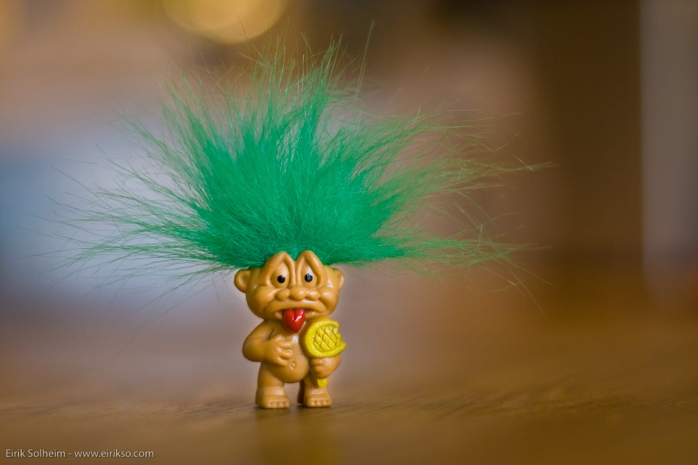

# Don't Let the Trolls Win

*The Power of Owning your Own Insecurities*

👋 *Hi! I’m Julie Zhuo. I’m a builder, advisor, and author of a [popular management book](https://www.amazon.com/Making-Manager-What-Everyone-Looks/dp/0735219567). I used to lead design for the Facebook app. **The Looking Glass** is my once-a-month-ish musings on products, teams, and our journey as builders.*

Many years ago, I learned that trolling, like everything else, is a kind of art. The people who do it the most take it as seriously as stand-up comics do their sets. Except of course, trolls are going for some flavor of hurt, outrage, or discomfort rather than laughter.

This surprised me because at first glance, it didn't seem like there was any special skill to saying mean things about someone. You just insult their intelligence, their body, their identity, or their relatives. Any elementary school kid knows this, in addition to a vast and varied collection of Yo Mama retorts.

But the very reason why *Yo Mama* gets phased out says something about their effectiveness: they lose their power because they’re so generic, a caricature of an insult rather than any serious attack on one's mother.

What trolls know is that to *really* get under someone's skin, it needs to be personal. The barbs that wound the most are those that fulfill two conditions: a) some tiny part of you believes it’s true, and b) you're ashamed of it.

Let's look at some examples. Suppose you snipe that I’m a lump of dough, or a four-eyes, or a jackass. I might wince at your rude overtones, but the insults themselves don’t sting because I'm 100% certain you're wrong. Instead, I wonder what got your goat.

Suppose you say you'd rather eat dirt than my cooking. Again, HOW RUDE, but I'm not going to get defensive. It’s true; the bottoms of my pans bear burn marks from many a kitchen mishap. I own that, and will continue “experimenting” from time to time.

The things that invoke my fight-or-flight response, that get me stammering and heated and feeling ill, are the ones that stab deep into my insecurities. After I became a new mom, for example, I struggled with frequent bouts of mommy-guilt, so even the *slightest* indication that I was doing a bad job felt like a dagger to my chest.

It stands to reason, then, that there are two broad strategies to reduce the possibility of personal pain inflicted upon you by trolls or unkind critics or judgmental family members or really, anyone:

1. Reduce the number of such people in your life
2. Learn to be less ashamed of your imperfections.

1 is a fine strategy, though not always possible. It’s 2 that I think about more.

I have a question for you: in your worst nightmare, when you imagine all the people you wish to impress standing together making fun of you, what are they saying?

The answer to this is your very own secret chest of insecurities.

When I was younger, my chest was enormous. I was terrified that someone I respected—whether a teacher, a mentor, a boss, a parent, or a friend—would think that I was (in no particular order):

* an idiot
* selfish
* defensive
* possessing of poor taste
* pitiful
* boring
* superficial
* cliche
* weak
* ineffective
* ... + about 49 other things

It's burdensome to carry such a heavy chest. It felt like I was always on high alert, my radar scanning the words and attitudes of those around me to see if they might support one of these beliefs. And when I suspected as such ("My boss asked me to revise my proposal? HE MUST THINK I'M AN IDIOT!!!"), I'd find myself floating in a swirl of horrible sensations—rejection and self-loathing and despair and fear.

Happily, my personal chest is getting lighter as time passes. I no longer get offended if you call me an idiot (because I think you’re mistaken) or if you say I'm superficial (I agree that I am about certain things like how a room looks.) I suspect that the older we get, the less sensitive we become to certain aspects of our identity. After all, it’s practically a ritual to cringe at our angsty teenage selves!

But I've also come to think that this process can be actively accelerated.

The first step, of course, is to be honest with yourself *about* yourself. This sounds obvious, but is in practice harder than it looks because we don't like to think of our weaknesses. In fact, we may be so adept at avoiding this topic that we bury our chest of insecurities deep in the cobwebbed nooks of our subconscious. You can tell when someone has done this because you'll offer helpful criticism and they'll completely explode and turn it around to be about *you* and your failings instead.

### *In your worst nightmare, when you imagine all the people you wish to impress standing together making fun of you, what are they saying?*

Write down your answers. Whisper them out loud. There is power in being able to give shape to fear in the form of words. It’s as if in the act of spelling them out, they release a bit of their death-grip on you. If you are able to say to yourself, *What I am secretly worried about is that I am not as smart as XYZ, and I'm worried that ABC won't respect or love me as a result*, the fear suddenly shrinks from a giant anxiety-cloud shadowing every aspect of your life to a tangible sentence that can be dissected, discussed, and addressed.

Which brings us to the next step: once you can voice your insecurities out loud to yourself, you can move on to saying them to somebody else.

Why does this matter? Because every time you share your insecurities, you are showing that they do not control you. Like mold, fear thrives in darkness. When you shine a light on it and expose it to another person, it becomes better seen and understood.

What we see and understand, we can overcome.

There is power in vulnerability, in showing up not as invincible, but as human. There is a precious connectedness we forge with others, because the demons we face are never ours alone. This is the biggest lessons I've learned in all my years of writing and managing: that no matter what we are going through, others have faced the same, or worse. And even those that haven't can empathize with and give us what we need the most, which is not usually the answer, but rather validation that we are worthy.

As much as we like to pretend that we are just fine on our own, the truth is that we are social animals. Our biology is hard-wired to seek belonging. Social rejection lights up the same areas of our brains as physical pain. We will always care what others think. The key is to reduce the size of "others" until it’s just those you truly care about—not the random trolls on the Internet, not the kids at the next cafeteria table, not the majority of your followers on social media.

Why am I no longer bothered by being called an idiot? Because the people who matter to me have helped me realize that I'm smart and my opinions are valid. Even more than that, they've told me that even if I'm wrong from time to time, or I'm slow to pick up something new, they still like and appreciate me nonetheless.

Owning my imperfections means that they can't be used to wound me. I skip reacting emotionally when I’m called a name by some rando with a complex, or given an uncharitable review by someone who would rather see me fail.

Owning my imperfections means that I can tell my manager what I’m struggling with and ask for her help in furthering my growth areas. It means I can come to the table with humility and collaboration rather than a need to prove myself to a colleague. It means I can take accountability when my husband or kids call me out for being distracted or irritable.

The thing about life is that until it's over, we continue to be works in progress. There is a better version of ourselves tomorrow, next week, next year. But it starts with acknowledging all the aspects of who we are today—the good and the bad.

Be the first to uncover and talk about the things you're ashamed of. Reclaim your own power instead of letting some troll open that box first.

---

*Photo by [Eirik Solheim](https://www.flickr.com/photos/eirikso/)*