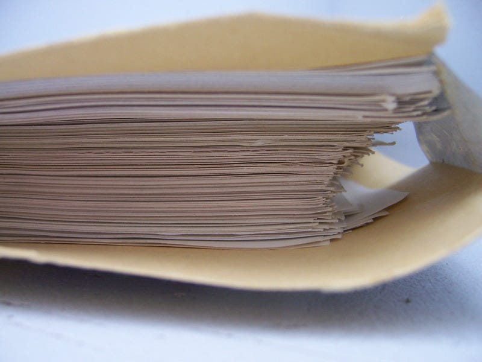

# The Words Count

*On the abundant bounty of writing*

👋 *Hi! I’m Julie Zhuo. I’m a builder, advisor, and author of a [popular management book](https://www.amazon.com/Making-Manager-What-Everyone-Looks/dp/0735219567). I used to lead design for the Facebook app. **The Looking Glass** is my once-a-month-ish musings on products, teams, and our journey as builders.*

My first full-length novel, *The Shadow Gods*, was a story about a modern-day goddess of love who becomes a pawn in a high-stakes political game.

My second, *The Chances*, was about a cat-mouse-game between a pair of identical high school twins, one a detective and the other a thief.

My third, *Neath*, was about a forsaken underground kingdom plotting its revenge in the last days of civilization.

And lastly, *Game of Chances* was a combo concept: a pair of identical high school twins, one a detective and the other a thief, discover they are modern-day gods in a high-stakes political game.

What do all four of these novels have in common?

1. None of them were any good.
2. All of them were birthed during [NaNoWriMo](https://nanowrimo.org/).
3. Through the experience, I grew to be the writer I am today.

If you haven’t heard of Nanowrimo, it stands for [National Novel Writing Month](https://nanowrimo.org/), and it’s exactly what it sounds like. In the month of November, the goal is to write a 50,000-word novel. (Very quickly, you realize this averages out to 1,667 words a day for 30 days.)

When I first heard of NaNoWriMo in college, I was instantly swept by the ingenuity of the concept. I’m not one to run an actual marathon, but this felt like the mental equivalent of one: intense, but capped. Extreme yet intoxicating. It felt like stepping into a creative blizzard and emerging at the end with something tangible: the actual bones of a story.

### *Here’s the thing: we all have stories to tell.*

Perspectives, parables, proposals, lessons, fantasies — they all live within us, in the dark depths of the mind’s ocean. Writing is the process of fishing these out. It’s the extraction of personal truth, bottled into little black squiggles on crisp white paper. These words help us sweep chaos into order, knit pain into opportunity, multiply the power of great ideas. They help us be known.

Entire religions, governments and innovations have been constructed from a few pieces of writing. The reading of someone else’s words is the closest thing we have to being able to occupy their mind for a few brief minutes or hours.

But your writing doesn’t have to be read by someone else for it to be worthwhile.

The hundreds of thousands of words of my earliest novels have seen no eyes but my own. The extraction process, especially during those Novembers, was sloppy. I often didn’t know what I wanted to say, or the sentences were dull, or the plot meandered like a lost child, or the characters changed histories midway through.

I failed in my dream of being a published novelist, and there were times when I wondered at all that effort — all those plot holes I tried to mend, the sentences I tried to shape, all those November nights lost in a flurry of typing — what was the point, if nobody was going to read them?

But now, more than a decade later, I reap the bountiful harvest.

What is a few hundred thousand wasted words when I have written millions more since then?

I am a product designer and manager by profession, but oh, how I write. Daily e-mails debating the pros and cons of specific product decisions; mission statements and company values; new strategies and organizational updates; promotion criteria and primers for new employees; letters to myself that turned into widely read blog that turned into a bestselling management book.

NaNoWriMo taught me that the most important thing in writing is to *just get the words down —*the discipline of 1667 a day. The words don’t have to be good; they just have to *be*. Because once they’re down, you have something you can evolve, respond to, and polish.

NaNoWriMo taught me that writing, reading and thinking go hand-in-hand. As my words sharpened, so did the clarity of my ideas. What used to be an amorphous haze of emotions and fragments now, more often than not, present themselves as a series of structured thoughts.

I approach reading with more depth as I consider all the choices the author made, and why. I express myself more honesty and connect better with readers. I am learning, over and over again, that writing regularly has many advantages in life.

NaNoWriMo taught me that writing is fun when you do it for yourself. There is joy in the invention that happens on the page. There is delight in unwrapping a tiny piece of ourselves only to discover what’s behind it is universal.

For all of you doing this year’s NaNoWriMo — congratulations as you cross into the final day! The end is in sight. Looking back, I hope you’ll find the journey as rewarding as I did. And for those who aren’t, there’s always next year… or next month! The spirit of NaNoWriMo is eternal: Write, because your story matters.

---

*I am a board member of NaNoWriMo. If you’ve enjoyed my writing over the past few years, I would love for you to consider a [$10 or $25 donation](https://store.nanowrimo.org/collections/donate) to support this non-profit’s costs of running the program for hundreds of thousands of writers (including nearly 100K students!) Cover photo is by [René Gademann](https://www.flickr.com/photos/bw14/).*