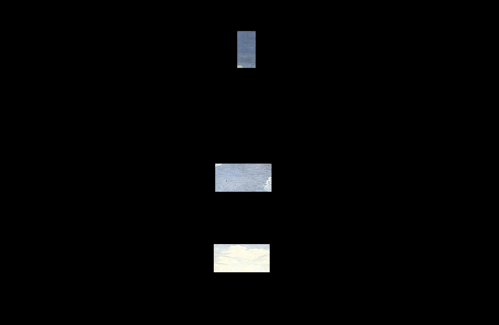
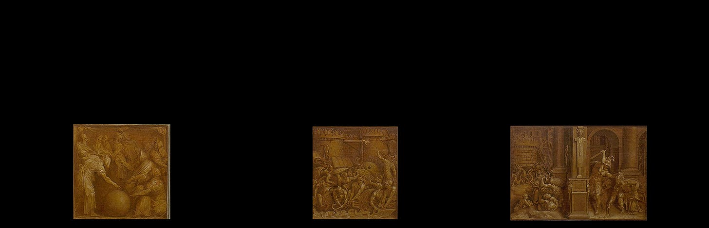
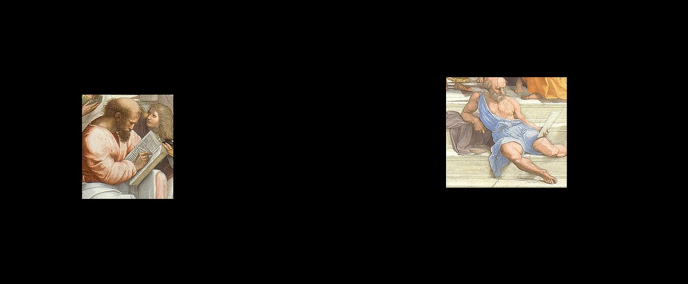
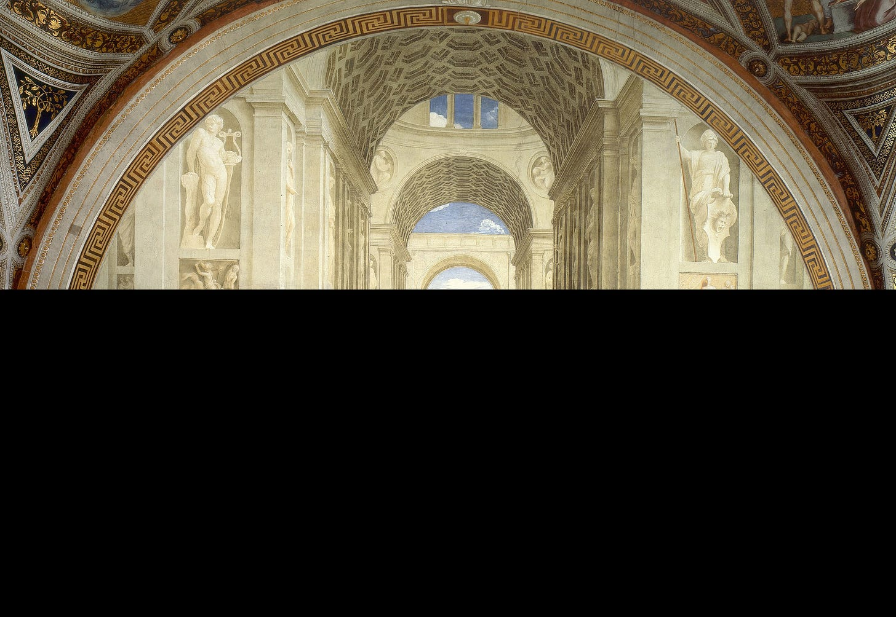
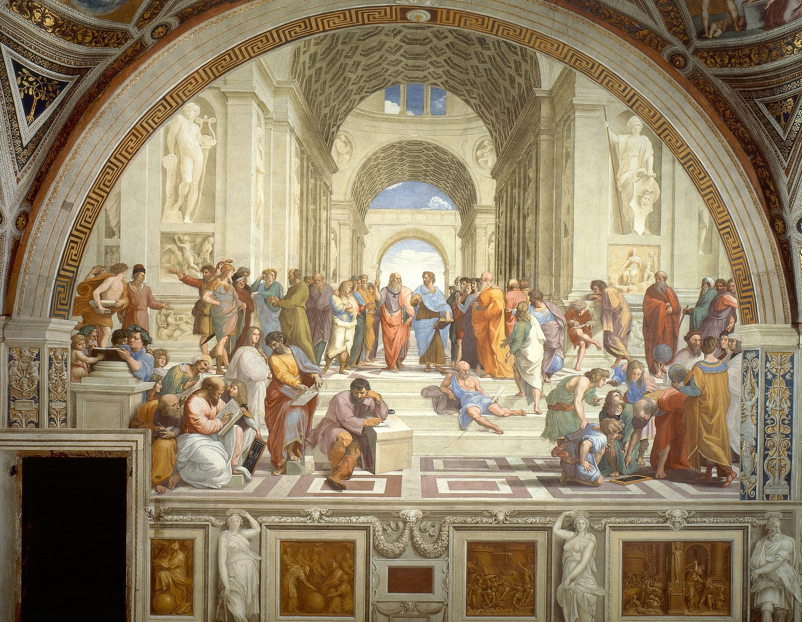
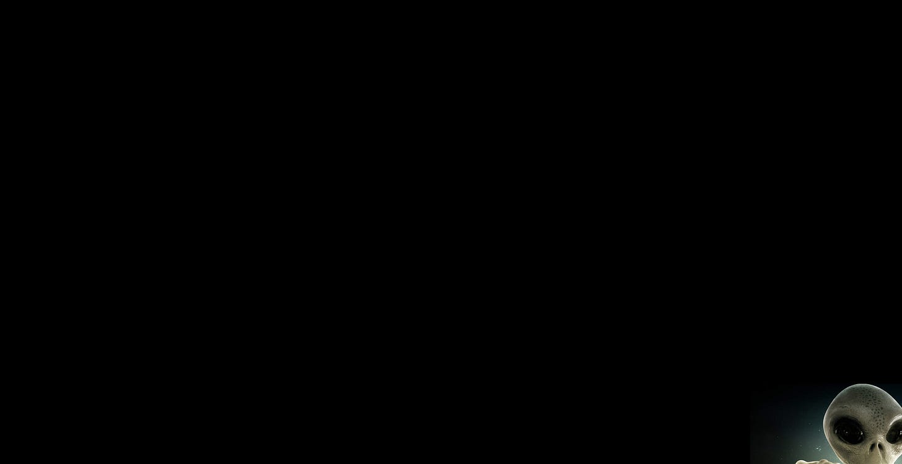
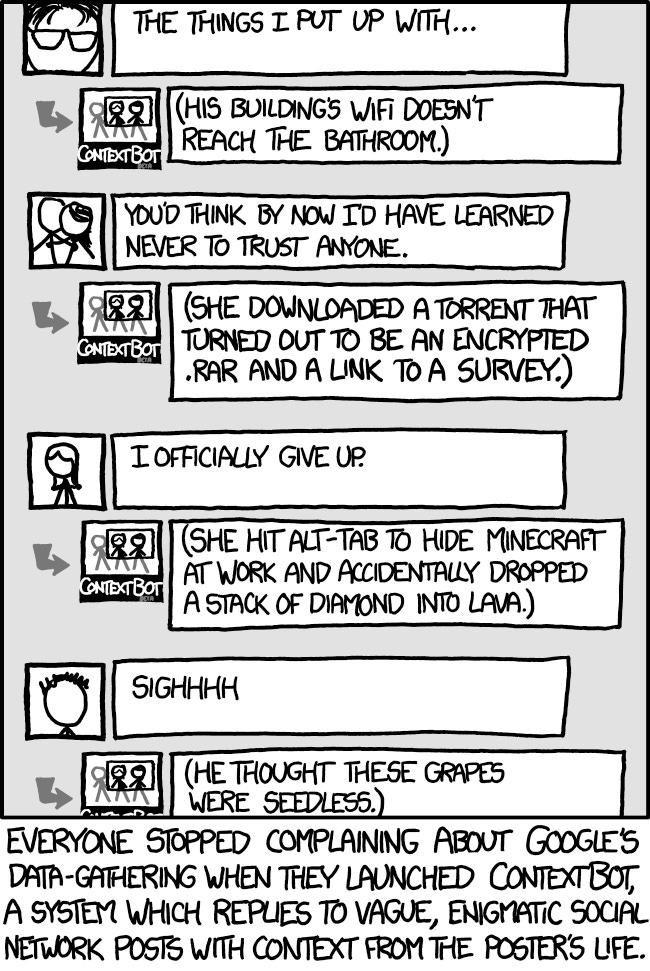

# Truth, Context, and Social Media

*Is Tiktok good or bad? Should Rick be fired? Should designers wear top hats? Also: How can social media systems better incentivize informedness? *

👋 *Hi! I’m Julie Zhuo. I [help companies scale and build](http://inspirit.work/) people-centric products informed by data. I’m the author of a [popular management book](https://www.amazon.com/Making-Manager-What-Everyone-Looks/dp/0735219567). I used to lead design for the Facebook app. **The Looking Glass** is my once-a-month-ish musings on products, teams, and our journey as builders.*

---

## One of the great gifts of social media is the way it expands our understanding of the world.

It used to be that our exposure to facts and opinions came from the dozens of people we see regularly in real life—besties, those colleagues we do Taco Tuesdays with, our parents and Uncle Paul and Cousin Maria, those high-school bandmates that we see once a year—along with the handful of TV channels, books or newspapers.

Today, thanks to social media, those dozens of opinions have become hundreds or thousands. We can get a peek into the thoughts and lifestyles of practically anyone we’re interested in, whether they’re top epidemiologists, activists, politicians, influencers or innovators. We can find kindred spirits we’ve never met before that share our undying love of ramen and Death Note and wacky real estate listings. With just a few *Follows*, we can tumble down the rabbit hole of our curiosity.

But with this access comes a belief that just because we see more, we can also come to better conclusions about more topics—whether wearing masks is necessary, whether saying or doing X is deplorable, whether TikTok is good or bad, whether a certain executive should be fired, whether designers should code/do woodworking/wear top hats.

We’re entitled to our own opinions, of course, but in reading through so many of these debates, I find myself wondering:

### *Is social media actually making us better informed?*

Here’s what it feels like sometimes: you and I are looking at a picture in the distance. We're standing in different spots, so parts of our view are blocked.

You say: “This picture has wonderful blue sky tones.”

And I say: "What are you talking about? There's so much exquisite detail in these little vignettes that are totally orange!"

And a third acquaintance chimes in and says: "You're both wrong. This picture is about dudes reading."

And some other random person on the Internet is like: "You all suck. I'm an expert, and architecture is what makes this 💯."

### Who is right?

Well, everybody.

None of the observations are patently false. But the fact that we're arguing about them is ridiculous. We’re all reporting the picture as we see it, but we each see such a small slice.

Some of us who have spent far more energy—years or decades, maybe—in understanding a thing might have have uncovered more of the picture, but even then, every perspective has blind spots.

One of my great frustrations with social media today is that it’s so hard to zoom out and gain an appreciation for the complexity of a given topic. Short, Tweet-like posts constrain observations to these micro-squares, stripping them of context and nuance. Covid hits, and suddenly it seems like everyone and their dog is an expert on how to deal with pandemics.

The problem gets even worse when you throw bad actors into the mix who intentionally lie and mislead. Now we have to deal with a bunch of voices claiming that this picture is actually about Martians and submitting false pixels as evidence.

Putting bad actors aside for a second, I suspect most posters on social media *are* describing their little view rectangles as they see it.

We may disagree on how representative that rectangle is—does a few guys holding books make *reading* the most salient theme? Is architecture really why this picture is so famous, or is it the dynamism of the figures, the noble subject matter, or the sheer scale?

But assuming the other party is stupid or dishonest or wicked for pointing out that they see blue clouds is not helping us understand the image any better. It's just causing us to waste time and energy.

It's why I struggle to agree or disagree with one-line takes on social media, or why I find writing short, pithy tweets exceedingly challenging. Everything that sounds like a sweet aphorism feels right in some contexts and wrong in others. Is Tiktok good or bad? Good for some, bad for others. Should a certain executive be fired? The people who know the most should judge. Should designers code? It depends on the designer and their goals.

Unfortunately, "It depends" is a dull answer. Nobody reshares "It depends." And the long explanations summarizing centuries of critical analyses for why "The School of Athens" is such a famous painting is simply tl;dr for most of us.

Our human brain craves villains and heroes, conflicts and denouements, the entirety of a story heard and judgement rendered in the time it takes for a quarantine lunch to heat up. Is it any wonder why our communication systems have evolved to ever shorter and shorter snippets of narrative? We went from the book to the blog to the tweet; the movie to the YouTube episode to the TikTok video.

And yet, "It depends" is often the path to real wisdom. It invites more questions, leads to more of the picture being filled in. It's not sexy, but actual learning and problem solving rarely is. It’s the spiritual sibling to all those things we rationally know are good for us but struggle to choose: the carrots over the chips; the workout shoes over the couch; meaningful time with loved ones over mindless scrolling of blue screens.

*Is social media actually making us better informed?* Maybe a better question to ask is:

### How can social media systems better incentivize informedness?

I'll throw out a proposal: Give **verified users** the **ability to determine** if a particular post needs more **factual context**. If **enough viewers** flag something as needing more context, **factual context** automatically appears next to the post.

Let's dive into this a bit more:

**Why verified users?** Given the prevalence of bots and coordinated misinformation campaigns, why not extend identity verification beyond just advertisers and blue-check celebrities to everyone? Make it easy to create an account and get started, but if you want to grow your influence, let's make sure you're a real person. Imagine capping your post’s distribution or limiting your ability to send engagement signals to the system (in the form of clicks, reports, votes, etc) unless you provide identification.

**Why give people the ability to determine?** Empowering a vast group of people to add context to content is a lot more democratic and scalable than a small, centralized body making unilateral decisions about what posts should stay up or go down. Plus, we all know the gray zone is vast. Some posts don't violate policies but cherry-pick certain facts and omit others in ways that distort the picture. Give people the power to fill in the blanks.

**Why factual context?** This is the fuzziest part of the proposal, because facts are notoriously tricky to define. Even if we agree on the facts ("who did what when?"), the way they are presented can favor certain interpretations over others. The proposal here is to let verified users browse a database of approved factual statements from independent fact-checkers and submit them to be included along with the original post.

**Why automatically trigger when enough users do this?** In order for a system to feel democratic, the rules for how it works need to be transparent. The trigger could be some combination of % of users who saw the post and flagged it and total number of viewers. The more a post is seen, the more scrutiny it should receive.

**Why is this proposal awesome**? I make no claims that this proposal is awesome. I share it because I hope to inspire critique and alternatives. This is where I throw you a heaping pile of caveats—that the proposal has holes and may be impractical and may lead to new vectors of abuse and gamification. Complexifying an already-complex system is a fool's errand, and throwing more things in front of people doesn’t mean they’ll absorb it. But if you think this solution sucks and have a better one, share it! Or if parts of this proposal inspire new ideas, by all means build upon them.

### Is social media more good than bad?

Depends on who you ask. The prevailing narratives, like Pokemon, have gone through so many forms already. Once, many hailed social media as the harbinger of democracy. Now, it’s blamed for the erosion of it. If you ask me, my answer is *Yes, social media is more good than bad*. Information travels today at unheard of speeds, much of it to strengthen relationships, nurture communities, spread ideas, and accelerate innovation. But the same tools also sow division, disguise truth, and enable crime. Our experiences with social media reflect the good and bad of humanity. In our lives, we’re somebody’s demon and somebody else’s angel. Still, I choose to believe that *we* are more good than bad.

And yet. Social media tools can and should improve. Between the walls of "free speech" and "make the platforms safer” lies a fertile ground of possibilities. I am reminded of a school cafeteria design I heard about once, where the problem to be solved was: "How can schools incentive healthier eating?"

*Get rid of all those flaming hot cheetoes!* you might think. *Slap nutritional labels on everything!* Instead, they kept the exact same lunch options but made the unhealthy stuff harder to access. Ice cream was put behind a closed, opaque door. Water lived next to the cash register while soda hung out in a different section of the cafeteria. Plates were smaller in size.

Guess what? Kids ate better.

What could we design to better incentive informedness? How can we make it easier to pursue the truth in wonderful collaborative fashion, as Raphael imagined in his masterpiece fresco?

There's work to be done. I’m looking forward to the next chapter.

