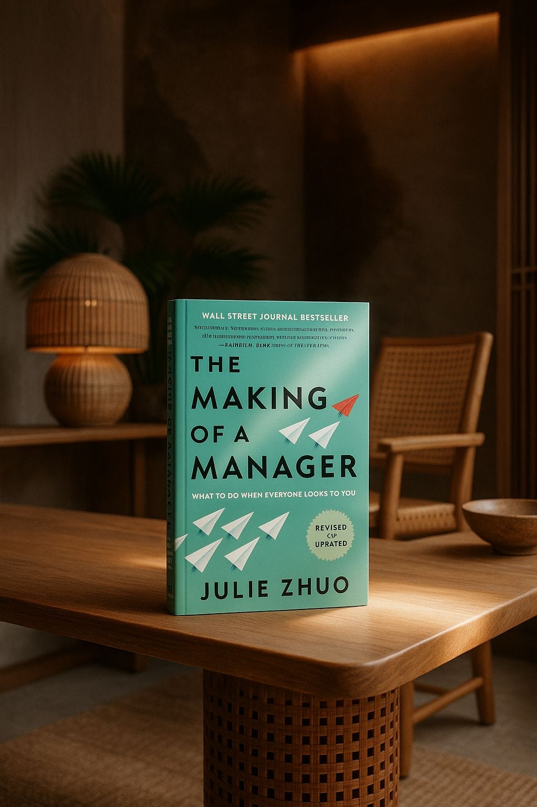

# You're definitely going to be a manager now

*Book launch! + Predictions for the manager in the era of AI *

Dear Readers,  
  
Today, the revised edition of **[The Making of a Manager](https://www.amazon.com/Making-Manager-What-Everyone-Looks/dp/0593852788/ref=tmm_pap_swatch_0?_encoding=UTF8&dib_tag=se&dib=eyJ2IjoiMSJ9.4Ka58eyIZaPD8LjRDwQ0S5B1-Aoo6Xfyo1WzYvxDPYr5qc4bj7raQtKy3_Ygite7LUJNj98IkeyFIuTLS5lgID9fT90fgjESTB6_flk6nkaPa9SwnXxADzSr5CyJfW1vbhMu3f8h6e5ZWuyE609jUHHsiOZv89wjit43vVKGpWEuSRUJG8LFpXcGyBJjX0zuoijaDnAIHIeZv3-RH2ggXkVt1ORfP12mdCWtwviRWZo.metyUgyml5b_fHsKgYSrpAnAeGqzeq6nPpYTahHyv0w&qid=1757374000&sr=8-1)** drops! (Note: the revised version is paperback with the new gradient background!)

Besides some refreshed examples in the original 10 chapters, it comes with two brand spankin’ new sections on **Managing Remotely** and **Managing in a Downturn**. In the years since publication I lamented not having addressed these two topics more deeply, especially after the pandemic and the various market downturns and layoffs we’ve seen.

Subscribe to The Looking Glass to get regular essays on the art of building.

To commemorate the book’s (re)-launch, I wanted to share my take on some of the most common questions about management as we enter an AI era. Got other q’s? Drop ‘em in the comments!

---

### Pure middle manager roles will decline

The promise of AI is that you can do more with less, which means we’re entering an era of leaner teams, as [I’ve written about before](https://lg.substack.com/p/the-death-of-product-development). Why summon all the Avengers when one Captain Marvel will do?

Remember the “telephone game” we all played as kids, where we’d whisper a sentence around a circle until it came back hilariously garbled? The role of middle managers unfortunately sometimes felt like that.

Leaner teams means fewer roles whose primary function is coordinating information. This is a good thing! Even when information *does* need to pass between humans, AI tools are highly competent at drafting updates, surfacing data, and generating summaries. Messages can more easily travel directly from source to decision-maker with less distortion.

---

### The need for management skills will only increase

What is the skill of management? In my book I define it as *getting better outcomes from a group* by the use of three key levers: **purpose** (aligning on *what* success looks like), **people** (defining *who* is needed to achieve the goal), and **process** (defining *how* the work should get done).

Now imagine that formerly large Avengers team being compressed into one or two Captain Marvels, thanks to AI. The headcount shrinks, but the need to manage work doesn’t. Those remaining individuals have to *think* like managers in deciding what to prioritize, how to split tasks, and how to keep themselves accountable. In other words, certain parts of the management function must shift into the hands of the Individual Contributor.

This is why there’s so much chatter about how AI rewards **high-agency people with a [clear sense of purpose](https://lg.substack.com/p/when-ai-has-better-taste-than-you)** (some great reads on what “high agency” is [here](https://www.highagency.com/) and [here](https://www.henrikkarlsson.xyz/p/agency))**.** Instead of waiting for someone else to help coordinate or define next steps, these folks experiment quickly, learn and share. Instead of expecting coaching and feedback from humans, an IC can ask, *Help me critique this presentation* or *Point out blind spots in my argument* and get an instant second opinion from AI.

AI also gives ICs better tools to improve collaboration with other humans. Worried about how to tell a colleague that their proposal sucks? Have AI help you draft a direct-yet-kind script and roleplay the conversation with you. Trying to make sure your higher-ups know what’s up? Have AI draft you clean exec summaries.

The old boundary lines are blurring. Just as we’ll see fewer “pure managers,” we’ll also see fewer “pure ICs.” Instead, more people will live in the messy middle: sometimes executing, sometimes designing processes, sometimes coordinating.

Like switching hats in a fast-moving improv show, the distinction between manager and IC becomes less about rigid role definitions and more about moment-to-moment needs.

---

### Managing AI is like managing humans, with one big exception

If you’ve ever managed a very literal intern, you already have a sense of what managing AI is like. Give clear instructions, and they’ll execute them earnestly. Leave things vague, and you might get back something kinda accurate but totally irrelevant (like asking for “a picture of a cat” and receiving a Renaissance oil painting of a lion wearing a ruffled collar).

Remember our core principles of good management? Not much changes with an agentic report!

* **Defining your purpose is critical**: What does success look like? This needs to be spelled out explicitly for AI to have any shot of hitting your target. This is why prompt engineering is an art.
* **Pick the right ~~people~~ model for the job**: Different models have different personalities and strengths, just like people. Get to know their unique quirks so you can send the best model for the task.
* **Build clear processes for how you ensure good work**: Trust, but verify. This is why constructing evals is an art.

Of course, there is *one* major difference between managing AI and managing humans, which comes down to the difference in physical and emotional needs.

An AI can work around the clock without faltering. An AI can take your curt, snappy tone without offense. An AI does not need you to empathize with its circumstances or feelings.

For some people, this makes the task of managing AI *much* less daunting!

---

### AI will make leadership both easier and harder

We’ve already spoken at length about the *easier* part: AI can act like the world’s best coach, teacher, and assistant—patient, tireless, and available 24/7.

And yet, leadership has never been harder. We’re living through a massive shift where entire categories of work are changing or disappearing. People are anxious. Fear can easily calcify into cynicism or transactional relationships: *Why should I invest in this if it may vanish tomorrow?*

In times like these, leaders need to be stabilizers. We’ve got to learn to manage our own psyche. If you project only cheer, you’ll come across as out of touch. If you project only worry, you’ll amplify everyone else’s anxiety. The art lies in holding both sturdiness and flexibility at once, like a tree that bends in the storm but does not break.

That balance of steady while adaptable may be the hardest and most important leadership skill of this era.

---

AI is changing what it means to manage and lead. Fewer layers, blurrier roles, more tools at our fingertips. But the heart of management remains timeless: setting purpose, building trust, helping people grow.

If you’re reading this, I expect you’ll manage. In both senses of the word. Let us stay sturdy in the storm, flexible in the unknown, and deeply human in how we guide others forward.

Enjoyed this essay? Subscribe to The Looking Glass!

[Share](https://lg.substack.com/p/managing-ai-is-like-managing-humans?utm_source=substack&utm_medium=email&utm_content=share&action=share)