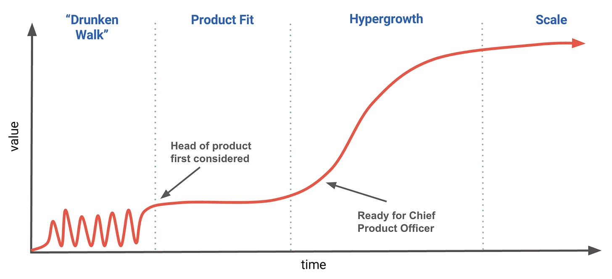

# Hiring Your First Head of Product

***Note**: This article was crafted by [Carla](https://www.linkedin.com/in/carlapellicano/), [Hemal](https://www.linkedin.com/in/hemaljshah/), [Gadi](https://www.linkedin.com/in/gadibenzvi/) and [Nikhyl](https://www.linkedin.com/in/nikhyl/)—members of the [Skip Community](https://skip.community), a curated group of 100+ product leaders from the world’s top technology companies. Special thanks to our partners at a16z and the founders who generously reviewed and enriched this content. For exclusive sessions, personalized career guidance, and community support from senior tech leaders, join our free Skip Coach mailing list* *[here](http://coach.skip.community).*

[Join Skip Coach](https://coach.skip.community)

---

Hiring your first Head of Product represents a pivotal moment in your company's growth journey. As you explore this guide, consider using the practical worksheet we've included at the end to capture insights specific to your situation and challenges.

# **The right leader at the right time**

> *"We're hitting our stride, but we aren't moving as fast as we used to. Our founders are spending too much time leading the product, not enough time building the company. But we’re afraid to add “product management,” as we want to avoid needless process or layers in decision-making. How do we approach this crucial hire and avoid the common mistakes?" — CEO of B2B SaaS startup, Series B*

Every growing startup faces an inflection point: founders who once guided product decisions with instinctive precision now find themselves stretched thin, unable to focus on strategic company-building. Yet bringing in a Head of Product introduces its own challenges—potentially adding bureaucracy when you need velocity, or disrupting the founder-led product culture that sparked your initial success.

This article explores the nuanced decision of when and how to hire your first product leader. Unlike other executive functions, product leadership evolves dramatically as your company scales, requiring different skills at each growth stage.

## **The Evolving Product Function**

Product management transforms distinctly across your company's growth curve:

During early product-market fit exploration, founders typically serve as the product team—rapidly iterating, making intuitive decisions, and prioritizing learning over process. The organization optimizes for speed and discovery.

As you secure a stable customer base, priorities shift dramatically. Your product needs standardization, scalability, and predictable delivery. This transition marks the ideal moment for introducing dedicated product leadership—and is our primary focus.

Some companies experience hypergrowth—when market demand creates extraordinary expansion opportunities. In today's capital-constrained environment, true hypergrowth has become rarer than during zero-interest-rate periods, but remains the aspiration for ambitious founders.

Eventually, established market leaders face another transformation: balancing innovation with protecting valuable assets and market position.

## **Finding Your Ideal Product Leader**

Many CEOs struggle with this hire precisely because the role's demands change so dramatically across growth stages. This guide helps founders:

* Identify the right product leadership profile for your current stage
* Avoid common hiring mistakes that create organizational friction
* Implement effective product management that accelerates rather than hinders growth
* Structure responsibilities between founders and the new product leader

While this guide focuses on hiring your first Head of Product, it's important to acknowledge that not every company should start their product management journey with a leadership hire. Many successful organizations begin by hiring hands-on product managers, upleveling engineers or designers with product instincts, or even bringing in project managers to establish initial processes. These approaches can be particularly effective when navigating early product-market fit, where rapid iteration and direct founder involvement in product decisions are often advantageous.

The inflection point we're addressing comes after achieving initial product-market fit—typically when your validated product needs to scale more systematically, your team has expanded beyond its initial core group, and you need functional expertise to standardize operations and enable predictable growth. At this stage, the right product leadership can transform your company's ability to scale efficiently while maintaining the customer-centricity that drove your initial success.

We'll focus specifically on companies at this critical inflection point—**seeking their first product executive** while maintaining momentum and building sustainable processes. In future articles, we'll address product leadership needs for more mature organizations, including Chief Product Officer considerations.

# **Common Mistakes When Hiring Your First Head of Product**

After analyzing dozens of unsuccessful product leadership transitions—whether from company terminations or leader departures—clear patterns emerge. Understanding these failure modes can sharpen your perspective on critical competencies and significantly reduce the risk of a misaligned hire.

## **Mistiming the Hire**

In early stages, founders naturally serve as the bridge between customers and product development. Adding product management prematurely can distance founders from crucial market signals when you're still navigating toward product-market fit.

However, once your target customer segment crystallizes and your product direction becomes clearer, the operational details multiply exponentially. At this inflection point, founders who resist adding product leadership actively constrain company momentum. The right Head of Product doesn't just relieve founders—they accelerate the entire organization.

## **Delegating Strategy Too Quickly**

A common and costly mistake is assuming that hiring a Head of Product means completely offloading product strategy. In reality, at this stage, product strategy should remain tightly connected to the founders.

Your ideal candidate should absolutely possess strong strategic capabilities—they should be an exceptional thought partner from day one and gradually assume greater strategic responsibility. But setting expectations that they will immediately "drive" product strategy often leads to misaligned priorities, indecisive leadership, and loss of the founder-driven conviction that fuels early success.

When founders inevitably try to reclaim strategic control, your Head of Product may feel misled about their role. Instead, prioritize execution excellence first—someone who excels at translating high-level vision into impactful roadmaps, collaborating effectively with engineering and design, and iterating rapidly based on market feedback.

## **Prioritizing Résumé Over Readiness**

The allure of hiring someone with an impressive background—perhaps from a FAANG company or who has led groups of product managers—is strong but often misguided for early-stage companies. Many senior executives thrive in environments with multiple management layers and robust operational infrastructure.

When suddenly asked to dive back into customer interviews, write detailed specifications, or collaborate directly with engineers daily, these leaders may struggle or simply find themselves dissatisfied. Your ideal first Head of Product should move comfortably between strategic thinking and hands-on execution, embracing the ambiguity and operational limitations of a scaling organization.

They must also engage closely enough with the work to accurately assess team performance and determine how to elevate capabilities through coaching, performance management, and strategic hiring.

## **Failing to Prioritize Between Scaling and Expansion**

Product leaders typically excel at different phases of development. Some demonstrate mastery in scaling existing products—optimizing performance, improving retention, and enhancing growth mechanisms. Others shine at incubating new offerings that expand your product portfolio.

As CEO, you must clearly define which capability is most critical for your current business stage. Leaving this ambiguous (or suggesting both are equally important) inevitably leads to misaligned expectations and debates about priorities that should be settled before the hire.

While exceptional leaders may possess both skill sets, most early-stage companies primarily need help scaling their core product—refining existing processes, strengthening customer retention, and driving efficiency in established growth loops.

## **Hiring a Change Agent Before You're Ready for Change**

Many founders hire product leadership expecting transformation in processes, decision-making, and development practices. However, meaningful change requires not just new leadership but organizational readiness and founder buy-in.

If your startup still operates with founder-driven decision-making, relies on gut instinct, and resists structure as "corporate bureaucracy," then hiring a product leader who excels at creating scalable processes will likely create friction on both sides.

Effective change agents drive prioritization and introduce structure thoughtfully, bringing teams along through questioning and listening. But if the organization fundamentally resists evolution, or founders secretly wish to maintain the status quo, your new hire will face insurmountable barriers.

This tension appears most acutely in the product-engineering partnership. If engineering leadership (particularly a co-founder) isn't aligned with product goals, or if you haven't established clear shared ownership and responsibilities, your Head of Product cannot succeed.

Before hiring a transformational leader, honestly assess: "Are we genuinely ready for change, or do we merely like the concept?" If you're not prepared, consider candidates who can execute within your current framework while helping you evolve more gradually.

# **Crafting Your Head of Product Job Specification**

Hiring your first Head of Product represents a strategic investment to unlock your company's next growth phase. Rather than recycling generic templates or asking an AI to generate a standard description, take time to create a specification that addresses your unique challenges and sets this critical hire up for success. This thoughtful specification process is valuable even if it ultimately reveals that your company would be better served by individual product managers at your current stage. The clarity gained about your specific challenges and needs will guide the right product management approach regardless of the hiring decision you make. And it will not only guide your search but also serve as the foundation for your interview process—helping you design targeted questions, align your hiring panel, and consistently evaluate candidates against your most critical needs.

## **Step 1: Identify Your Specific Problems**

As we've discussed in earlier sections, your Head of Product needs to match your company's current growth stage and specific challenges. Start by identifying the concrete barriers standing between your organization and its strategic goals over the next 12 months.

Work closely with your executive team and functional leaders to document these challenges transparently. To make this exercise more actionable, consider organizing your thinking into three categories:

* **Pixels (Product Challenges):** What significant gaps exist in your product today? These might include unmet customer needs, performance issues, or strategic market opportunities that—if addressed—would significantly drive adoption, retention, and competitive differentiation.
* **Process (Operational Challenges):** Where are the bottlenecks in your product development? Look for inefficiencies in prioritization, collaboration between teams, product iteration cycles, or communication practices that currently limit your execution speed and quality.
* **People (Leadership Challenges):** What critical talent or leadership gaps are holding your team back? These might include unclear direction, missing expertise, or structural issues preventing your product organization from scaling effectively.

This exercise directly connects to the timing considerations we explored earlier. The right moment to hire your first Head of Product is when these challenges become significant enough that founders can no longer effectively address them while building the broader company.

## **Step 2: Clarify Areas of Accountability vs. Influence**

After identifying your critical challenges, outline precisely what you expect from this new leader—and equally important, what remains outside their domain. As we noted in the common mistakes section, ambiguity around responsibilities often leads to misalignment, strained relationships, and shortened tenures.

Start by honestly documenting what you and your founding team will retain. Be particularly careful with product vision and strategy—areas founders often claim to delegate but struggle to release in practice. As we discussed earlier, expecting your first Head of Product to immediately own all strategic decisions typically leads to frustration on both sides.

Next, define the core responsibilities this leader will own outright, along with areas where they'll collaborate with or influence others. For instance, while engineering processes or sales workflows might primarily belong to other leaders, your Head of Product will play a crucial supporting role.

This clarity helps avoid the "delegation regret" pattern we identified earlier, where founders hand over responsibilities only to reclaim them when outcomes differ from expectations.

## **Step 3: Define Essential Competencies and Leadership Qualities**

With your key challenges identified and responsibilities clarified, now determine the specific competencies your ideal candidate needs to succeed in your environment.

Rather than listing generic traits (strategic thinking, communication skills), focus on the practical capabilities required to address your specific product gaps, streamline your processes, and fill leadership needs. Be selective! Concentrate on what's truly essential for your current challenges.

**Don't overlook evangelism capabilities.** In many organizations, particularly those hiring their first product leader, the ability to effectively teach and advocate for product management practices is crucial. Strong candidates can articulate how they would establish product vocabulary across the company, educate stakeholders on the product development process, and build credibility for the function. This evangelism capability is distinct from execution or scaling skills and becomes especially important when product management isn't yet embedded in your company culture.

**Value adaptability over narrow expertise.** Consider not just technical competencies but compatibility with your team. Are they required to have domain expertise, or is it more advantageous to hire an athlete, who has had success scaling in another domain? We find a generalist who has shown the ability to learn new things quickly outperforms a more narrow leader, since each company is unique.

Reflect on your recent successful and unsuccessful decisions—what traits in a product leader would have improved those outcomes? How can you identify the communication approaches that drive results in your company's culture? As we noted when discussing common hiring mistakes, the right leader isn't necessarily the most impressive resume, but someone who thrives in your specific context and stage.

## **Step 4: Future-Proof Your Specification (But Not Too Much)**

A common question at this stage: how future-proof should this hire be?

It's tempting to look for someone who can grow from Director to VP to CPO as your company scales. However, as we've explored throughout this article, the skills required for product leadership transform dramatically with each growth stage. Rather than betting heavily on future potential, prioritize someone who can confidently solve today's most pressing problems.

If you hire specifically for your current challenges, your new Head of Product can make an immediate impact. If your company later outgrows their capabilities, that's actually a sign of success! Either they'll develop new skills alongside the business, or you'll have established a strong foundation for bringing in different leadership when needed.

Your carefully crafted job specification becomes the foundation for an effective interview process, ensuring alignment across your panel and sending a clear, mature message to candidates about what success looks like in this role.

# **Running an Effective Head of Product Search**

> *"Throughout five interviews, the CEO painted an impossibly rosy picture. I couldn't identify their actual challenges or whether they've even taken time to define them. Was this hard-selling or genuine confusion about what they need?"  
>  — VP Product candidate after withdrawing from Series B startup search*
>
> *"We spent three sessions discussing product strategy vision, only to learn in the offer stage that the role would be 'purely operational' for two years. The founder wasn't ready to share strategic ownership despite what the job description promised."  
>  — Director of Product who declined offer at Series A startup*
>
> *"The boundaries between the CEO's role and this position were completely undefined. When I asked clarifying questions about decision authority, I got different answers from each interviewer—I don't think they've aligned internally on what they want."  
>  — Head of Product candidate who accepted competing offer*

These candidate reflections come directly from our Skip community of product leaders sharing their actual experiences on both sides of the hiring table. As product executives who have collectively participated in hundreds of searches and been candidates ourselves, we've seen firsthand how misalignment during recruiting leads to missed opportunities and failed hires.

Without clarity about challenges, role boundaries, and expectations, your most promising candidates will sense the disconnect and choose opportunities where they can make a clearer impact. The advice in this section reflects what has consistently worked—and what has consistently frustrated—for experienced product leaders in our community.

## **Preparing Your Search**

With your thoughtful job specification in hand, you're ready to find your Head of Product. As with many executive searches, how you approach this process significantly impacts the quality of candidates you'll attract and your ability to close your top choice.

### **Leverage Relationship Networks**

The strongest product leadership candidates rarely come through public job postings. Ideally, you've been building relationships with potential candidates and product leaders well before your immediate need. Your existing network—including investors, advisors, and product communities like Skip—can help you identify candidates who are both qualified and primed for your specific challenges.

Consider engaging executive recruiters specializing in product leadership, especially if your network in this domain is limited. A professional search not only expands your candidate pool but signals to the market that you're serious about finding exceptional talent.

### **Prepare Compensation Framework**

Before engaging candidates, understand where your company stands in the market compensation spectrum. Research comparable roles at similar-stage companies and be ready to discuss salary ranges and equity details confidently.

It's critical to align your compensation with market rates for the specific skills and experience level you're targeting. This connects directly to our earlier discussion about hiring for your current needs versus future stages. If your immediate needs require a highly experienced hands-on product leader—sometimes called a "Super IC" (individual contributor) with execution excellence—recognize that this talent commands premium compensation in the market. Attempting to secure this caliber of talent at below-market rates typically leads to failed searches or problematic compromises.

While a competitive cash offer matters, equally important is your ability to articulate the equity upside, especially for early-stage companies where stock represents a significant portion of long-term compensation. Be prepared to explain your valuation logic and growth trajectory in terms that resonate with experienced product leaders.

### **Prioritize Process Velocity**

Once quality candidates enter your pipeline, speed becomes a competitive advantage. Fast turnarounds—from prompt scheduling to quick decision-making and timely follow-ups—not only give you an edge in a competitive talent market but demonstrate to candidates that both they and the role are top priorities.

## **Conducting Effective Interviews**

Every interaction in your interview process must balance two objectives: rigorously evaluating candidates against your criteria and convincing them that your company represents their best opportunity for impact and growth.

### **Align Your Interview Panel**

Your entire interview team needs to present a unified understanding of the role, its challenges, and how success will be measured. This directly addresses the misalignment illustrated in our opening quotes. Before interviews begin, ensure everyone understands:

* The specific problems this hire will solve (referring to our "Pixels, Process, People" framework)
* Which responsibilities the Head of Product will own versus influence
* What success looks like in the first 6-12 months

### **Ground Assessment in Current Needs**

As we discussed in the common mistakes section, it's easy to be swayed by candidates with impressive backgrounds or those who match your long-term ideal. Stay disciplined in evaluating candidates against your immediate needs. If your current priority is scaling your core product with hands-on leadership, that should outweigh a candidate's potential to build a large organization in the future.

### **Design Practical Evaluations**

Move beyond hypothetical discussions by creating practical exercises that reveal a candidate's capabilities in context. These might include:

* Reviewing an actual product challenge and outlining an approach
* Facilitating a mock prioritization discussion
* Analyzing metrics from your product and identifying opportunities

These exercises not only assess capabilities but give candidates insight into your real challenges and working style. When designed thoughtfully, they create mutual value regardless of outcome.

### **Assess Learning Velocity**

Pay particular attention to how candidates process information and build knowledge throughout your process. If they lack specific industry experience, do they demonstrate rapid learning and genuine curiosity? Your challenges will evolve quickly, and adaptability often matters more than domain expertise.

### **Conduct Thorough References**

Don't underestimate the value of reference conversations—both provided references and backchannels. As a founder or CEO, conduct these critical conversations yourself rather than delegating them to recruiters or HR. References aren't merely checkboxes to uncover potential red flags; they're invaluable opportunities to deeply understand how candidates have solved problems similar to yours.

These discussions often reveal patterns of success, collaboration style, and growth potential that formal interviews miss. Focus reference questions on specific situations that mirror your current challenges: "How did they approach prioritization when resources were constrained?" or "How did they collaborate with engineering when deadlines were tight?"

If you're likely to move forward with an offer, use references strategically to understand how to set this person up for success. Ask about optimal working styles, communication preferences, and where they've had the greatest impact in previous roles. This information becomes invaluable for onboarding and helps ensure you get the most value from your new product leader from day one.

## **Closing Your Top Candidate**

Successfully moving from evaluation to offer acceptance requires balancing transparency with compelling vision.

### **Embrace Radical Transparency**

Share a complete picture of your company's state, including challenges identified in your job specification exercise. The best product leaders aren't looking for perfect organizations—they thrive on solving meaningful problems. Highlighting these challenges helps candidates envision their potential impact and growth.

This transparency directly addresses the frustration expressed in our opening quotes. When candidates understand the real challenges they'll tackle, expectations align from day one.

### **Maintain Consistent Connection**

Small but meaningful gestures significantly influence a candidate's decision:

* Create touchpoints between formal interviews
* Ensure your team follows up promptly with feedback
* Regularly check in to understand the candidate's evolving questions and concerns

These interactions demonstrate your company's values and working style more authentically than any interview question.

### **Make Confident Decisions**

As you reach final stages, remember that no candidate will check every box. The more conversations you have, the more you might be tempted to construct an idealized "composite candidate" combining the best traits you've encountered—but this person doesn't exist.

Instead, trust your evaluation notes, priorities, and instincts. Choose the candidate whose strengths align most closely with your immediate needs and whose growth areas are manageable given your company's support systems and your own leadership capacity.

You've carefully defined the role, evaluated candidates thoroughly, and conducted a thoughtful process. Now it's about making a confident decision and setting your new Head of Product up for success from day one.

# **Conclusion: Setting Your Head of Product Up for Success**

Hiring your first Head of Product represents a pivotal moment in your company's growth journey. When done thoughtfully, this strategic hire accelerates your product development, frees founders to focus on company-building, and creates scalable processes without sacrificing the speed and innovation that drove your early success. By understanding the common pitfalls, crafting a job specification tailored to your current challenges, and conducting a rigorous yet transparent hiring process, you dramatically increase your chances of finding the right leader at the right time.

Remember that this critical partnership requires ongoing investment beyond the hiring process. Clear communication about expectations, regular calibration on strategic priorities, and thoughtful integration into your existing team and culture will help your new product leader thrive. The most successful founder-product leader relationships evolve through mutual trust and aligned incentives, with each party bringing complementary strengths to the table.

As your company continues to scale, the skills and focus required from your product leadership will inevitably transform. Embrace this evolution rather than fighting it. Whether your first Head of Product grows alongside your company or creates the foundation for a future leader to build upon, the frameworks we've shared will help you navigate each transition with intention and clarity—keeping your product organization aligned with your company's changing needs at every stage of growth.

> ***Now that you understand the key considerations, take the next step with our practical worksheet designed specifically for leadership teams preparing for a Head of Product hire. The few hours your team invests in answering these essential questions will create alignment and clarity before your search begins. Using the included sample responses as a guide, you can leverage your completed worksheet with AI tools to generate a tailored job specification and structured interview guide—significantly reducing your search timeline while attracting higher-quality candidates who will thrive in your specific context. Access the worksheet [here](https://docs.google.com/document/d/1xk6Z6stOIA16Iwzu-vW3qwX2DUvBisH89kqP0zhlnLI/edit?usp=sharing) to set your search up for success from the start.***