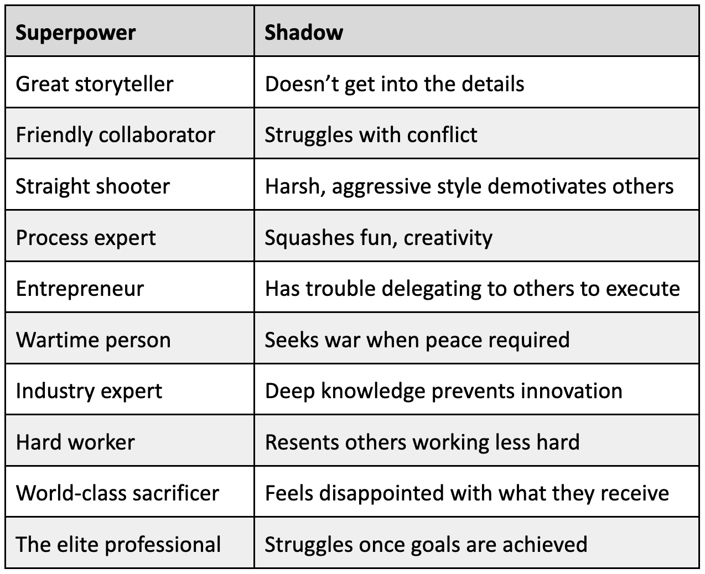

# Open Doors in Your Career by Unlocking the Dark Side of Your Superpower

*In the shadow of any strength is a weakness that should (and can) be overcome*

When successful people get stuck in their career, the cause can be a mystery. But the results are very real. Promotion is perpetually a year away. Feedback is a mix of, “This person is one of our top performers,” and the occasional (often whispered), “These glaring weaknesses require immediate attention.” Switching companies may not help. And it’s possible that the person has an abrupt ending, either being asked to leave the company or quitting in frustration.

Perhaps your boss, an executive, or even someone you manage is excellent in many regards, perhaps even world class. But this person might also suffer from very real development areas. Maybe this is even you. At first, it’s easy to ignore these concerns, as nobody is perfect. But as the years go on, these subtle issues only grow and become increasingly elusive.

Often I preach to the folks I coach, “What gets you here isn’t what gets you there.” But it’s hard to turn this adage into action. They ask, what do I need to change? Well, the first place to look is your superpowers. Though it may feel really counterintuitive, your strengths could be the source of your struggles. It’s possible for a superpower to shine so brightly that it obscures a challenge, or weakness, intrinsic to your strength. So you are not only *not* gaining other skills, you’re also *not* fixing the hidden shortcomings that will inevitably hold you back.

This article is devoted to this crucial topic and accompanies [Episodes 13](https://www.skip.show/shadows-of-your-superpowers-part-1/) & [14](https://www.skip.show/shadows-of-superpowers-part-2/) of my Skip Podcast.

**If I had read these notes 10 years ago, it would have accelerated my career by years and saved me needless frustration and challenges. In some ways, this article on “shadows of superpowers” might be the most important content that I share with my audience.**

And unlike many of my other articles and podcast episodes, this one is designed for everyone, not just the product managers or executives out there. If you have an expertise, you must be well versed in its shadows.

I know this topic sounds mysterious, and it is – just not in the geopolitical spy novel sort of way. It’s a phrase I learned from my wonderful therapist, and my hope here, as a longtime career adviser, is to unravel this mystery for you.

To make this a bit more tangible, let’s start with 10 examples of strengths all of us find among peers in our workplace and the shadows they may cast. Then we’ll introduce a process to identify these shadows, understand why they exist, and tackle how to eliminate them.

**#1: The great storyteller:** Many of us know a great storyteller. Almost every company has a few of these folks. Sometimes they’re in leadership positions. Sometimes they’re people you know in the industry. These evangelists are the people you *love* to listen to because they have great, great presence and explain complicated things so clearly.

* **The challenge:** They don’t go deep. As they paint these amazing narratives, they often don’t have a feel for the constraints. People may hear a great story and feel motivated in that moment, but then they’re unclear about how to proceed. How do you take an inspiring vision and turn it into real action? The details and constraints can get in the way of a great story, so oftentimes being able to take it to the next level is a missing skill.

**#2: The friendly collaborator:** Consider the person who’s incredibly collaborative: a joy to work with, nice, and thinking about the team. These are the friendlies, so to speak.

* **The challenge:** They struggle with conflict. In the shadow of being nice is the tendency to shy away from making really tough decisions or disappointing anyone. Collaborators sacrifice being more opinionated and emphatic about their point of view for being nice. “Nice” is a good thing – so seeing any sort of fault and addressing it can be particularly difficult.

**#3: The straight shooter:** Then there is the straight shooter. These folks say, “Well, I tell it like it is, even when it comes to people. I’m a clear communicator, principled and fair. But I refrain from sugarcoating anything.”

* **The challenge:** Not everyone is used to receiving such monotone, principled communication. Straight shooters can come across as harsh or aggressive because they are direct, yet diplomacy also has its time and place. This single way of operating prevents the person from realizing that diplomacy can also get the job done. And despite being less efficient at times, might yield better results.

**#4: The process expert:** Every company has this sort of expert: They know how to create the meetings, the docs, and the schedule. People are where they should be, and deadlines are met. Heck, every family probably has one in order to keep the troops marching in the right direction.

* **The challenge:** All work and no play … well, you get it. So much focus on process details can squash the fun and innovation that’s necessary to build a great product. On the one hand, nothing can be built without a process. On the other, some process experts have yet to learn how to introduce enough space and free-flowing oxygen into the equation.

**#5: The entrepreneur:** We all know innovators who have great concepts and great ideas and are known for the brilliance of their concept. These are often founders.

* **The challenge:** Okay, one person has an idea. Now what? The ideas person, like the storyteller, might have trouble executing. Yet when they hire people who are excellent at executing, they struggle with trusting them. They worry that the process and rigor those people introduce could slow things down and take the company away from the quick pace of the early days. They have trouble welcoming these other qualities into the light and creating the right balance.

**#6: The wartime person:** This is one of my favorites, especially in our current tech climate. When a company seeks product-market fit or needs to make a rapid shift, it often “goes to war.” Gone are the lengthy debates, excess spending, or enabling a large management team. Instead, it’s replaced with an efficient organization that stays on point, and drives progress, pace, and execution.

* **The challenge:** What happens when the goal has been reached and peace time arrives? Those who are great in wartime tend to seek more “war” as opposed to basking in peace. Companies need to live in this warlike mode to establish a footing, but then they need to also settle into peace, which creates room for long-term thinking and strategic bets. It’s a constant struggle to find the balance of being reactive and being more thoughtful.

**#7: The industry expert:** When someone has worked in an industry for some time (say, health care, travel, or enterprise sales), that person is bound to have deep domain expertise. These folks have held jobs at multiple companies working on the same business problem. So these experts get hired to navigate the nuances of a specific industry.

* **The challenge:** Their depth of expertise is so great that they can *always* find a flaw in a new idea. Interestingly, however, disruption happens through naivete. The very nature of the “expert” superpower squashes the “naïve” concepts, which are, at their core, innovative. These experts (and those around them) feel proud of this level of expertise – and that overshadows the failure to deliver a brand-new idea. This person is focused on finding the faster horse, while the entrepreneurs, due to their healthy degree of naivety, invent the automobile.

**#8: The hard worker:** Some people can work day and night, regardless of how efficient they are. Their commitment is well regarded by the company, but it comes at a cost.

* **The challenge:** Resentment. The hard workers can’t see why the folks around them aren’t also working a hundred hours a week. The shadow is failing to understand that not every top performer at a company needs, or can, spend that much time. And it makes it very difficult to build a diverse workplace if people end up only respecting and advocating for folks that can also push that hard.

**#9: The world-class sacrificer:** Many top performers have tremendous work ethic. They prioritize work above everything, ending up sacrificing family, friends, personal time, hobbies, and even health. Those extra hours deliver great results at work, so they continue to prioritize and invest. I call them power givers.

* **The challenge:** This person gives so much that no manager or company will ever be in a position to reciprocate in kind. This is, by the way, not just a work concept. This is a relationship concept. The shadow, therefore, is to always feel disappointed. Elite performers face this more than any others because they can give and have such an impact that they always feel shortchanged.

**#10: The elite professional:** The last example, I think, is one of the most curious. These tremendous professionals are equipped to succeed: One day I will have the money. One day I will have the power. One day I will have the title. It’s this very, very intense focus on that power, title, responsibility, and compensation that oftentimes results in success.

* **The challenge:** After achieving those important goals, what does that person do now? If a person’s entire world is to be wired by what’s next, what happens when all of that has been achieved? I’ve observed that they tend to become lost, and spin in all directions, until they can find another mountain to climb.

## **The path from realization to understanding to growth**

As these “examples” reflect, career skills live in a balance. Every superpower has its opportunities for development. Underneath the sparkle of their superpowers lie weaknesses that must be addressed for true career advancement. So why are they so hard to find?

**When you have a superpower, you receive tremendous praise that feeds your superpower. Your strengths create such an aura that your colleagues, your peers, and even your boss will look past any shortcomings or bad habits that need development.**

They assume it’ll go away naturally or it’s erroneous or too inconsistent to raise the issue, even informally. Why criticize one of the best and brightest?

This, of course, allows your weakness to grow unchecked, like a sidecar accompanying your strength down the road. And this only makes the weaknesses increasingly harder to address. But what was subtle in your past, might be not so subtle the more senior and visible you become. One day, the shadow will catch up to you – that’s when you hit your moment of crisis (slow promotion, culture mismatch, et cetera).

How you react when you hit this wall is critical. There are multiple camps. Some people fight back because the feedback is new and out of left field. So you immediately doubt any critique because you’ve been cruising along pretty successfully. But that is only going to accelerate your demise. Others hear the critique but lose confidence and retreat. They worry that their career was built on a house of sand and know they should make some changes, but a damaged ego and loss of confidence hold them back from doing anything. Another group will see the fault but lack the energy or skill to address the concern. These folks will ignore it and even double-down on the superpower, only to cover up their shadows. That leads to a slower demise, but the fundamental issues never go away.

The more promising reaction, however, is to seek understanding and mentorship; this camp realizes that the flaw is merely a sidecar to their strength. They embrace the idea that you can’t have light without darkness. These folks truly listen and realize this is part of the process of advancing a career. They choose to make tweaks or adjust, whether it’s for the sake of the workplace, the expectations of their employer, or the environment. This is the most sensible reaction, because, once someone has conquered one shadow, they’ll likely face another.

The trickiest part to shadows are their subtle, inconsistent nature. Perhaps you’re amazing most of the time, but then shockingly bad on that rare occasion. A person or a situation can draw out your moment of weakness. This causes any feedback to be contradictory. Or maybe you’re in a position of power, so people are reluctant to share what they’ve seen or experienced. And even when you hear it, it’s natural to justify it as just a feature of your strength – and that addressing any critique will inevitably make you less effective at wielding your superpower.

All of this is to say that addressing these shadows are challenging for most of us. Though this is skill development, much of it is a mental game. You have to accept the feedback and really commit to change. It’s like rewiring your breath or your posture because this thing you need to tweak is in some ways an intrinsic quality.

> Successful changes require three prerequisites: desire, self-awareness, and humility. It’s hard work not because it’s complicated, but because it’s elusive. So you have to desire to make a change.

Self-awareness is needed to find the subtlety and to truly listen and confront it. And, frankly, the most critical ingredient is humility. You have to be humble enough to say, hey, I’m really successful, but I’m still willing to take one step back to skip two steps forward. It’s rare to see a person possess all three, but once you have these three elements of attack, you’re 90% there. And surprisingly, once you see the development area, the connection to strength, and have the motivation to change… you might eliminate that shadow in mere weeks.

## **Five profiles for a much deeper dive**

Now that we’ve shined a light on this superpower–shadow dynamic and a process for addressing it, the best way to explain the coaching part is to run through a few deeper examples. These scenarios represent patterns I’ve encountered in the people I’ve coached or are actively coaching. Perhaps a profile will apply to you specifically, or it’ll encapsulate someone you encounter in the workplace. As you read through these, pay attention to how connected a person’s shadow is to their superpower – and how the feedback on the shadow will be inconsistent and subtle, making it all the more difficult to sort out. Last, realize that making a lasting change is less about developing a new specific skill, but rather, involves understanding and fully committing to the process.

### **Example #1: Shadows of a great executor**

Martin comes to me frustrated. He tells me that he’s great at details and at owning his work all the way out the door. Martin is a **master of execution**. But lately he’s been hearing from co-workers and even his manager that he’s too intense and pushing his team too hard. When Martin focuses so intently on completing the milestones, he isn’t zooming back out more broadly to get the team’s sense of the project or the process. The folks around him are running ragged and feeling left out of the journey toward success. And though the project hits its milestones, it doesn’t always have the right strategy and adapt the right learnings along the way.

From Martin’s perspective, he thinks his role is to *get it done* – not sit around to strategize or debate the process with a team of people. His work isn’t strategy, and if he delegates too much, he risks failure. “Frankly,” he says, “if you can’t take the heat, then get out of the kitchen.” He can’t understand why he simply isn’t appreciated for his ability to execute and faithfully leveraging this superpower.

**My take:** Martin feels that any adjustment to how he operates will be a sign of weakness. The irony is that by not listening, not adjusting, he’s showing weakness. And he’s going to hurt himself in the long run. Ultimately, if he could zoom back to get a bigger picture, he’d see that leadership is not about hitting the milestones. In fact, Martin’s desire for control of the situation is starving the strategy from being successful. Anyone who is building something needs diversity of thought and dissenting opinions. Having conversation, debating process, and getting consensus can actually save a project from flaws, which is where real delays happen. But Martin, to a certain extent, has connected the execution of the project with “winning by hitting the date,” so he’s not creating the space for any of that to happen.

**My advice:** I advise Martin to pull back a bit and delegate more, which is going to ensure that both the project and the outcome are collectively owned. He’s likely to tell me that he has some folks on his team that he doesn’t trust to handle the task. But I encourage him to run a positive and inclusive project. He needs to partner with his peers that he has certain expectations. Then, if those expectations aren’t matched, Martin can feel confident going to senior leadership and explain how events played out. This avoids being adversarial or excluding peers.

> In addition**,** I tell Martin that a hobby would do him good. It sounds hilarious, I know, but I can explain. That project and milestone have become too much a part of Martin’s identity and ego. If he has something else to control, then perhaps he’ll feel less focused on controlling this project at work and gives him greater perspective. Projects are going to come and go, but the people are likely going to stay, and they need to feel excited about the successes, too. Operating this way will undoubtedly build a better strategy and a better team, and illuminate Martin’s shadow.

### **Example #2: Shadows of a great ideas person**

Jackie is that **entrepreneur** type. She feels confident in her strategies and opinions, and she’s respected for them. Jackie has made it into leadership roles because of the novel ideas she continues to bring to the table. But Jackie is frustrated. Just like Martin, people are saying she’s not bringing them along, or fully explaining why the company is going in a certain direction. She can’t understand why people aren’t simply celebrating her concepts and insight, particularly as these capabilities have launched her into leadership roles. Instead, they are commenting that she’s not collaborative. She feels the proof is in the pudding – that she’s proven herself and shouldn’t be attacked this way.

**My take:** Though Jackie’s situation is similar to Martin, she’s the formal leader in charge. So the feedback is whispered in the halls and only comes out when her project ideas fall short. Of course, the more risks she takes, this is bound to happen. But when the team hits a setback, she doesn’t merely “lose points.” No … people come out of the woodwork to criticize and accuse, and may even show her the door, particularly if they feel like they haven’t been a part of the outcome. Jackie’s shadow is that in her desire to own the outcome she’s acting more like a dictator than a leader with great ideas. There is a fine line in being clear and decisive and being dictatorial and close-minded.

**My advice:** Jackie needs to take the time to explain her opinions, the context, and the thought that goes into those opinions. A written document might do. Opening up a bit about her reasoning will attach a lot more value to her perspective. Second, before she moves into action, she should encourage debate. Part of scaling is to enfranchise. So Jackie can have a point of view, but then openly seek debate. In the end, it’s not about Jackie adjusting, it’s about improving the quality of ideas overall and bringing folks along. If her ideas are solid, they will stand up. And by moving too quickly and not giving people a chance to understand, Jackie is essentially just leveraging her power, which is very fluid in organizations.

**When Jackie masters the art of loosely held strong opinions, as opposed to strongly held strong opinions, she can ensure that everyone is part of the win.**

### **Example #3: Shadows of a great team builder**

Max comes to me with an entirely different problem from what I laid out in the first two examples. He’s a **terrific manager**, recruiting great talent and building wonderful teams. But he’s frustrated because he’s being accused of being political. “My team loves me. My staff is loyal. My employee survey results are awesome. And my teams get so much done, we’re always on the most important projects. And I work tirelessly to build out our team culture,” he says. Yet he’s been accused of fighting too hard for his people rather than doing what’s best for the company overall. He insists he’s being principled, not political. Tensions can skyrocket when decisions are being made on where headcount goes, who gets a promotion, or how to allocate projects. But Max has always put team first and prioritized fighting for his people to ensure the company retains its best people.

**My take:** Initially, it might be hard to see why anyone is annoyed at Max, right? He’s advocating for his team just like all good managers should! But I actually received some of the very feedback Max needs to hear. I can vividly recall one quote in particular: “Look, I think you built a Maserati, and it's going through the potholes of Venice.” We might think we always want the Maserati. But in reality, it’s important to build the right team for the company itself, and this particular company didn’t need a five-star engine.

**My advice:** A great team builder, in a drive to build the best team, might end up over-building the team. That’s the shadow. So Max needs to take a bit off the team instead. He needs to realize that a high-performing team needs to be fed, so it will constantly need more scope and opportunity to prove themselves. Max is getting caught between his team’s need and the constraints and climate Max is working within. Instead, he needs to be more strategic in picking his people and his projects.

Max should also realize the team isn’t working for Max. It’s working for the company and subject to its business and goals. Max is merely a caretaker of the project and his group. Max may leave the company one day, projects will change, the economy will change, and those folks need to be prepared more broadly. When Max realizes this, it makes it easier to avoid fighting for his people every chance he gets. Last, Max needs to be open to hiring fewer A-players. If the company needs a smaller or less qualified team to succeed in the project, he needs to thin out the talent. The people that remain will be happier as they’ll see more opportunity to grow. And the A-players might lead other sister teams and find more career growth elsewhere. It’s sad for Max, and perhaps not even a job he wants to retain. But at least he’s not fighting for his people. Instead, he’s confronting reality and thinking long-term.

### **Example #4: Shadows of a great org builder**

Jenny says, “I am **excellent at scaling and managing** an organization. I give senior people plenty of room to maneuver, the strategy is always clear and on target, and the team is healthy.” But what is the shadow of scaling? Details. The weeds. And this is where Jenny is challenged. She’s accused of falling short on the details and delegating too much. Her new manager feels she lacks clarity on crucial information. But she insists, however, that part of scaling is delegating and her team knows these answers. If she ends up with all of the details, how does that scale and what role do her managers end up having?

**My take:** There’s a happy medium between knowing none of the details and micromanaging every person and decision. Without some understanding of the data, the decisions, and the context, Jenny is going to have a hard time expressing her point of view and clarity about projects.

**My advice:** To avoid going too high-level or into the minutiae, Jenny should try going a level deeper in only a few key areas – and signal this. She doesn’t need to know everything her leaders know. But digging in will give her a lot of perspective on the challenges the team, or org, is facing and its constraints. It’ll help drive more successful strategies and ensure Jenny can support the team better. This doesn’t need to happen on every project, and it’s not about taking over. She should build the skill to “share the steering wheel,” which means avoiding displacing the driver or sitting in the backseat. That not only retains space for her leads, but also doesn’t consume as much time as she fears it will. Her managers see her more engaged, quickly surfacing the right tensions without dragging in the teams to every review. And a nice side benefit, with the additional context, is that she enjoys the work since it’s less academic and closer to the customer and business.

### **Example #5: Shadows of the old guard**

Evan, who has worked long and hard in his career, is worried about some of the feedback he’s hearing. I see him as a bit of a stereotype for any successful company – as the old guard who knows his stuff. He’s the **company expert**. “I understand the history of what we’ve done in the past,” he says. “I can predict how the things we try will play out with uncanny accuracy, making me one of the most valuable members of the team.” But Evan is sensing that he’s resisting innovation by holding on so tightly to the way things have always been done. Evan insists he’s open to ideas, but he’s also not going to entertain ideas simply for the sake of enabling a team. He wants to be thoughtful around what does and doesn’t work – that’s his role – yet feels that the team needs to just come up with better concepts instead of lowering the bar.

**My take:** Evan has it tough here, because his superpower is a double-edged sword, both helping and getting in his way. Most of the great innovations didn’t look very winning in the beginning. Nearly all experts could have (and likely did) bet against those ideas. Interestingly, founders of companies who do bet on that new thing or service are often pretty young, because they are still naive enough about what can go wrong. They very often fail, but on occasion, win big because what shouldn’t have worked, very much did. And though Evan is a great gatekeeper against bad ideas, he’s also filtering out the potentially good ones.

**My advice:** Since Evan has a reputation for killing things that don’t seem like big ideas at the beginning, no one will try big things, and that company won’t attract innovative thinkers. So it might be time for Evan to give up the day-to-day decisions to someone else who is a bit more naive yet still able to usher in new concepts. Evan can still oversee the work, but he should be scaling up and teaching, not deciding.He needs to shift from asking, “Will this work now?” to, “What would you need to believe for this to be big in a few years?” By pushing the team to think long-term, he can still leverage his knowledge of the ecosystem without killing ideas in their infancy.

## **Conclusion**

There is a lot to process here. But understanding this relationship between your superpowers and shadows is essential to making those meaningful leaps in your career. Just remember that every strength will have an opposite. It’s natural, as much as it’s natural for light to exist with darkness. You’ll have to keep a careful eye out for these shadows, listen to feedback carefully (even if contradictory or subtle), and then pull back on your strength to address that shadow. Once you do, it’ll be a big breakthrough for your career. I’m hopeful that we can keep this conversation going, so please comment about any strength-weakness challenges you are working through.