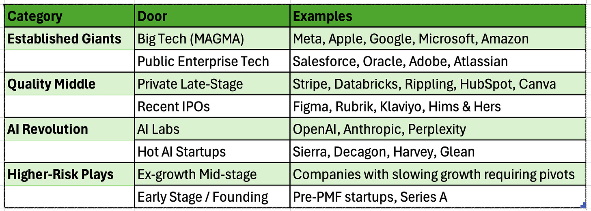
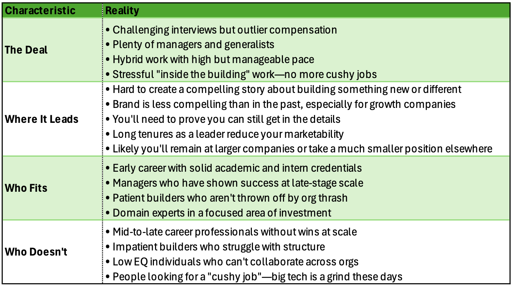
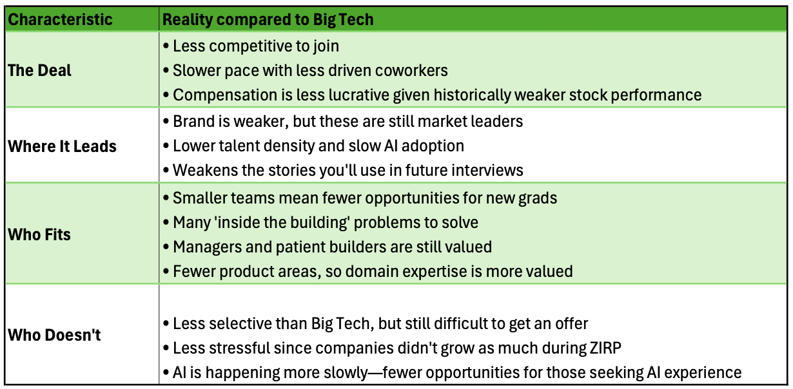
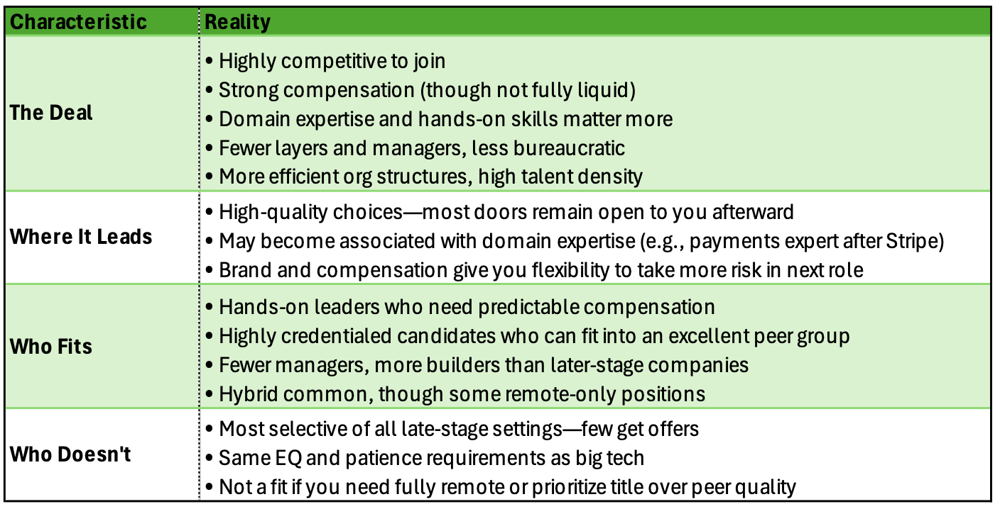

# The PM Career Framework for AI (Part 2): The Large Tech Playbook

*From golden handcuffs to quality middle ground—understanding which doors are actually open to you*

In [Part I](https://theskip.substack.com/p/the-pm-career-framework-for-ai-how), we introduced the career framework that’s helping hundreds of PMs cut through AI-era anxiety. The core insight: stop asking “which opportunity should I take?” and start asking “which doors are actually available to me?”

Since then, the questions keep pouring into [Nikhyl.AI](http://nikhyl.ai)—over 600 now. And many cluster around specific career transitions:

*“I’ve been at Meta for nine years. The offers I get are half to one-third of my Facebook comp. I know I’m overpaid for my market value, but how do you walk away from that kind of money even if you’re not learning anything new?”*

*“I got an offer from Salesforce that’s actually less total comp than my current late-stage startup role, but it’s all liquid RSUs versus paper money. Am I settling for mediocrity or being smart about risk?”*

*“I have offers from both Stripe and Databricks. Their secondary markets are active and the equity feels almost as good as liquid. Is this the sweet spot—upside potential with some liquidity?”*

These aren’t abstract career questions. They’re people standing in front of specific doors, trying to figure out what’s on the other side.

Today, we’re opening those doors.

---

### **A Quick Recap: The Framework from Part I**

Over the dozens of career conversations I take every month, I’ve developed a consistent process for working through them. In my previous articles, I laid out some of my foundation: instead of jumping straight to “should I take this job at Company X?”, we first build a deep understanding of who you are and what actually constrains your choices.

That means examining:

**Your qualifications**—your credentials, the stories you can tell about impact, and the strength of your professional brand. Have you shipped things that matter? Can you articulate your role in those outcomes? Do people in hiring positions recognize your name or your companies?

**Your constraints**—the hard realities of compensation (are you making 2-3x market rate with golden handcuffs, or are you equity-burned and need liquid income?), location (can you relocate to the Bay Area, or are you locked into remote work?), and pace (can you sustain 9x9x6, or do you need boundaries?).

**Your identity**—where you fall on the spectrum from builder to manager. Builders are hands-on, in the details, constantly using AI tools and hacking on side projects. Managers think in systems and scale, building through people and process. Most people lean one direction, and the market increasingly rewards clarity about which one you are.

**Your level**—early career guidance looks very different from senior leader guidance. The doors available to someone two years out of school aren’t the same as those available to a leader in their power years or to an executive with only 1 or 2 jobs remaining.

Once you’ve mapped these inputs honestly, you can evaluate which doors are realistically open to you—and stop torturing yourself over opportunities that were never available in the first place.

This article is about those doors.

---

### **The Eight Doors Framework**

We organize the market into eight distinct doors. Each represents a different type of company with different requirements, trade-offs, and career trajectories.

These aren’t theoretical categories. The [Skip Community](http://skip.community) includes ~150 heads of product and senior product leaders from companies across all eight of these segments—Big Tech, AI labs, hot startups, late-stage private companies, and everything in between. This framework comes from observing what PM life actually looks like at each phase, who thrives there, and who doesn’t.

Think of these as case studies. For each door, we’ll examine who fits, who doesn’t, where it leads—and answer real questions from people considering that transition.

This article covers the first four doors: the Established Giants and the Quality Middle. These are where most experienced PMs find themselves, and where most of the golden handcuffs anxiety lives.

---

### **Door 1: Big Tech (Meta, Apple, Google, Microsoft, Amazon)**

---

*“I’ve been at Meta for nine years. The challenge is no one is offering anything close to what I make here—the offers I get are like half to one-third of my Facebook comp. My stock grants have tripled since I joined. I know I’m overpaid for my market value, but how do you walk away from that kind of money even if you’re not learning anything new?”*

**You probably can’t.** And that’s okay to acknowledge.

Your compensation is elevated due to the stock run-up and your high level. Leaving and rejoining later would mean a massive loss. A few more years isn’t going to kill you professionally.

But here’s the trade-off you’re making: your brand is likely getting worse over time. Younger companies, especially the hot ones, don’t build products like late stage companies build products. Your intuition about how things get done—the processes, the timelines, the org structures—may be getting less relevant each year. You’re harvesting compensation while your relevance slowly erodes.

If you eventually want to move to a smaller company but you’re within a few years of a financial milestone, maximize the harvest with a clear exit timeline. Or lose the anxiety if you are comfortable remaining at larger tech companies.

---

*“I’m at a big tech company managing a large team. I know I’m in a ‘harvest’ role—making 2-3x market rate. Instead of feeling guilty about not learning, I’m trying to figure out how to maximize this position. Should I coast and focus on side projects, or push for L7 promotion to maximize comp before I eventually leave?”*

**Stay and maximize, but probably not to chase promotion.**

If you are certain you want to eventually leave, the goal isn’t the next level—it’s to continue making more than your market rate. Promotion won’t improve your stock externally, and longer tenures can actually reduce your marketability for the companies you’d eventually want to join.

If you want to stay sharp, look for internal mobility to a team doing something more relevant. But if your primary objective is financial optimization, you’ve already identified the strategy. Just be honest that this is a harvest play, not a growth play. And that you might not be completely sold on leaving the company in the first place.

---

*“I’m a Senior IC PM at big tech for 10 years. I feel like I’m not learning fast enough and potentially pigeonholing myself as a big-tech person. I’m 35 and interviewing for a Senior PM role at a hot AI startup, but it feels like a step down—peers would have way less experience and I’d take a pay cut. Is this career suicide or necessary evolution?”*

**For most people in your situation, it’s necessary evolution—if you can get the job.**

Ten years at big tech as an IC PM is a long time. The fact that you’re getting interviews at hot AI startups is a signal: you likely still have the credentials to make the jump. If you land the role, you might quickly become one of the senior members and learn an entirely new way to build product.

The “step down” feeling is the old playbook talking. In the new playbook, joining a smaller, faster company as a Senior PM—even if your peers have less experience—is often how you upgrade your intuition. Your big tech tenure taught you scale; now you need to learn speed and tackle outside the building problems.

That said, these roles are competitive. But if you get the offer, it’s probably a signal it’s time to leave.

---

*“I’m a staff-level IC at Pinterest being actively recruited by Apple. But I wonder if Apple is truly elite and future-facing—they blur PM/PMM roles, insist on Sketch over Figma, and have limitations on using AI internally. Would joining Apple actually be a step backward for someone wanting to build AI-native products?”*

**Apple builds products uniquely, even among big tech.** That playbook may be less likely to translate to how AI-native companies build products in the future.

But there’s nuance here. If you land on an AI-focused team at Apple, you’d get close to the needs and challenges of building AI products at massive scale. That has value given where we see the market heading.

However, if your goal is to understand how AI-native companies work—flat orgs, fast iteration, builder-first culture—you’d likely be better off finding a more nimble organization. Unless you have compensation concerns that make Apple’s stability essential, a big tech move probably doesn’t accelerate your learning in the direction you want.

---

*“After two failed startups where equity went to zero, I need something more stable. Friends who stayed at Google are millionaires. Should I finally just take a boring big tech job for the money, even if it means becoming obsolete?”*

**Maybe, but don’t assume it’s “boring” or easy.**

There’s no cushy big tech job anymore. These roles are hard to get and hard to do well. The interview process is selective, and the work is genuinely demanding.

More importantly: you came from startups. You’re probably a builder. Big tech might frustrate you—the pace, the politics, the “inside the building” problems that consume your energy when shipping small iterations on mature products.

If you have the credentials for big tech, you might have credentials for the Quality Middle—companies like Stripe, Databricks, or recent IPOs that offer stability plus higher talent density and faster iteration. Don’t assume your only options are “risky startup” or “safe but stagnant big tech.”

---

*“I’m 2 years out of school at a struggling startup. Got an offer from a big tech APM program. Everyone says Big Tech is where careers go to die, but wouldn’t 2-3 years there set me up better than grinding at unknown startups?”*

**Yes, this is likely a good move—and here’s why it’s more valuable than it might seem.**

First, understand that PM is historically one of the hardest functions to break into. Unlike engineering or marketing, you can’t just learn it in school. Traditionally, you need to have built or sold something to develop the product intuition that makes you credible. APM (associate product management) programs are one of the few early on-ramps into the function before you’ve “earned” it through building or selling experience.

This question also illustrates an important point: leader career guidance is different from early-career IC guidance. The “big tech is where careers go to die” narrative applies to tenured leaders who’ve stopped learning, not to someone two years out of school.

That said, be clear-eyed about what you’re getting. There are fewer APM positions today than during the hiring boom, and most programs teach you to navigate big-company complexity—stakeholder management, process, org navigation. That’s “inside the building” PM, not the hands-on builder PM that AI-native companies value. You’ll build a brand-name credential and learn how products get built at scale, but plan your exit accordingly.

Most APMs leave early anyway, often because they don’t want their boss’s job. Use the program to learn, then make your next move from a position of strength.

---

### **Door 2: Public Enterprise Tech (Salesforce, Oracle, Adobe, Atlassian)**

---

*“I got an offer from Salesforce that’s actually less total comp than my current late-stage startup role, but it’s all liquid RSUs versus paper money. The work seems less exciting and the talent density feels lower than Big Tech, but at least it’s stable. Am I settling for mediocrity or being smart about risk?”*

**It depends on what you’re leaving.**

Public enterprise tech is essentially a weaker version of the previous group of companies: liquid compensation, less competitive interviews, but also less exciting work and generally weaker peer groups. You’ll likely build a playbook that’s less relevant to future employers at faster-moving companies.

That said, there are real advantages. It’s less difficult to join, which means good people can get bigger roles. Scale means managers are needed, which helps if you’re stuck in the middle-manager squeeze.

The key question: what’s your current late-stage startup? There’s a massive difference between Stripe-tier private companies and ex-growth startups with inflated equity that may never be worth anything. If you’re at an ex-growth company, take the Salesforce role. If your current company has real secondary liquidity and strong momentum, the calculus changes.

**Take the role if you’re leaving ex-growth. Stay if your current company’s talent and compensation are genuinely better.**

---

*“I’m a Principal PM at Intuit who’s been here 1.5 years. I was hired for a specific initiative that got deprioritized shortly after I joined. I haven’t worked on anything impactful, but my mentor says to wait for internal mobility. My stock refresh was lower than peers because of my low-priority work. Should I stay and hope for better projects, or leave for big tech/AI startups before I get pigeonholed?”*

**Look for something else—but be realistic about what you can get.**

Here’s the hierarchy that matters: **Stories > Company Brand > Tenure.** A short stint is easily explained by org dysfunction. It’s better to move and improve your story than to stay and have nothing to show for it.

Don’t assume waiting will improve your situation. After 1.5 years, you’ve had enough time to settle and ship something. If you haven’t, something is off. Either the project was genuinely busted—in which case, run an internal and external search simultaneously—or your qualifications might be weaker than you think. The better projects often go to better people; sometimes it’s not bad luck, it’s signal.

You already left your last company for similar reasons. That pattern is worth examining. But the answer isn’t to stay in a bad situation hoping it improves. The answer is to be honest about what roles you can actually get, then pursue those aggressively.

---

*“I’m at a public enterprise tech company as a Director. We keep talking about AI transformation but we’re moving at a snail’s pace compared to the market. I could be the one driving our AI strategy, but the org is so risk-averse. Is it worth trying to be the change agent here, or should I go somewhere that’s already AI-native?”*

**If you can get an AI-native role, that’s likely the better path. But it’s not guaranteed you’ll qualify.**

Older tech companies do need AI transformation, and they move slowly. If you successfully lead that work, you’ll learn something about building AI products. But adding an AI feature to an existing product often won’t teach you that much. And failing to move the needle won’t add to your story either.

AI-native companies have efficient org structures and build with less, more quickly. Those skills are hard to learn in a big, slow organization.

But here’s the reality check: AI-native companies are highly competitive. It’s unclear whether you’d qualify. Before assuming you can walk through that door, test it. Apply to a few AI-native roles and see what happens. The answer will tell you whether “be the change agent here” is your strategy by default or by choice.

---

### **Door 3: Private Late-Stage (Stripe, Databricks, Rippling, HubSpot)**

---

*“I have offers from both Stripe and Databricks. While neither is public, their secondary markets are active and the equity feels almost as good as liquid. Plus the talent density is incredible—everyone here shipped something important. Is this the sweet spot—upside potential with some liquidity?”*

**Yes, this stage checks most of the boxes.**

Strong compensation, higher talent density, and a bias to ship and innovate. You get the stability of an established business with the energy of a company still building its future. The secondary markets provide real liquidity—not lottery tickets, but actual value you can realize.

It’s highly competitive to join. You might need to take a step back in level. The pace is often heavy and there’s likely some in-person requirement.

But for someone who can clear those bars, this is what I call the **“quality middle”**—arguably the best pocket in the market right now.

Who wouldn’t fit here? Someone who needs fully remote work. Someone who can’t pass the selective interview process. Someone who wants a bigger title more than they want to work with exceptional peers. If none of those apply to you, and you have offers from both Stripe and Databricks, you’re in an enviable position.

---

*“I’m currently in final stage interviews for 3 positions after a long post-layoff search. One is a hot AI startup, but the others are Stripe and a fintech company. I have strong fintech background from my last role. Everyone says chase AI, but wouldn’t I have more impact at Stripe where I actually understand the domain deeply?”*

**Great news after a layoff to have choices like these.** Both paths can be career-additive.

Late-stage companies tend to favor domain expertise. They’re often B2B companies in deep verticals—security, data, fintech. Building domain expertise always gives you future choices within that domain. The conventional wisdom is depth first, then breadth. Stripe would deepen your fintech expertise and position you well for the entire fintech ecosystem.

AI is becoming another domain. Today it’s more picks-and-shovels, but eventually we’ll see more opportunities above the stack. Having that foundation will have lasting value.

The decision often hinges on risk tolerance and compensation structure. The hot AI startup probably has more variable equity and higher pace. Stripe has near-liquid compensation and proven business fundamentals. Both upgrade your resume. Pick based on which trade-offs align with your constraints.

---

*“I have a long career in risk management starting with traditional finance (Moody’s, American Express) and transitioned to leadership roles at scaled fintech (PayPal, Stripe). I’m burned out with ‘fixing’ foreseeable issues that come from unconsidered business choices. Should I move out of tech, or out of risk management?”*

**Here’s a question worth sitting with: isn’t being the “fixer” part of the job at this level?**

Late-stage companies have dysfunction. They’re often not PM-driven, with engineering or business teams holding more power. The bigger the org, the more patience and skill you need to get things done.

That’s frustrating. But it’s also the job for many senior product leaders. Someone has to navigate the complexity, build consensus, and fix what’s broken while the company keeps running.

If you don’t want to be that person—or can’t—then yes, find something else. But recognize that you may be describing a core function of product leadership at scale, not a bug in your particular situation. The question is whether you still want to do this work, not whether the work should exist.

---

### **Door 4: Recent IPOs (Figma, Rubrik, Klaviyo, Hims & Hers)**

Recent IPOs are essentially the liquid version of private late-stage. Same talent density, same competitive interviews, same emphasis on domain expertise and hands-on skills—but with fully liquid stock.

The main difference is volatility. Young public companies have stock that moves. Your compensation is real and liquid, but it fluctuates more than established big tech grants.

For someone choosing between Stripe and a recent IPO like Klaviyo, the decision often comes down to excitement for the domain and risk preference on equity structure rather than fundamental differences in the work or culture. Both doors lead to similar places; both require similar credentials to enter.Recent IPOs are essentially the liquid version of private late-stage. Same talent density, same competitive interviews, same emphasis on domain expertise and hands-on skills—but with fully liquid stock.

---

### **What’s Next: The AI Revolution and Higher-Risk Plays**

We’ve covered the Established Giants and the Quality Middle—the doors where most experienced PMs find themselves, and where most of the golden handcuffs anxiety lives.

But there are four more doors we’ve only hinted at so far:

**AI Labs** (OpenAI, Anthropic)—where elite builders work at unprecedented pace, where management roles are rare, and where the interview process has extremely low acceptance rates.

**Hot AI Startups** (Sierra, Decagon, Harvey, Glean)—where 9x9x6 is real, where PM is introduced later than traditional companies, and where the equity might be a bubble or might be generational wealth.

**Ex-growth Mid-stage**—where fully remote is common, where titles are bigger, and where your equity might be worth nothing.

**Early Stage and Founding**—where the decision is more emotional than rational, where ex-founders are highly valued, and where the spreadsheet-makers shouldn’t apply.

In Part III, we’ll walk through each of these doors with the same framework: who fits, who doesn’t, where it leads, and real questions from people considering those transitions.

---

### **Your Move**

The framework isn’t meant to tell you what to want. It’s meant to show you what’s actually available.

Most career anxiety comes from trying to force open doors that were never available in the first place—or from staying behind doors that no longer serve you.

Map your constraints honestly. Know whether you’re a builder or a manager. Understand what each door requires and where it leads.

Then walk through the one that’s actually open to you.

**Have your own career question? Get personalized guidance at [Nikhyl.AI](http://Nikhyl.AI)**—where these questions came from.