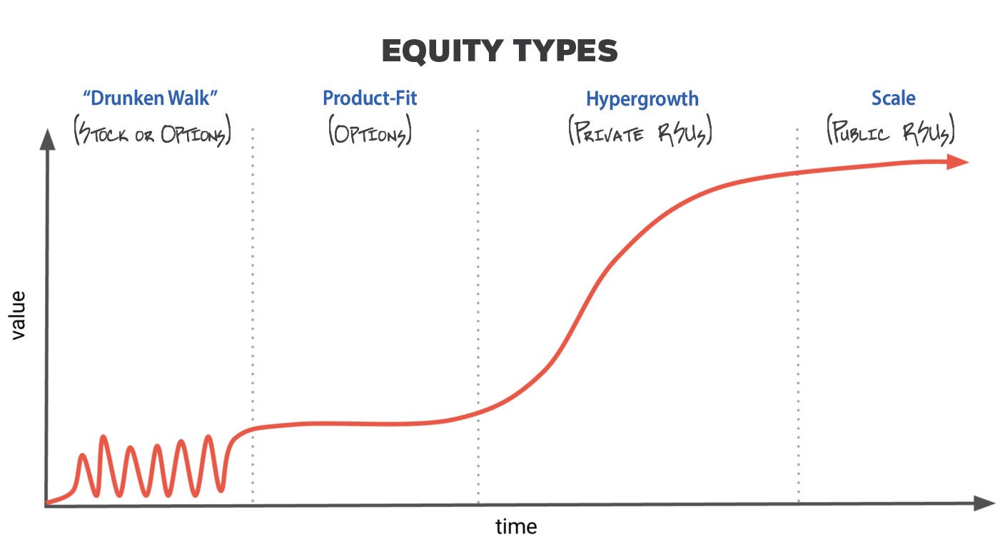
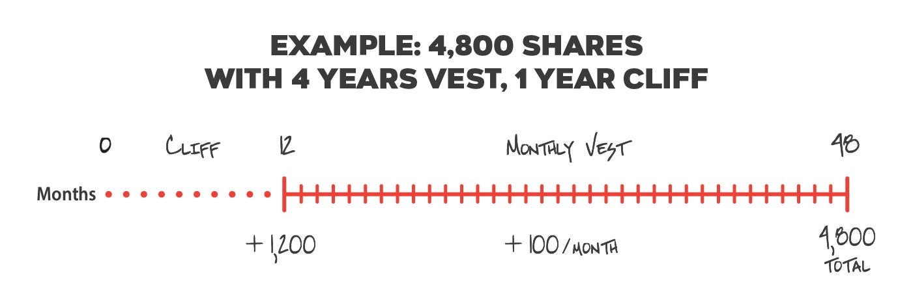
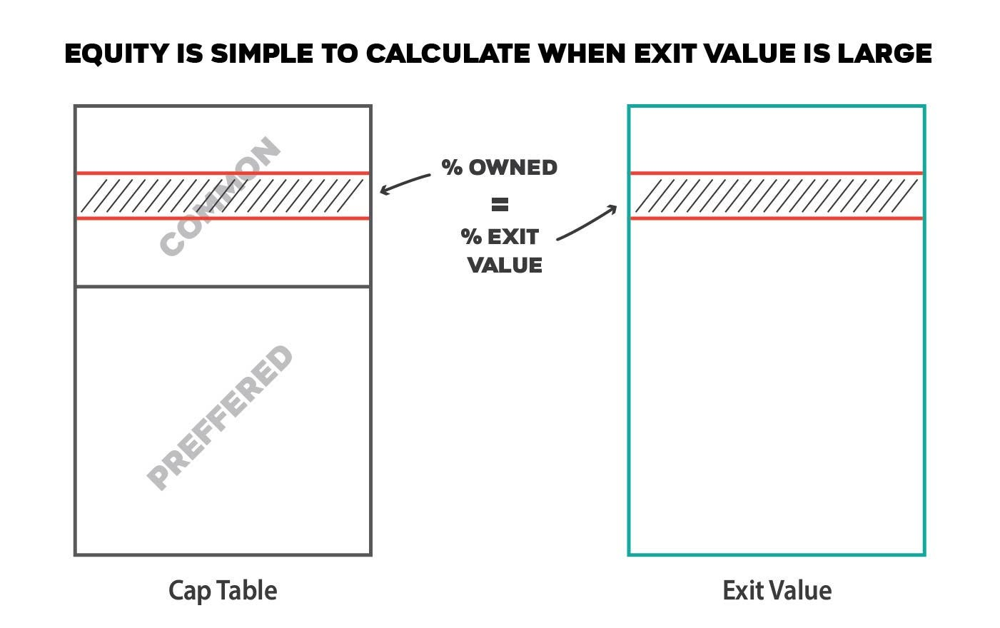
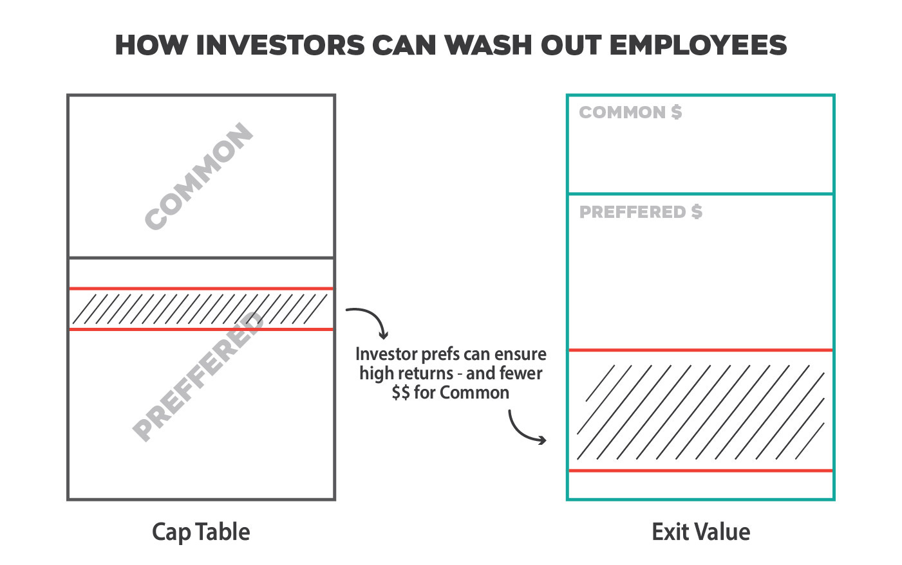
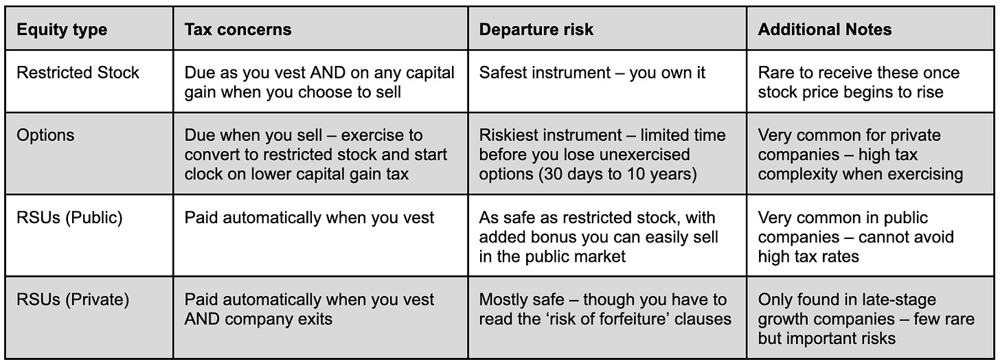
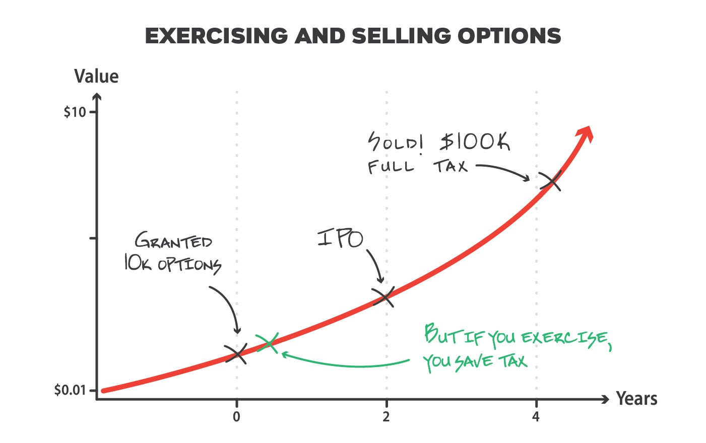
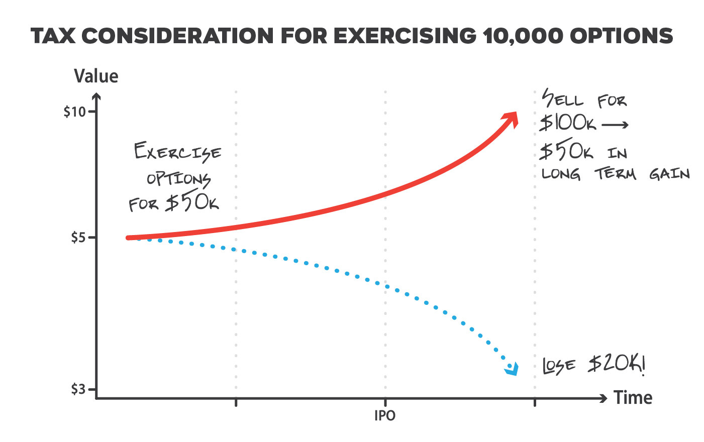

# How equity in tech companies works

*A guide to understanding and maximizing the stock in your compensation package.*

*This article is the second I’ve written devoted to compensation. The first one ([link](https://theskip.substack.com/p/tech-compensation-beyond-the-offer)) focused on the details surrounding the other parts of a pay package, including salary and bonuses, negotiation tips, and how to think about risk. This article is devoted to FAQs on equity and the best way to value this important instrument. It accompanies the Skip podcast (listen [here](https://www.skip.show/explaining-equity-and-executive-compensation-with-goodwin-procter/)) during which I spoke with [Anthony McCusker](https://www.goodwinlaw.com/en/people/m/mccusker-anthony) and [Lynda Galligan](https://www.goodwinlaw.com/en/people/g/galligan-lynda) from Goodwin Procter to demystify equity.*

Let’s say you are exploring new tech roles and are fortunate to be reviewing different offers. Less fortunately, comparing the offers against one another is really challenging. How do these equity packages work? How do you value and compare the equity? And how do you not make a mistake when getting paid in equity?

It’s no secret that working for technology companies can be very financially lucrative. Many tech companies, unlike in other industries, offer equity as part of their employee compensation plans. This instrument has resulted in billions of dollars of wealth creation and a bonanza for employees who were lucky enough to join a company and see their stock rise with its success.

If your compensation package includes equity, this article is a guide to the critical things you should understand. To be honest, I’m a little surprised I need to write this article. Given equity’s importance, you’d assume your company, your friends, and the blogs out there would have the necessary information. But there is a lot of detail and nuance. And, frankly, employers and managers are nervous to talk about this stuff. So I worry that too many of you don’t understand your equity and could be en route to making an error.

This article isn’t designed to replace a professional. I’m not a financial advisor, an attorney, or an accountant. I have just received a lot of different kinds of equity over the years, whether it’s from advising, founding, or working for tech companies. And I made a few mistakes along the way. This article is written as plainly as possible, covering consistent patterns and my most important lessons. It’s not a substitute for reading those legal documents or consulting a professional. In fact, my first draft tried to tackle some of the gnarly tax rules around equity, and I realized that I don’t have perfect clarity there. So hopefully this will elevate a novice to an intermediate level of understanding and leave expertise to, well, the experts.

Given the complexity of this, I’ll start with a few basics and then go into depth on each of the various equity instruments. My goal is to help you understand how each of these instruments works, including the basics of taxation and how to keep your equity when you depart a company. Along the way, I’ll highlight some of the common errors, which I hope will deepen your understanding.

## **EQUITY BASICS**

Equity is ownership in the company. It means you get a portion of the proceeds if the company exits (meaning IPOed, sold, or acquired). A company issues different “instruments” depending on how mature it is and whether it is private or publicly held.

We’ll review the differences between these instruments in greater detail. But before we get to the details, let’s ensure that you understand the basics – beginning with the language. Here’s a reference chart, but don’t worry if it doesn’t all make sense – I’ll use them in context below to help explain them.

**Key terminology**

* **vesting:** time period when you earn your equity.
* **cliff:** period of time in which you are accruing equity, but have yet to receive it.
* **exercise:** act of converting a stock option to actual stock; price is based on your strike price.
* **strike price:** price set by the company for your equity grant.
* **409A:** price for the equity value of the company based on third-party assessment.
* **underwater:** when the strike price is above the current market price.
* **exit:** when a company moves from being private to being liquid; usually this is due to going public or being acquired.
* **cap table:** the name and size of ownership for all of the equity holders in the company, including founders, employees, and investors.

**Vesting and cliffs**

When you get an equity grant, you don’t receive your stock all at once. It accrues over time in what’s called a vesting period. Most commonly, this is a four-year period, and an equal portion (1/48) is doled out every month. So if you leave the company after two years, you’ll have earned half of your equity grant. If you leave after 30 months, then you’ll have 30/48 of your equity. To further protect the company, equity grants commonly have a “12-month cliff,” meaning that if you leave within the first year, you get none of your equity. You have to hit that one-year anniversary to keep your equity. Some companies have a longer vesting period beyond four years – but unlikely shorter. A few companies don’t have a cliff (Meta, for example), so you vest right away.

Your equity represents an ownership percentage of the company. Let’s say you receive 1% of a company in stock when you join. Then five years later, the company is acquired for $100M. If you still own that 1%, you just made $1M. If the company had been acquired two years after you’d joined, you’d have $500K on the day of acquisition. And half of your stock still remains to be vested, available to you if you complete the full four-year grant period.

#### **Explaining option pricing and 409A**

Most people who join privately held companies are going to be issued stock “options.” If you receive an option, you have the right to buy a share at whatever the price was when your option was granted (likely whenever you joined the company). You don’t get the share itself, so vesting these doesn’t require you to pay taxes, and you can accumulate them without having to pay tax.

There is a bit of complexity in determining the option price (also known as strike price), which is the price you pay when you convert your option to a share in your company. Your company will reveal this price to you when you get your option paperwork. It’s set by the board of directors and applies to your full option grant. This means that if you get 20,000 options, all of your options will be set to the 409A price.

How is this 409A price set? Every year a company has an outside firm update its valuation. Its value is based on market conditions, the strength of the business, and other factors. This produces a price for the options, which the board uses to set the 409A. The board can choose to use this price, or it can use a higher price (not a lower one).

#### **Watch: Your option price may be set artificially high**

In 2022, we saw a huge market correction. Some public companies lost half their value, others lost more than 90%! But a private company doesn’t have a stock price that trades daily. And its valuation (the number used to set its 409A price) may have been based on a frothy market and the company’s growth rate. Today, the climate is different, and these valuations have come way down, even if the company’s business remains strong.

A board can choose to lower its 409A for new employees. But lowering a company’s option price creates lots of complexity for employees as well as investors – and is usually done only once in its history to avoid the company sliding down a hill. So companies tend to wait until they are forced to refresh (likely annually), and want to avoid lowering these at all costs.

What does that mean for you? It means you might end up joining a company with an option price that is artificially high. If/when the company exits, you won’t gain as much per share as you might have if the price had been more accurately set. Or, worse yet, you might not make any money.

If you work for a private company and the valuation has dropped, this very much applies to you. Your option price is based on a previous, higher valuation. Companies set their option price as low as they can, as it helps to make the options affordable for the employees. And there is always a gap between the price investors pay for the stock and the 409A, right up until the time of IPO. So maybe when a company exits you will still make money. But an inflated option price just reduces your equity compensation.

#### **Watch: Dilution and share counts**

But over those years when you are vesting, the company will raise more money and hire more employees. Investors and those new hires will also receive equity. As more equity is issued, the overall number of shares increases, diluting all previous shareholders, including you. Your ownership percentage is based on your equity divided by all of the total pool size, which is a combination of equity owned by employees, investors, and founders, plus an allocation for future employees. So your ownership percentage in the company will drop over time. If you are trying to estimate the value of your equity, it’s how much the company will be worth when you sell multiplied by the ownership percentage you have *at that time,* *not when you join*.

As a side note, when I look at a startup equity offer, I still focus on equity percentage, not number of shares. Though it might be tiny portion of the company, it’s easier to compare offers between companies and avoid drawing the wrong conclusions. To be concrete, an offer of 10K from company A might look smaller than 30K from company B. But what if company A had 10M total shares and company B had 100M? Ownership percentages quickly indicate company A’s offer is far stronger.

#### **Watch: When investors silently dilute your equity and dramatically reduce your return**

Earlier, we used an example in which you own 1% of a company and it was sold for $100M. It’s possible you actually don’t make $1M, especially if the investors don’t end up profiting from the exit.

There are different types of shareholders in a company: Founders get “founders stock,” employees usually get “common stock,” and investors get “preferred stock.” (To keep things simple, assume founders stock and common stock work similarly.) Common goes to employees in exchange for services performed for the company, while preferred is given to investors in exchange for their money. If the company exits at a high valuation, the differences here are not material. Everyone just converts their shares to common and ends up with their percentage of the company.

However, not every company exits with a handsome profit for investors. Let’s say SquishyBank is an investor and eyes your company. SquishyBank thinks the company is going to be the next thing and invests $20M in exchange for 10% of the company. So your company is now valued at $200M. Now if, down the road, the company exits at $1B (and no further dilution took place), then SquishyBank receives $100M – great outcome, they made $80M.

But what if the company sold for $100M? They put in $20M and now their 10% is worth $10M, or half of their original investment. Instead of losing money, investors have protections in their preferred stock agreement that require them to be made whole (get their original investment back) before employees get paid. (That is why it’s called preferred.) In this scenario, Squishy might get their full $20M initial investment back and so would all of the other other investors. If, say, all of the investors put in $40M total, there would be $60M remaining between the employees and founders. You would get 1% of $60M, not $100M – far less than the $1M you would have guessed.

And to make things even more complicated, some investors might want a guarantee of more than just their money back in the worst case. SquishyBank might really struggle to value your startup at $200M. But if the company guarantees they’ll get 3x their money on exit, well – maybe owning 10% of the company at a $200M valuation is okay. If the company has a huge exit at $1B, SquishyBank gets more than 3x their money back, so they don’t need to use any special preferences. But at $100M, they and the investors might take all of the money, leaving the employees with nothing.

So things get really messy with all of these investor terms. Investors add critical financing but drive dilution, and on exit they might be first in line. What’s worse is, as an employee, you rarely know whether the investment terms result in a clean cap table. This is usually company confidential and only surfaces at exit. Typically, brand-name investors are reluctant to create complex terms, because it sets precedent for future investors. So do your best to ask the company about the investor terms, outlining the above scenario, and understand its likelihood.

## **Comparing Equity Types**

### **Restricted stock**

Early-stage companies usually start by issuing “restricted stock.” This is the easiest instrument to understand. You own a percentage, as noted above, and you get your prorated portion of the company when you sell. The value of your stock can also be based on the price and number of shares you own as well. Meaning you receive 10K shares, vest it over four years, and (assuming the company is public) you simply multiply your 10K shares by the price you can sell it at.

This is so simple – why don’t companies just stick with issuing stock for all of their employees? It’s mostly due to taxation (though stock comes with rights, which they might want to hold back, too). And this is why most of this is so complicated.

Since equity is a form of compensation, naturally the IRS wants to tax it. This means that as you accrue stock through vesting, you’ll owe tax. When the company is early, the value of the stock is miniscule, and as such, the tax is negligible. But as the value of the company grows, its stock price rises. So if you receive 1,000 shares this month, and it was valued at $6 per share, you’d owe tax on $6,000. But you can’t sell the stock yet, so you’ll have to take this out of your savings. As growth accelerates, this gets expensive fast and can quickly become unaffordable. Companies do have a couple of solutions to avoid this burden.

If the stock price is very low, your company might allow you to “pay tax” up front, before you even start vesting. You have to file paperwork within 30 days of receiving your stock grant with the IRS (called an 83(b) election). This signals to the IRS that you are paying tax for your vested and unvested portion. So let’s say the stock price is $0.10 and you will acquire 10K shares over four years. When you join, you file an 83(b) and indicate that you are receiving $1,000 in compensation. Now as the stock price rises, you don’t owe tax on the price increases.

Eventually, when you sell the stock at, say, $10, you’ll have to pay the remaining tax. If you’ve already paid it up to $6, then you have $4 to go. But more likely, you filed an 83(b) and your basis is $0.10. And most importantly, you probably have held it more than a year – so you end up paying long term capital gains. This is far lower than the rate for ordinary income and highly desirable.

But as the price rises, companies end up switching to stock options, which scale well past the first few employees.

### **Stock options**

Though I covered a bit about options in the definitions above, let’s ensure we understand by using an example. You receive 10K options (vesting over four years) at the price of $0.01, meaning if you pay $0.01 you will receive 1 share in the company. So let’s say after four years, the company is public and the stock price is valued by the public markets at $10.01. In this case, when you sell, you net $10.00 for each share, or $10.00 x 10K = $100K.

For some of you, that’s all you want to know. Options are different from just getting a stock grant from the company because you have to buy them, but you don’t pay tax as you vest. When you go to sell, you just flip the option into stock and sell it, so you net the difference. In this example, the option price is immaterial so your proceeds are almost like you own stock. But imagine if the price is $6 – when the stock sells for $10, you net $4 per share or only $40K. Big difference! So make sure you consider this price when you consider your potential proceeds.

Back to our chart – the $100K that you receive will be taxed as though you received a bonus from your company, basically at your normal income tax rate. That’s because you are technically buying your option, getting a share in the company, and selling it shortly thereafter. This “same day sale” allows you to put no money down – you are basically buying and selling instantly. But if you want to reduce this tax rate, you’ll have to exercise the option, get stock in the company, and hold it for a year. This is what I described for restricted stock – it drives the tax difference from ordinary income to long-term capital gain, which could be half the rate.

#### **Watch: You can file an 83(b) just like you can for restricted stock**

A common way to pay long-term capital gains when you sell options is to file an 83(b) election, just like I described above with restricted stock. Note that 83(b) early exercise might not be available to all employees, and might not be practical when the exercise price is high. Just ask your company. But take a typical example in which it’s available and you have 10K options at $0.10. You can pay the company $1,000, file an 83(b) election within 30 days, and then start the clock on all of the equity, both unvested and vested.

#### **Watch: Trying to reduce your taxes doesn’t always yield more value**

Let’s say your company gives you 10K options at the price of $5.00. In this example, the company might be later stage, but there might be all sorts of promises that the company is heading toward IPO soonish. Though you are still vesting the shares, you decide to write a check for the full vested and unvested portion equal to $50K (10K x $5). Now each month as you vest, you are getting actual stock in the company. And for each block of stock you receive, you start the clock on capital gains. Now if the company goes public at $10 per share, this was a pretty good decision. You’ll be able to pay less tax for the profit you made than if you hadn’t exercised the stock, But if the stock drops below $5 when it’s public, you actually are going to realize a loss. And if you hadn’t tried to improve your tax situation, you would have lost nothing – you would have just written off your equity.

My advice is to exercise when the price is low and you aren’t putting too much money at risk, based on your net worth. Avoid borrowing, as an example, just to own the options and save taxes. I’m all for lowering your taxes, but if you can’t really afford to hold the stock, it might be easier just to pay the extra taxes if/when you choose to sell.

#### **Watch: You can lose all your equity when you leave your company**

If you leave a company and are holding a stock option in that company, you have to be very careful. These options have an expiration date. This means that after some period of time defined in your stock option agreement (e.g., 90 days), when you leave the company, the options will expire – and you lose even the options you’ve vested! Imagine this situation: You join a company, work for a few years, and leave the company for another role. Eventually, the company exits and you go to cash in your vested options. But the company informs you that you don’t have any equity. This exact thing happened to me when I was paid in stock options for a consulting role. After I completed the contract, I received stock options – that expired a few months later without me knowing it or even attempting to exercise them. So check the expiration period very carefully when you receive your stock option grant!

To avoid expiration, you need to convert these options into actual stock. That is, exercise the option and pay for the stock at the grant price. If the grant price is low, it won’t require much cash, but if it’s high, it’s a lot of money to shell out. When the company is still private and the stock can’t be sold, it’s a particularly big risk. Some people borrow in this situation, hoping they can pay it back if/when they can liquidate. (There are even firms that specialize in assisting employees with this, sharing some of the risk in exchange for some of the proceeds.) Some people just walk away from their equity. Or buy a portion of their options. And others actually just don’t depart the company, basically waiting for an exit and avoiding getting fired.

Companies have reason to favor shorter exercise windows, as they like to be consistent across their employees, feel it drives retention, and has favorable tax consequences. Longer windows are also a lot harder for the company to administer (and might require a conversion from ISO to NQ options, check with your accountant on these tricky situations). But these short exercise windows can lead to tragic outcomes for the employees. Always ensure you understand the time you have to exercise your options if you are joining a company. They are sometimes negotiable in the offer letter, especially for executives that have most of their compensation tied up in equity. And it’s best to negotiate compensation terms up front than when you have little leverage and leaving a company.

## **RSUs**

RSUs stand for **restricted stock units**, not to be confused with **restricted stock**, mentioned above (yeah, tell me about it). RSUs have some magical qualities, essentially fixing some of the taxation challenges that come from restricted stock. Many large public tech companies now issue RSUs for employee compensation.

If you join Meta or Google, as an example, your offer might include an equity offer that says $400K over four years. If the stock price was $40 when you join, that would translate into 10K RSUs. To start, think of this RSU grant like I described the restricted stock grant described above. Your RSU might vest monthly or quarterly, just as restricted stock. So after a year, you’d have 2,500 in RSUs – which maps exactly to 2,500 shares of stock in your company.

Now, just as with restricted stock, when you vest your RSUs, you do immediately owe taxes. But your employer solves this by selling the stock needed to pay your tax as soon as it vests. So instead of actually getting 2,500 shares in the example above, your company might sell about 1,000 shares to pay your tax and you’d get the remaining 1,500. (Pro tip: Your employer may underwithhold, especially around state taxes. If you are getting large RSU drops, it’s worth it to check with your accountant and to pay quarterly estimates to avoid penalty.)

Ultimately, the IRS is happy because the moment you receive stock it gets paid. The company is happy because it is ensuring that you are withholding taxes at the right time (by selling an appropriate number of shares). And you are mostly happy because you don’t need the stock price to rise to earn money. As an example, in the above scenario, if the stock didn’t change value over four years, you actually receive the $400K you were promised. And if the stock drops in half, you’d receive $200K. But in both of these cases, with stock options, you’d actually receive nothing since the option price did not increase! It’s a massive difference in compensation since you don’t need the stock price to rise to get paid versus just vest.

The main downside to RSUs is that there isn’t a simple way to reduce taxes. Since they are sold immediately upon vesting to cover taxes, they are taxed as ordinary income, which is your highest rate.

## **Private RSUs**

Late-stage companies increasingly issue private RSUs, like unicorns valued at $1B+. They were created in response to the challenges with issuing options when the stock price is high. Options are hard to value, since to know how much you earn, you have to subtract your option price from the future sale price. This makes it really hard to estimate your future earnings. And options in a highly valuable company are simply too expensive to exercise, which might be necessary to keep your vested equity if you leave the company. And trying to borrow money, find another buyer to help you out, et cetera is very messy and might require the company’s cooperation. So employees find themselves imprisoned by the company’s success and reluctance to go public.

A few years ago, these late-stage startups began to issue a new equity instrument modeled after public RSUs. These private RSUs work a lot like their public counterparts. Let’s return to the example used above. You receive $400K in your equity grant. This maps to 10K RSUs and you vest these, say, every quarter. Each quarter, you need to pay taxes for what you vest. But unlike the public case, the company can’t easily liquidate the RSUs needed to pay taxes at each vesting, since it’s privately held.

But the IRS is watching your vesting carefully, ready to pounce every quarter. So on vesting, the company doesn’t issue you actual shares in the company (as they would with restricted stock). Instead, it promises that when the company goes public (or gets acquired), you’ll get your stock. And at that time, the company will sell a portion of your shares to withhold your tax for everything you vested. So it’s a different version of the public use case. You are earning stock just like in the public example, but you can’t sell. If after two years, the company does go public, you’ll receive your 5,000 shares minus the shares needed to cover the tax.

This makes the compensation easier to model, just like in the public RSU case. You don’t need the valuation of the company to rise – you just need it to be liquid to get your money. There is risk, of course, that the equity never becomes liquid – the company could fail to go public or get acquired.

But unlike options, if you leave a company and have private RSUs, you keep your vested RSUs. So let’s say you leave in two years and walk away with your 5,000 RSUs. Then, a couple of years later the company goes IPO – your RSUs convert to stock just as if you were still employed. Though you will pay full tax at that time, at least you haven’t lost your equity (well, except for the corner case covered below).

#### **Warning: Private RSUs might expire**

Though this is an unlikely event, it’s very much worth flagging. The IRS isn’t fully buying that when you vest a private RSU, you don’t have to pay tax. From their vantage point, it’s compensation that is due to you, so they normally would want you to find a way to pay tax against it, much like if you received restricted stock. They don’t care if you can’t sell the stock – they want to consider it an unrealized gain. But if they were to force you to pay tax as it vested, it would defeat the purpose.

The company argues that you don’t have to pay tax as it vests, because your equity may expire. Translation: Private RSUs have a time period, say seven years, in which the company must go public or be acquired. If they don’t, you lose all of that equity. You heard it right – in this example, seven years from when you join, if the equity is not liquid, you’d lose the stock. The IRS sees this as enough risk that it doesn’t require tax until the company exits. And keep in mind, when the company does go public, the RSU switches to a public RSU, and this expiration is no longer applicable – because the IRS finally gets its money as you vest.

To my knowledge, this expiration has never happened to an employee in a company. But as companies stay private longer and longer, and as the IPO market shifts, it’s possible this will happen. It would be devastating to ex-employees as presumably the company would find some way to assist current employees. But definitely look for the “risk of forfeiture” clauses in your RSU agreement to determine how long you may have.

#### **Warning: You could lose your private RSUs upon exit**

RSUs are painful and expensive to administer, which is partly why they often vest quarterly not monthly. They are new as well, so many companies avoid using them altogether. But as a company prepares for IPO and issues public RSUs, it may choose to issue employee RSUs at that time. So let’s say you join a company that has announced it’s going public in six months. And you receive your 10K private RSUs. As you vest, the IRS no longer believes there is much risk that your stock will expire in seven years. After all, the company is close to going public, but you are not paying taxes as you vest. So your employer has to make a stronger case that you might not receive your stock beyond just a long expiration period.

If your company is close to going public, it simply changes the rules such that if you leave the company, your stock will expire and you’ll receive nothing. That’s a pretty serious risk and satisfies the IRS that you might not receive your equity. And this time period is hopefully short, so it’s not a terrible burden to the employee since once it goes public, you’ll get a standard public RSU and start paying tax to the IRS. But it’s a real risk – so again, check the risk of forfeiture clauses and ensure that you can keep your vested stock when you exit. Some companies are very conservative, so they may introduce this clause when the company is a year or more from IPO – which means you really can’t leave and retain your equity until it exits.

#### **Watch: Selling before your company exits**

There are increasingly more choices for employees who have private equity in a company. In the past, you just waited until the company exited. But over the past few years, some investors are open to acquiring private common stock, especially for high potential or distressed companies. This allows employees who have vested stock to sell it privately or through a sale that your company organizes.

So let’s say SquishyBank is investing $400M in your company. They might take $200M in preferred stock and $200M in common stock. That means employees can get liquidity as though the company went public and the company doesn’t have to issue more shares for $200M of the investment.

This requires stock or options in the company – rarely would this option apply to RSU shareholders (since technically employees only received vested stock when the company exits). So, although RSUs have many nice benefits, you can’t get liquidity until the company exits, which increasingly is not the case for stock and option holders. And if you leave and have stock or options, it’s a lot easier to sell in the secondary market than RSUs.

## **Conclusion**

My hope is that we’ve taken you from a basic to intermediate level understanding of equity. There are still dozens of topics that I didn’t cover, including details on ISOs versus NQ options, QSBS, lots of tax nuances, and so forth. Experts get paid to be experts, and often talking with them can save you a bundle of money and trouble. If you have substantive dollars on the line, find an expert you can trust. But hopefully you’ll be better educated after reading this article, know some of the common pitfalls and the key questions to ask – and can avoid a lot of mistakes!