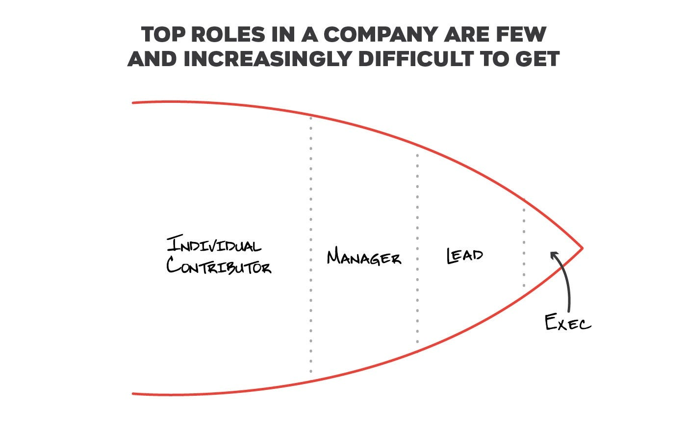
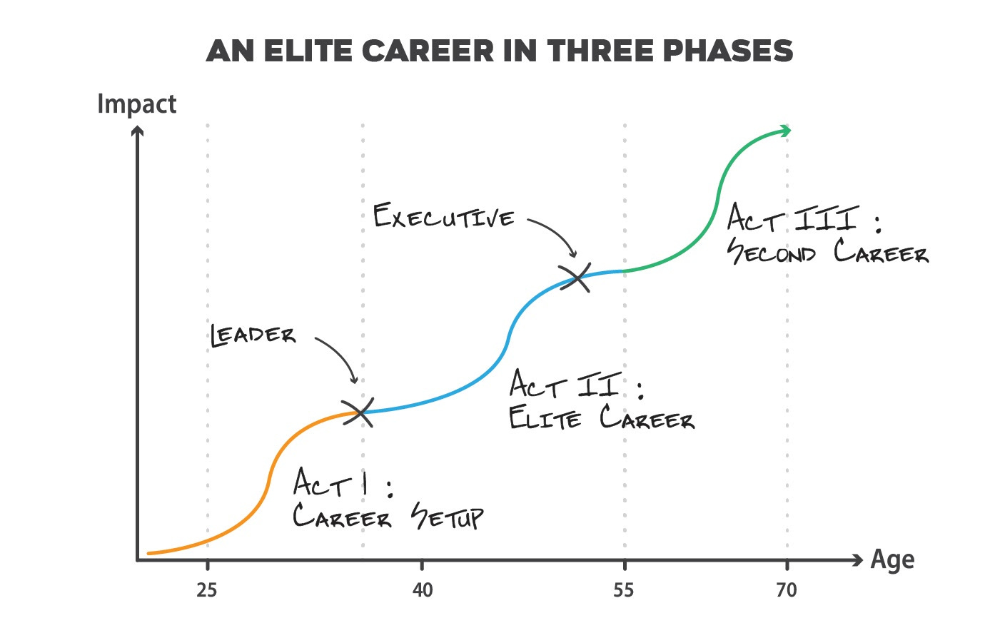
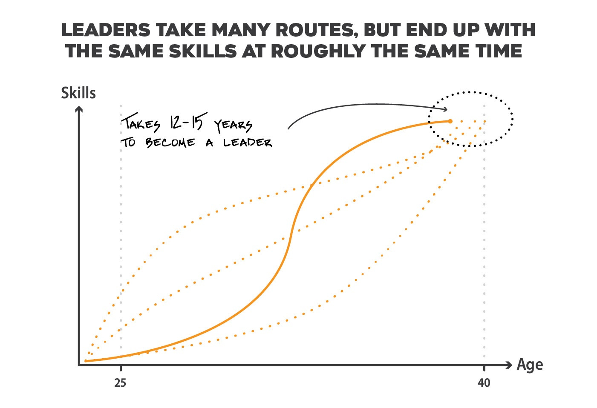
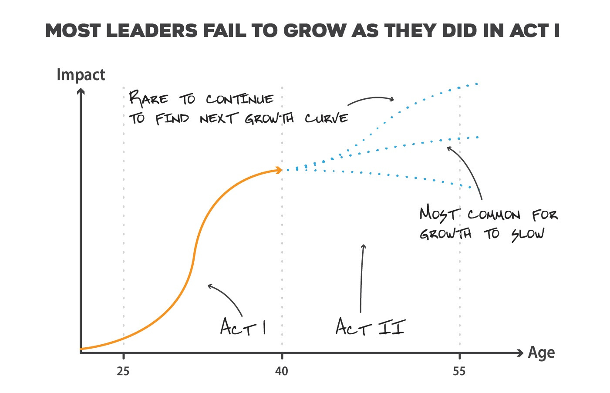
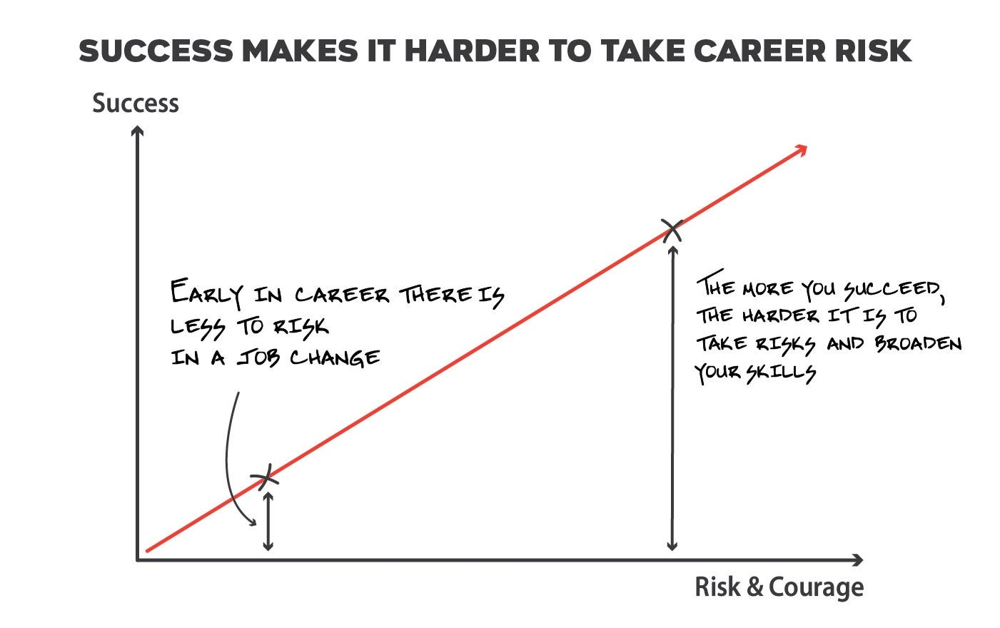
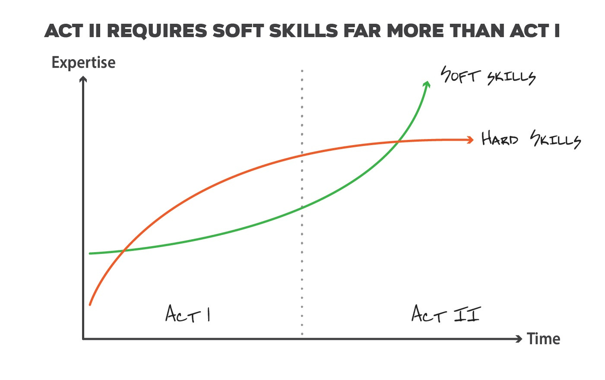

# Three crucial skills that leaders must develop to become executives

*Summary: Becoming a great executive requires a set of skills beyond what's needed to be a leader. Executive skills are subtle and can be elusive to managers, demanding a great deal of focus, courage, and dedication. These skills include taking (almost irrational) career risk, learning to scale by trusting your team, and developing advanced soft skills. New skills are hard for leaders to develop simply because they’ve already found success, which makes them less motivated to make substantive skill shifts. But those who see change as a path to growth will ascend to top roles within an organization.*

Over this holiday break, I caught up with a number of leaders I coach. A common theme that surfaced is how to ensure a person keeps growing once they join the ranks of leadership. Though a few were flourishing, more were struggling to grow beyond being a senior manager or director. So this article is devoted to the new skills crucial for you to acquire to grow from a leader to an executive.

Companies have far more individual contributor (IC) and management roles than leadership roles. So it’s hard to become a leader of these teams, and even harder to become an executive. These elite roles require highly advanced skills.

Before we dive in, let’s run through a bit of terminology. Most people start their careers as an individual contributor. They then become a manager, and eventually a leader, in their company. Midsize companies assign leaders the title of Director or VP—essentially a leader who manages other managers. In a larger company, the titles might be a bit deflated and something like senior manager or director. As the diagram above shows, far fewer end up as a leader in their organization. And even fewer transcend to the small team entrusted with running the company, titled as C-level, Senior VP or VP.

Now let’s take a look at your 40-to-50-year career, divided into segments of 12 to 15 years, or “acts” as I note below.

Break your career into three phases, roughly 15 years in duration. Most people start slowly but eventually hit their rhythm and drive impact, which could be defined in terms of skills, compensation, scope, or amount of learning. For simplicity, consider a “leader” as a director in a large company, and “executive” as a VP. Note that we are living longer these days, so even after 30 years in the workplace, you can start a second career, which is shown as Act III.

Ideally, your career will go through three acts. Act I is the “setup.” It’s where you transition from being an individual contributor to a leader. Act II is your transition from a leader to an executive. And Act III is where you start your second career, hopefully unconstrained by previous financial and personal needs. I’ll devote a future newsletter to Act III, as I find myself close to that point and actively thinking about how to maximize impact and joy in this phase. But let’s focus on Act I and II here.

Let’s start by examining how Act I unfolds for most top-notch professionals.

Though the most common route to leadership starts slow and then spikes over time, some people spike early, late, or just grow steadily over time. Regardless, they all end up with the same batch of skills about 10 to 15 years after they enter the job market.

Act I begins by refining your core skills as an individual contributor. These skills depend on your function, of course, but eventually you’ll succeed at solving increasingly ambiguous problems with minimal guidance. Next, you’ll start managing a team and increase your scope and responsibility. And, finally, once you master managing ICs, you’ll start to manage managers. This completes Act I and lands you as a leader in your organization.

One of my executive coaches, [Jim Sniechowski](https://judithandjim.com/about/), surprised me with an observation he made. After coaching hundreds of top performers, he found that most leaders, like clockwork, complete Act I roughly 10 to 15 years after they enter the workforce. Not everyone ends up as a leader, but those who rise to that level follow a pretty consistent timeline. Some start fast, lucky enough to land in a rapidly growing environment and be supported by a good manager and team, and are able to quickly move from learning a skill to mastering it. Those who start slowly might not have the growth and environment at first. But eventually the cream rises to the top, and leaders, growth, and opportunities tend to find one another.

**Act II**

So after a dozen years, most leaders have arrived or are close to arriving. Time to begin Act II. Naively, I had envisioned people growing in their next dozen years as they have in their first dozen. But Jim noted the opposite to be true—he observed that unlike in the first dozen years, career paths become highly inconsistent. Some people continue to rise, but most will stall or even decline. This is highly unintuitive, but in reviewing the careers of a myriad of leaders, I see he’s absolutely right.

Though the default growth path for leaders is to stagnate, it’s not a failure. It’s a huge accomplishment to become a leader in a company and certainly nothing to minimize. But only a small percentage, perhaps as few as 20%, continue to scale. A few of your colleagues might fit into this camp, and when you spot them, pay close attention. Each of these folks started as an individual contributor, got promoted every year or two, perhaps shifted companies along the way. Then as they became a leader, they deftly took on greater responsibilities. In a couple of years, this happened again, and in those next dozen years, they were promoted into a C-level or a VP role at a scaled company, became a venture capitalist, or successfully transitioned into founding a company or embarked on a second career.

What causes some to stagnate while other people rise? **I believe to ascend into an elite role professionally, you need** ***different*** **skills in Act II from what led to your success in Act I.** And the leaders who struggle to evolve fail to realize “what got you here, isn’t what gets you there” and retool themselves.

**When good enough is not enough**

When you reach Act II, you’re comfortable and have a successful career. But to grow, you need new experiences, which likely means you need to change jobs. Change now takes courage and significant risk—you have more to lose than you had in Act I. So most prefer to avoid making big changes, resulting in fewer new challenges and much slower growth than they experienced in Act I.

Think back to that first apartment you had when you left home and school. It likely met your needs at the time: Perhaps it was a one-bedroom or you had a set of roommates. Or maybe it was designed for adventure. It definitely wasn’t designed for the long-term. It’s liberating to know when decisions aren’t durable. When you leave this place, it’s unlikely you’ll give it much thought. After all, it’s designed for you to outgrow.

Now fast-forward 10 to 15 years, after you’ve purchased your first or second home and you’ve established roots in that particular city. What will it take to move again? No doubt, we could always move again to a bigger, better home. But it’s more of a luxury than a necessity. So many people simply don’t do it, instead being content with staying the course, avoiding the pain and cost of moving, and focusing their energies elsewhere. After all, ask people your parents’ generation how long they’ve stayed in their homes and you’ll see the majority don’t want to keep moving.

I think this same thing will play out in your career. You’ll take risks in Act I because, by default, you have little established. Every direction requires you to step onto thin ice, risking something. But then you find yourself on thick ice, with the possibility of an Act II. Why risk wandering back onto thin ice? It’s far easier to remain a harvester than become a pioneer again.

Think about the stretch roles you might want to take on downstream in your career. These executive roles are competitive to get and go to professionals with broad, diverse work experiences. Even if you stay at your current company, you’ll need to build a portfolio of experiences, ranging from overseeing build-from-scratch projects to scaling successful products, acquiring both peacetime and wartime leadership skills.

Yet as I note, it’s increasingly more difficult to switch roles when you are in rhythm and comfortable. But it’s necessary to amplify your career, which is why most leaders stagnate and fail to continue to grow in Act II.

**The hard truths about soft skills**

Getting things done in a workplace is some combination of what you know (“IQ,” or hard skills) and how to use your knowledge (“EQ,” or soft skills). Act I is where you build out functional expertise. For a software developer, it’s how to effectively write quality code, tackle more complex technical problems, work in a team, and eventually manage a group of individuals. For a product manager, it’s how to run a meeting, set goals and direction, drive accountability, and deliver useful products to end users.

Most focus on the development of hard skills because they are tangible and easy to measure. But soft skills are essential and need to grow exponentially for executives.

Though a successful career requires a blend of soft and hard skills, when you start out, hard skills are considerably more important. But as you head into Act II, your soft skills are more critical to your success. In fact, the professional world is littered with insanely talented leaders who never became executives because they simply didn’t learn how to improve themselves, influence others, or manage their emotions. Let’s examine these three specific soft skills to illustrate this point.

* As mentioned earlier, to grow you must take risks and constantly put yourself in new, challenging, and increasingly ambiguous settings. Your current expertise will help navigate these new roads, but you’ll need to build new talents and adjust your existing skills to truly excel. Most leaders don’t have an intense desire to reinvent themselves—they’d prefer to continue pushing on the skills that made them a leader to begin with. But new challenges require new approaches that fit the new environment, not just replicating the past. So in Act II you must be humble, be highly self-aware, thirst for self-improvement, and be able to hold things loosely so that you can quickly recalibrate and build the necessary skills.
* When you join the ranks of leadership, getting things done is more than getting your team to execute in a good direction and managing the individuals. More substantive projects require you to convince and influence the other leaders in the company working on adjacent projects or disciplines. This requires building strong relationships with other senior people, some who work in entirely different functions. It requires powerful listening skills, patience and empathy, an interest in compromise, and the ability to diffuse conflict. These soft skills are difficult to master and less likely to build in Act I because projects are smaller and less complex organizationally. But they are key in unlocking success in Act II and moving forward to Act III.
* As you grow as a leader, your scope increases, the problems are increasingly ambiguous, and the solutions are unclear. Though you might have the knowledge to tackle these challenges, you might not be prepared for the emotional ups and downs. The majority of my leadership coaching is to help people manage these anxieties and frustrations. These include:

  + “I get nearly zero feedback so I feel like I don’t belong.”
  + “The company simply doesn’t acknowledge my importance. It’s taking far too much time to get promoted, increase my compensation or my scope.”
  + “I’m frustrated by how slow it takes to make things happen.” Or, “The bureaucracy around here is crippling.”
  + “I just don’t understand my tenured co-workers. They just feel so stuck in their ways, unable to consider new ideas.” Or I hear, “These new people just have no sense of how things are done around here. They are impatient and shoot before they aim.”

Though all of these observations might have merit and might require action, the accompanying emotions can be crippling. They can buckle you in on a never-ending roller coaster ride, preventing you from working through the problem. I think Act I is far more predictable, so the emotions are simpler and more common to manage. But in Act II, the stakes feel so much higher, so the ups and downs feel far more extreme and require far more advanced soft skills.

**Trust others, not just yourself**

As you become a leader, you start by mastering a small project and then gradually increase responsibility and scope. As the company trusts you to own bigger and bigger problems, you succeed by owning all of the details and goals, whether they are big or small. As you succeed, the race doesn’t end—instead, you start a bigger, more challenging adventure. So with career progression, the problems only get harder and the better you have to become to thrive.

With this added responsibility, at first you might just end up working harder and increasing your level of engagement. Up to this point, your success has mainly come from making good decisions and mastering the details. So naturally, as the problem space gets bigger, you increase focus and absorb more context. Sadly, there are only so many hours in a day and your capacity is finite. So on your path to becoming an executive, mastering each detail will hold you back. You’ll need to develop a new, crucial skill: building teams and trusting the people in them.

Though managing and trusting people is vital for all leaders, I think many people can be mediocre-to-average managers and still become leaders in a company. Management skills aren’t as important as measurable impact. For many leaders, they don’t need a great team around them—they just make the important decisions and ensure the leader works hard enough to avoid dropping any balls.

So to scale yourself, you will need to recruit leaders who can work and thrive under you, likely from outside the company. And you’ll need to learn to trust them, even when you don’t have full context. Leaders who are scaling learn:

* how to prioritize and be efficient with their time
* invest in finding and managing great people
* dive in at the right altitude
* how to make the right decisions by asking just the right questions

During Act II, these skills move from additive to essential. You simply cannot continue to take on more scope if you don’t have these talents. But using them requires reworking your working style, since you’ll have to substitute trust for detailed knowledge. You’ll need to lean on your team instead of doing things yourself. This ends up being very challenging for most new leaders, since they became successful without honing these skills. And that’s another reason so many leaders slow their growth.

**Conclusion**

After reading the challenges that come with Act II, please don’t feel discouraged from pursuing an executive career path. If you are in Act I, do your best to recognize and pull forward the skills noted above. And if you are in Act II, realize that career growth will rapidly decelerate by default. To keep pace and continue to grow, you will need to aggressively seek new talents and skills.

By the time you are on a leadership path, you have more to lose by making substantive changes. Yet the best roles require diverse experiences and require your courage to leave a comfortable environment. Your soft skills will increasingly become essential, as you need to influence more people and have the strength to reinvent yourself. And last, you’ll need to build and trust your team to expand your scope.

If you can master these new skills, you will not only climb to the top roles within a company, but also have a far more fulfilling career.