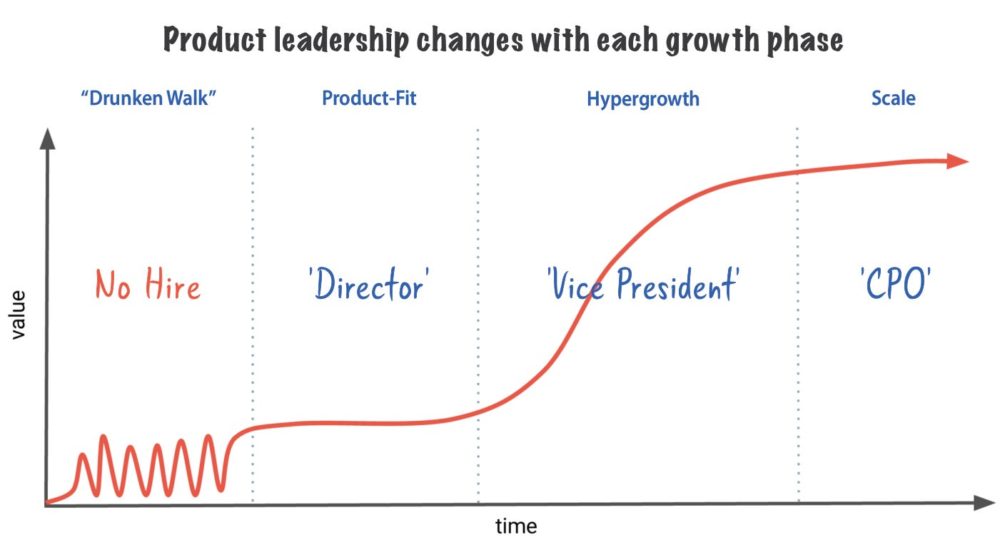
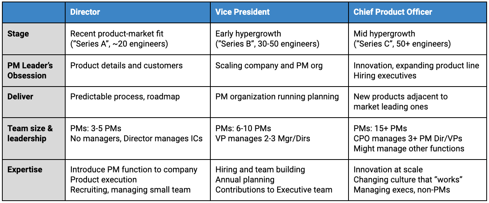

# Dear CEO: Here are 8 tips to most effectively hire and manage your head of product

*“My board tells me I need to scale myself and hire a head of product. So now that we’re hitting our stride, I’m thinking about kicking off a search for a chief product officer for my startup. What should I know? And how do I avoid mistakes that others have made?”*

I love taking this question because a great chief product officer, or CPO, can change a company’s trajectory. But many CPO searches last 6 to 12 months. And once hired, how long will they stay in the role? *If you were to guess two years, you’d be right.* Two years for such an important position? Seems absurd, and even more concerning is that tenures seem to be shrinking, not growing.

Lots of reasons contribute to abrupt separations. In talking with dozens of CEOs and CPOs, reasons include: mismatched growth rates, role incompetence, missed expectations, unclear ownership of product strategy, or even the company no longer needing a lead. Examining these in greater detail can help you find the right person and avoid a harsh ending.

This article examines (a) why these tenures are unusually short (Hint: It’s not always a “bug” — it can be a “feature” for both the company and the product leader); (b) offers tips to shorten the recruiting timeline; and, (c) makes suggestions for how to extend a new hire’s tenure.

### **Product leaders by phase of company**

First, let’s place where your company is on the growth curve. This will help you set accurate expectations for your product leader. You’ll see skills change dramatically as the company grows. And though this article is addressed to any CEO looking to hire a product lead, it also applies to:

* **Any product manager, who aspires to be a future product lead and wants to understand what’s required**
* Management teams and/or board of directors looking to understand what a product leader does and how to assess talent
* Executive talent or recruiting search firms trying to shape (or reboot) a job specification for a new product lead search
* Existing CPOs trying to understand how they should be measured

As readers of [The Skip](https://theskip.substack.com/p/stage-of-company-not-name-of-company) know, the discipline of product management shifts radically as a company scales.

So, not surprisingly, your product leader will need to master three different product skill sets to properly scale your company. Though it’s possible to find these in one person, it’s easiest to illustrate the skills with three different individuals shown below.

Though the titles of “director,” “vice president,” and “chief product officer” are placeholders, they map to how late-stage growth companies apply the titles. A director (or a product leader without a formal title) usually manages a small team and is the first PM manager to join. A vice president manages a few PM teams, usually led by a manager or director. And a chief product officer has multiple large teams with a few layers of management.

I find this vernacular helpful when distinguishing between the different product levels. As an aside, these titles aren’t applied consistently across the industry. In particular, big tech companies usually deflate titles. So a director at Google, for example, might take a chief product officer role at a growth company. And first-time managers at Facebook commonly are placed as product leads at Series B companies (the director title above). And even more confusing, they all might use the “chief product officer” title. So in this article, a title is primarily used to clarify the distinct skill sets of a product leader, which in turn can help you formulate your needs.

### Tip #1: Don’t hire a product leader until you have product-market fit

Don’t search for a PM lead before your company is ready. Specifically, if you haven’t found product-market fit, you don’t need a product lead and a product management organization to help you find it. Instead, the founders need to help guide the company to this product.

Why? Much of this has to do with the role’s compensation, risk, and power. Founders have the lion’s share of the equity in an early startup and hold leadership roles. They hired the team, so the board and employees joined because of the founders and listen to their guidance. Now imagine bringing in a head of product. The equity compensation is probably a tenth of the founders. The lead is new and learning the business and building relationships. Yet the product needs to shift considerably, so there remains a lot of risk to the value of the equity.

Few product executives worth hiring would be attracted to this stage of company. They would be better off joining a founding team from the beginning or waiting until the company is further along and has more pull from customers.

If you need help finding product-market fit, you can find help. If you need more ideas, build an advisory board of experts who know your market and can advise you on potential directions. The ideas from this group can be a lot better (and less expensive) than a single operator. Need help with process? Promote someone from your current technical team to oversee execution. They know the product and existing process and might see this as a growth opportunity that isn’t easily obtained at another company. Or, if that’s not possible, hire a project manager (titles vary) who excels at technical execution. They don’t need to be managers and, in fact, likely have no management experience. Instead, they should know how to ship and iterate, and have basic soft skills that allow them to quickly build trust and take direction from the founders and technical team.

---

### Tip #2: Set your expectations for the product lead based on the company’s growth phase

Once you are familiar with the skills you need today for your product leader, you’ll be able to create the right job specifications for your executive search, interview effectively, and ensure that your expectations are calibrated.

> #### The skills become more sophisticated and advanced as the role moves from director to VP to CPO. The focus for these leaders shifts from obsessing about the product to obsessing about the team and eventually obsessing about innovation and scale.

Essentially, directors need to have terrific hard skills, specifically in product management. But VPs and especially CPOs need to add excellent soft skills and experience at scale. They need to manage very senior people and be experts at partnering with other executives, including you, the CEO. And to scale and innovate at the same time, they’ll need to battle the so-called innovator’s dilemma by thoughtfully identifying and timing changes in culture, process, and product strategy.

#### Director of product management

If you hear a sucking sound in your (virtual) office, you might be ready for a product leader. When customers start to line up outside the door, marketing and growth tactics are working, and investors are starting to approach you about investing proactively — you likely have found product-market fit.

Two things happen at the same time when you hit this phase. Your founding team suddenly needs to scale the company and act like executives, less like product managers. And the technical organization needs real process to drive prioritization, better communication, and product quality. That’s what a director of product management would do for you.

Essentially, your director needs to really live and breathe your product and your customers. They will have to be in the details and fully understand the customer better than anyone else in the building. So at this phase, you want someone who loves delivering product, hiring a few PMs, working with customers, and running the hallways to ensure everyone is excited and understands the roadmap.

#### VP of product management

While your director needs to be everywhere at the same time, your vice president simply cannot. The company is simply too large now. There are too many customers to know all of their requirements. The product has too many moving parts to know all of the details. And there are too many PMs for the director to directly manage. Between staying on top of planning cycles, leadership meetings with the CEO’s staff, and nonstop interviews, your director simply cannot scale. Either you need to hire a VP, or they need to step up to the next level.

Your VP needs to be a stronger manager than your director. They’ll need to know how to structure the PM organization and recruit and retain managers. They’ll need to trust their team and other functions since they no longer know all of the details. Vice presidents are part of the executive team for the company at this stage, likely reporting directly to you. So they need to know how to influence and be influenced by sales, marketing, and finance executives. And they are a key leader in quarterly and annual planning, likely driving prioritization and goal-setting for the technical team. In short, the VP is responsible for moving the product management discipline from a service to a power function.

#### Chief product officer

While most of the energy for a director and VP goes to scaling the product team, the CPO is focused on expanding the product line. During hypergrowth, the company has opportunities in adjacent markets and wants to capitalize. There is a short window in which it can leverage all of its users from its core product. Whether it is Uber expanding into food delivery (Uber Eats) or Google’s search and ads business drifting into Maps and Gmail, the best growth companies build adjacent products and transform from a single-themed product to a multi-themed product line.

A company that has one hit product works differently from when it has multiple products. It needs more sophisticated processes, entrepreneurs who can work effectively at scale, and a management team that can oversee products at different levels of maturity. As such, the CPO needs to identify key changes and introduce them at the right time while balancing short- and long-term results.

When a CPO is required, the product management team is large, looking after fledgling businesses alongside a more business-driven, scaled set of products. So the CPO needs to structure these teams with the right lieutenants and expertly hire, trust, and manage senior leaders who can function independently but work together on a consistent vision.

Many CPOs oversee more than just product management. A CEO probably has two technology leaders in the management team — your CPO and CTO. The engineers report to the CTO, but product and content designers, data scientists, and project managers might end up under the CPO. There are no rules here — in fact, some companies might elevate data and design to report to the CEO, or pull all of the engineers under the CPO. But usually the CPO leads more than just product management, so a qualified candidate would need the ability to manage a team beyond their practice area.

---

### Tip #3: Your growth rate should determine the tenure of your product leader

If your company grows too fast, your product lead might not scale quickly enough. Growth companies are challenging environments, and if, as an example, your company moves through a new phase every year, few leaders can shift from managing product directly to building a team to driving innovation so rapidly.

On the flipside, if your company grows too slowly, a top-notch product lead might leave for a bigger challenge that’s more lucrative. After all, your lead is at the top of their career. If the company begins to slow, they might get snatched up by a stronger company or be tempted to join a role at a late-stage tech company, which are increasingly ravenous for top-tech talent. The better the product leader, the more the company’s growth and culture must sustain itself.

If you and your product leader are separating due to a growth mismatch, it’s understandable.

Growth is hard to predict, and when it doesn’t track with an executive’s abilities, it’s not surprising an ending is near. But avoid separating due to mismatched expectations, which is far more common. Product management is so personal to a company (unlike engineering, marketing, and sales) that by default, your expectations are likely not well grounded.

### Tip #4: Don’t hold out to hire someone who can do ‘all things product management’

The three product leads described above are very different from each other. Yet most executive searches that I review are targeting someone who can do it all, essentially skilled at all three phases of company. This reduces the applicant pool to a few elite, hard-to-hire candidates.

As an example, to succeed in all three phases of a company your leader would need to master a hybrid of skills:

* Start hands-on, owning the process, and learning every detail of the product
* Possess soft skills that blend the historical knowledge of the company (including its strategy, technology, and culture) with their own ideas and point of view to uplevel the process and product
* Recruit and manage a team full of terrific PMs
* Innovate and build new products, taking advantage of this window when you are on top of the market.
* Become an effective member of the executive team
* Know the playbook at a substantive scale — to ensure the product continues to grow with customer demand
* Give plenty of space to founders so they can drive strategy

If you are actively searching for a product lead and this looks like your job description, you are asking the recruiting team to look for a needle in a haystack. Moreover, if you consider that most CPOs do the job only once, you have a rather limited pool of candidates to begin with. And when you find someone who possesses all of these skills, they are probably on the short list of every growth company in tech.

### Tip #5: It’s okay to hire different people to lead your product as the company grows

> #### **Just like in professional sports, different key individuals shape a winning franchise: an all-star player, a coach, and a general manager. An all-star player dominates the field. A coach is the mastermind behind the plays. And the general manager recruits and drafts the team while managing the business.**

Some players eventually become coaches and even successful general managers. But this takes time, and they have one job at a time. So instead of requiring all three traits in one person, sequence the skills and hire different people — first find a great player to establish product management at your company. Then a coach to scale the team. And finally, the GM to innovate and further scale. This is why I frame a director, VP, and CPO as different people. By sequencing these hires, you don’t lower your standards. Instead, you speed up hiring and find the right person for the needs of your company today with an eye on tomorrow.

Once you do hire a product lead, it is not a given that you will have to replace them. With the right amount of time and coaching for you and your lead, the director you hired when you first found product-market fit might successfully scale. If they don’t, convince them they would benefit from a more experienced leader above them. I’d even signal this during the interview, so expectations are clearly aligned. And if you are hiring above your product lead, ensure that the new leader has the soft skills to groom other senior leaders. In my coaching of directors, they often wish they had someone to learn from who knows their function. So they might welcome a more seasoned VP or CPO to lead the team and might remain at the company.

But if you do have to part ways, the experience they gain at your company is highly career additive and will translate well to their next company. And your company will have grown substantially, enticing higher-quality candidates. The alternative is to look for an expert with skills to navigate multiple growth stages, which is dramatically harder to identify and makes for a slower search, as tip #3 suggests. Or hoping for the best without a plan.

### Tip #6: Own the fact that you own the product strategy

Product leads are there to establish and scale the product management function. You may want to assist with strategy, especially regarding the narrative and implementation of the company vision. But given your close connection to the corporate vision and product strategy, and the success and value of the company, it’s unlikely that you will trust another executive to determine the product strategy.

Contrast that with a top-notch CPO who has successfully built a PM organization, achieved a balance between scale and innovation, and partners effectively with the management team. What’s left? Product strategy. To continue to grow, the CPO wants ownership of the direction of the company’s products — which projects to fund, which features to build, which products to kill, and how to organize the company to enable the product team. Yet unless the CEO and CPO deeply trust one another — rare for a non-founder to achieve — they end up colliding on where to invest resources, who to hire, and how to organize the company to enable the product team.

I don’t fault you for not giving up the reins on product strategy. Because it’s such a critical component of the success and failure of the company, it’s quite understandable to feel that way. Just don’t hire (or expect to retain) a CPO who wants to own this. And even more important, don’t prioritize interview questions on product strategy just to turn around and dictate the strategy once a product leader joins. It’s possible you’ll grow to trust your product leader to drive your strategy, but it’s rare and shouldn’t be a prerequisite.

### **Tip #7: A product leader is not the same as a chief operating officer**

There are people in your company who sell stuff (marketing and sales), build stuff (engineering), and operate the company (finance, legal, and HR). Then there are the people who make up product management. They rarely have authority over any of the other functions, yet they act as the glue that binds the divisions and are responsible for the success of the product. Their role is a stressful one, but many of the best leaders in the industry relish the challenge.

Given that product management is different depending on the scale and culture of the company, it’s not always clear what is and is not a PM problem. Avoid assuming your product leader should be the catchall for every problem not owned by other functions. If you do, your PM will likely do a bad job of playing out of position and will also fail to install product management. And as such, appreciably underperform your expectations.

If you find yourself with lots of “scaling the company” problems, consider hiring another “glue” executive, a chief operating officer (COO). COOs exist for a reason and are skilled differently. They are trained to look across the company and adjust the organization to be optimal. During planning, they effectively bridge the financial and product plan. And they can provide an unbiased view on which teams and products deserve investment.

### Tip #8: Once the product function is established, you may no longer need a product lead

If all goes well, you might outgrow the need for a single product leader. When product management gets established, a high-quality product leader is essential. But over time, as the PM organization takes shape, product leadership might be distributed between the general managers and executives leading the different products and business units. In this case, the product lead might find themselves squeezed between the CEO and the other leaders in the company.

I think this is a success case, especially if the company chooses not to replace the CPO when they depart. Scaling oneself out of a job is a successful mantra for all growth executives, and product managers aren’t any different.

### Summary

My hope is that as CEO you take great care in hiring your product lead. Focus on your existing needs and avoid looking for skills you don’t need yet. Follow the tips in this article to ensure that you aren’t churning through executives. Recognize that some shifts are needed as your company scales or as your product leaders struggle to grow.

And as a **final tip**, work with advisors and other executives who have experience with product management in growth settings. They can help set accurate expectations, find the right coaching for you and your leader, and help you navigate this critical yet challenging relationship.