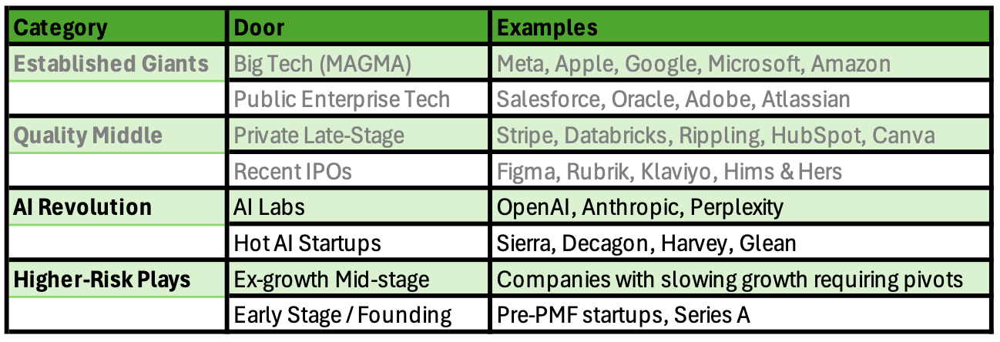
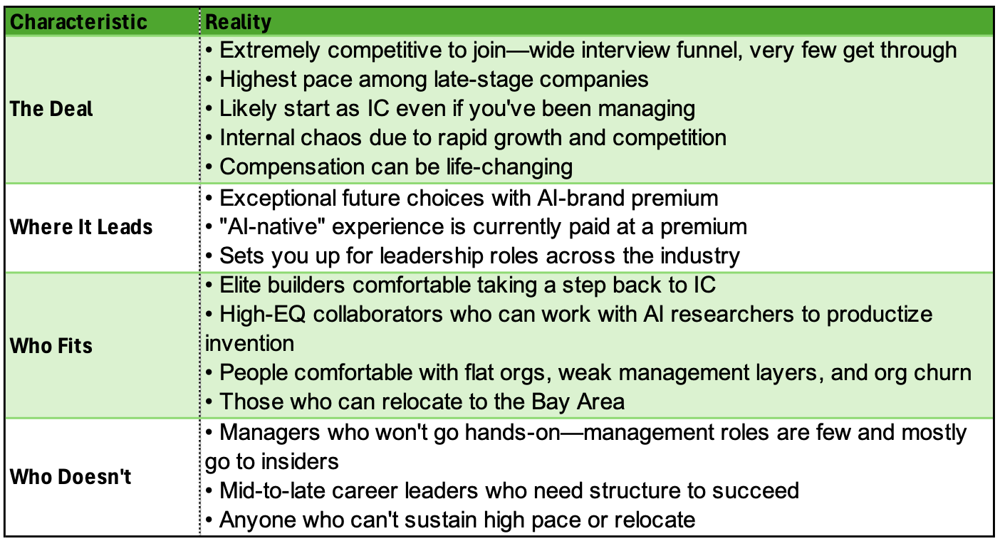
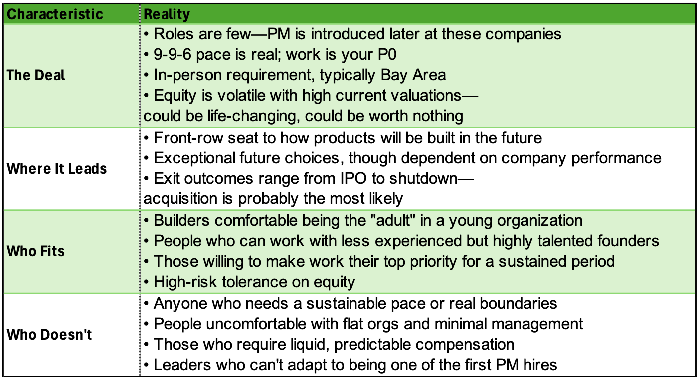
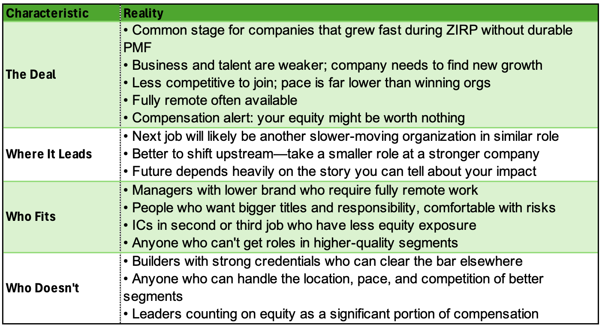
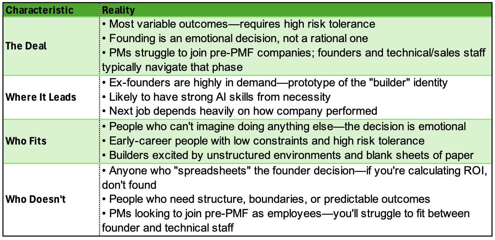

# The PM Career Framework for AI (Part 3): AI Labs to Founding

*Where the bets get bigger and the trade-offs get sharper*

Over the past few months, I’ve answered more than 800 career questions through [Nikhyl.AI](http://nikhyl.ai). The same anxiety runs through most of them: *Am I at the right company? Should I make a move? Am I becoming less relevant by staying—or unqualified to leave?*

In [Part I](https://theskip.substack.com/p/the-pm-career-framework-for-ai-how?r=8ori4), we built a framework for cutting through that anxiety. Instead of jumping to “should I take this job?”, we start by understanding your constraints (compensation, location, pace), your identity (builder vs. manager), and your qualifications (credentials, stories, brand). Once you map those honestly, you can see which opportunities are actually available to you—and stop torturing yourself over doors that were never open in the first place.

In [Part II](https://theskip.substack.com/p/the-pm-career-framework-for-ai-part?r=8ori4), we introduced the “eight doors”—distinct segments of companies, each with different requirements, trade-offs, and career trajectories. We covered the first four: the **Established Giants** (Big Tech and Public Enterprise Tech) and the **Quality Middle** (Private Late-Stage and Recent IPOs). These are where most experienced PMs find themselves, and where most of the golden handcuffs anxiety lives.

Today, we’re opening the final four doors:

These four doors couldn’t be more different from each other. The AI Revolution companies demand elite builder credentials, Bay Area presence, and intense pace—but offer potentially life-changing outcomes. The Higher-Risk Plays are almost the opposite: ex-growth companies often have the loosest constraints (remote-friendly, slower pace, easier to join) but the weakest trajectories, while founding is less about constraints and more about whether you’re wired for the emotional leap.

The questions that came in reflect these tensions:

*“I’ve been managing teams for the last five years. OpenAI rejected me after the first interview. They said they wanted someone ‘closer to the product.’ What does that even mean when I’ve been shipping products for years?”*

*“I saw that some AI startups expect ‘minimum five days a week, but Sunday’s a workday too’ and that 9-9-6 is very real. Is this sustainable? Are people actually signing up for this?”*

*“I’ve been at my company seven years. Growth has slowed to 30-40% and I’m worried the AI wave is passing us by. At what point do you cut your losses?”*

Let’s open these doors.

---

### **Door 5: AI Labs (OpenAI, Anthropic, Perplexity)**

*“I’ve been managing teams for the last five years. OpenAI rejected me after the first interview. They said they wanted someone ‘closer to the product.’ What does that even mean when I’ve been shipping products for years? How do I position myself for AI-focused roles when I don’t have direct AI experience?”*

**They’re not looking for AI experts. They’re looking for builders who can productize research.**

The genetics of these organizations are different from typical tech companies. AI researchers build magic—a new voice interface, a breakthrough in reasoning—but they aren’t always clear on what product it should become. Product people at AI labs take that magic and turn it into something hundreds of millions of users can actually use. That’s a very specific skill.

If you can’t get deeply into the technical details, can’t form strong opinions about what customers would want, and can’t manage the messy process of turning a research project into a shipping product, you’ll struggle. These companies are staying flat on purpose—they believe the closer you are to the technology, the more shots on goal you get. Middle managers aren’t what they need right now.

The path in, for most people, is to go hands-on. Get very strong on understanding the research, be opinionated about product direction, and prove you can ship. Management opportunities will emerge as these companies scale, but those roles will mostly go to insiders who’ve already proven themselves.

---

*“I’m at Amazon as a Senior PM. I interviewed with OpenAI and Anthropic but didn’t make it past the initial rounds. I obviously don’t mind going back to IC at those high-quality companies, but I’m curious—how many years should I spend at Amazon before trying again?”*

**Focus on your story and skills, not the calendar.**

One thing worth noting: these AI labs interview broadly. They have a wide funnel because the skills to productize research come from unexpected places. Don’t take getting an interview as a signal you’re qualified—they’re just open-minded about who they talk to. Getting through the process is the hard part.

The question isn’t how long to stay at Amazon. It’s what story you’re building there. Are you working on a project where your opinions are landing and having impact? Are you close to the product, shipping things that customers touch? If so, stay and build that story.

But if you’re spending most of your time on internal politics, influencing stakeholders, and navigating organizational complexity, you’re building different skills—skills that matter less to the labs. They have a blank sheet of paper they’re trying to fill as fast as possible. “Inside the building” expertise from big tech doesn’t translate directly.

If your goal is eventually joining an AI lab, consider whether Amazon is the best place to build the story they’ll want to hear—or whether founding something, joining a hot startup, or finding another path might make you more relevant.

---

*“I was a Senior AI PM at a private late-stage tech company. I’ve just accepted a PM role at Google working on LLMs. Does this move make sense as a stepping stone toward eventually landing at Anthropic or OpenAI?”*

**It helps, but probably not in the way you think.**

Working on Gemini at Google will absolutely give you relevant experience—you’ll see how AI products iterate rapidly in a competitive space, work with high-quality peers, and understand the technology at scale. That’s valuable.

But here’s the nuance: AI labs aren’t primarily recruiting for AI domain expertise. It’s a young field, so there aren’t that many people with deep AI product experience anyway. What they really want is creativity, width of product understanding, and the ability to ship and influence in chaotic environments.

Most of what you’ll learn at Google, frankly, will be “inside the building” skills—how to navigate a massive organization, influence across teams, and work within established structures. Those skills matter more at scaled AI labs than they do today, and they’ll matter even more as these companies grow. But they won’t differentiate you in the interview process.

The move is career-additive. Just be clear-eyed about what story you’re building and whether it’s the story these labs want to hear.

---

*“I moved from big-tech PM to an operational role at OpenAI. I increasingly feel I’m away from the core of the action. Part of it is my location—I moved back to NYC from SF—and part of it is my team and function. The PM managers said I’d have to move back to SF to join their team. Waiting for the NYC office to expand feels passive.”*

**Most of the core AI work is happening in the Bay Area. That’s unlikely to change soon.**

Product management at AI labs is a small, selective function. These companies aren’t hiring 50 PMs per quarter—they’re doubling their PM staff slowly and deliberately. And most of those roles are in San Francisco.

If your goal is to be in PM at one of these hot companies, the vast majority of opportunities require Bay Area presence. That applies not just to OpenAI but across the AI landscape. You might find exceptions, but you’d be one of the few.

The geographic constraint is real. If you can’t or won’t move, this door becomes much harder to walk through.

---

*“I’m a Principal PM at Atlassian weighing an IC offer from OpenAI. It’s an IC role with highly specific scope—compensation security—but I’d need to relocate to SF. I’m worried about the increase in cost of living, plus my spouse would need to find a new job. Is OpenAI worth upending everything?”*

**Probably yes—if you can sustain the pace and your career feels constrained where you are.**

Let’s argue both sides.

The case for upending everything: You’re a sharp person at Atlassian who feels like your career is on pause. The products are older, the pace is slower, and no matter how many hours you put in, it won’t dramatically change your trajectory. You’ve proven you’re qualified by getting through OpenAI’s selective process. Taking this role could be life-changing—not just in compensation, but in the doors it opens afterward. Year six at Atlassian plus two years at OpenAI creates a completely different set of future choices than year eight at Atlassian.

The case against: What if you’re actually doing well at Atlassian? What if OpenAI’s chaos—the org changes, the flat structure, the lack of management support—means you struggle in your first year? What if your spouse can’t find work, you’re miserable in a new city, and you look back with regret?

The tipping factor is usually this: if you’re interviewing at OpenAI and you’ve gotten all the way through the process, something is pulling you toward change. People who are content don’t put themselves through that. My guess is you’ll upend everything—but do it thoughtfully. Understand what you’re signing up for, mitigate the risks where you can, and recognize that even if OpenAI doesn’t pay out financially, the skip job value is enormous.

---

**One more note on AI labs:** The pace is high, but it’s not 9-9-6. People at OpenAI have kids. You can take PTO, keep a recurring Friday appointment, maintain some boundaries. There’s an expectation you’re online and responsive, but it’s more similar to Meta’s pace than to the hot startups we’ll cover next. The real difference in pace comes when you move down-market to earlier-stage AI companies.

---

### **Door 6: Hot AI Startups (Sierra, Decagon, Harvey, Glean)**

*“I’m an IC at Big Tech considering a Senior Agent PM role at Decagon. I’d take a pay cut and my peers would be less experienced. But I feel stuck at Big Tech. Is joining a hot AI startup worth the step backward?”*

**It’s not a step backward. It’s likely a step forward—if you can get the offer.**

Let’s reframe this. You’re an IC at Big Tech, which means you’re getting trained to navigate and succeed at Big Tech and other large organizations. If you become a Senior PM at Decagon, your future choices expand dramatically—including Big Tech if you ever want to go back.

On compensation: I’m not convinced this is a clear pay cut. Your liquid pay might be less, but the equity at a hot AI startup could be significant. Over a 10-year horizon, the risk-adjusted math isn’t obviously worse.

On less experienced peers: This is actually an opportunity. These companies are just now installing product management as a function. They grew without PMs, achieved product-market fit, and are now bringing in people who know the discipline. You’d be one of the first—surrounded by people who know the product, customer, and technology deeply, but who need your expertise in the PM function. You can be the adult instead of searching for one.

The real question is whether you can handle the pace and the lack of structure. If “stuck at Big Tech” means you want to move faster and the internal bureaucracy is holding you back, this unsticks you immediately. If “stuck” means your manager doesn’t trust you or your project is on the wrong side of an internal battle, a hot startup won’t fix that—you’ll just have different problems with even less support.

---

*“I saw in your Skip Coach interview, you talked with two executive recruiters and they noted that some AI startups expect ‘minimum five days a week, but Sunday’s a workday too’ and that 9-9-6 is very real—in the office on Saturday. They said founders are working six days a week and expect their reports to do the same. Is this sustainable? Are people actually signing up for this?”*

**Yes, people are signing up. No, it’s not sustainable long-term.**

This isn’t fictitious. Ten companies are building the same product in any given AI vertical, all well-funded, all racing. The founders are young, often without children, and they’re working at this pace themselves. They expect the same from their teams.

Is it sustainable? Probably not forever. Eventually these companies will mature and the pace will normalize. But right now, the industry is moving so fast that nobody wants to risk slowing down. If you join this segment, you’re committing to make work your P0 for some period of time—probably a few years.

Here’s the uncomfortable reality: this pace self-selects for certain people. If you’re in your power years—mid-thirties, mortgage or saving for a house, young kids, aging parents—9-9-6 is brutal. A two-year-old is not a managed entity. Your partner is probably working too. There’s no version of “powering through” that’s compatible with that life stage.

This creates a demographic skew. These companies end up younger and more male, not because of explicit bias, but because the pace requirements filter out people with certain life constraints. Women in their power years are often starting families, and the biological realities make “just power through it” less viable. It’s deeply unfortunate, and it evens out as companies mature—but it’s real.

If you’re considering this segment, be honest about whether you can actually sustain the pace. Don’t assume you’ll be the exception.

---

### **Door 7: Ex-growth Mid-stage**

*“I’m a Senior Director at a late-stage private company between $100-150M revenue. I’ve been here seven years since I was an IC, but our growth has slowed to 30-40% and I’m worried the AI wave is passing us by. I’m torn between staying for the equity that might never materialize and jumping ship to learn AI properly. At what point do you cut your losses on a slow-growth company?”*

**Probably now—if you’re qualified to get something better.**

Here’s what worries me about staying: you’ve been there seven years. Your best stories were probably in years two through four. By year seven, your incremental story value is marginal—you’re not learning much new, and neither is your resume.

Meanwhile, the equity that’s keeping you there may never pay out. These ZIRP-era companies are often well-funded enough to avoid bankruptcy, but not growing enough to go public or get acquired at a meaningful price. You could be earning below-market compensation for years while your relevance erodes.

The calculation is straightforward: if you’re qualified for roles at Big Tech, the Quality Middle, or even the AI segments we just covered, you should seriously consider moving. The story you’ll build in year one at a new company is almost certainly more valuable than the story you’ll build in year eight at this one.

One caveat: if you’re early in tenure—year one or two—the math changes. Your equity was granted at post-correction valuations, so it might actually be realistic. And you’re still building a meaningful story. But at year seven? The trigger has been pulled. When evaluating whether to stay, don’t count equity that’s unlikely to materialize—you may have been earning below market rate for longer than you realized.

---

*“After being laid off from Big Tech, I got an offer to be VP of Product at a mid-stage company that’s clearly lost momentum—they’ve pivoted twice and growth is flat. It’s a big title bump and they desperately need someone to ‘add AI strategy.’ But the team seems weak and I worry I’ll be captain of a sinking ship. Is taking a VP role at a struggling company career suicide?”*

**If it’s the best job you can get, take it. Being employed beats being unemployed.**

I know the LinkedIn advice says never compromise, shoot for the stars, you’re only as good as the people around you. But being unemployed is hard. Very few people can stay in growth mode when they’re not in motion. Your self-esteem erodes, your skills atrophy, and every month of job search makes the next interview harder.

This might be the best job available to you right now. That’s not a failure—it’s reality. Lots of high-quality people are being laid off from Big Tech, and not everyone can land at Stripe or OpenAI.

If you’ve run a real search—Big Tech, Quality Middle, some AI companies—and this is what came through, take the job. Recognize the trade-offs: the equity probably won’t pay out, the team is weak, and you might be in another job search in two to three years. But you’ll be in motion. You’ll build new skills—leading AI strategy, learning a new domain, potentially leading a turnaround. Those become stories for the next search.

You have permission to take a subpar role if it’s the best one available. You also have permission to restart the search from a position of employment rather than unemployment.

---

*“I’m a product leader in Austin and every AI role seems to require SF or NYC. I’ve built my whole life here—kids in school, spouse with a local job. My current ex-growth company is fully remote but struggling. Are remote senior roles basically dead? Do I have to choose between my family’s stability and my career relevance?”*

**Remote leadership roles aren’t dead, but they’re declining—and the constraint is significant.**

About a quarter of the companies I work with in mid-to-late stage are still remote-friendly. So these roles exist. But the trend is clearly toward in-person or hybrid requirements, even in tier-two tech cities like Austin and Seattle.

If you’re committed to staying outside the major hubs, your pool of opportunities narrows considerably. The AI labs and hot startups are mostly out. Many Big Tech roles require proximity to offices. You’re largely looking at the Quality Middle companies that have maintained remote flexibility, or ex-growth companies that can’t compete for talent otherwise.

The uncomfortable truth: many people have made this sacrifice. There are folks in San Francisco who would love to be in Austin—to afford a house, be closer to family, escape the pace. But they’ve chosen career density over life flexibility. You’ve made the opposite trade-off. Neither is wrong, but both have consequences.

If you’re elite—truly exceptional—there will always be a role for you somewhere. But for most people, this constraint meaningfully limits which doors are open.

---

### **Door 8: Early Stage / Founding**

*“I’m a university sophomore who took a semester off to work at a hot AI startup. They offered me a founding engineer role with a competitive base and a large chunk of equity. They went through YC and have insane backers. On the other hand, I have an internship offer from an AI lab to join as a summer intern and then return to school. How do I choose here?”*

**You’ll have similar choices after you graduate. The question is where your tribe is.**

First, let’s acknowledge: you’re clearly sharp. These opportunities don’t come to most people. You’re going to be fine either way.

The YC startup offer is real and exciting. But here’s what I’d explore: where do you feel most connected? If school is your happy place—you’re settled, you love it, you’ve found your people—leaving for a mercenary job with older colleagues might feel isolating. You’ll probably have another shot at a hot startup in two years.

On the other hand, if you don’t really connect with anyone at school, and this startup is full of people like you, and your tribe is actually in the building—that’s different. Your happiness and sense of belonging matter.

The bubble is inflated right now. If you don’t love the work or believe in the people and company, take the internship, finish school, and join a hot company with more experience and perspective. School is unlikely to teach you what you need to succeed in the workplace, but that’s not the only objective function in life. You’re going to work for 50 years. Pausing for two more years of school isn’t tragic.

---

*“I’m paralyzed by indecision. My friend wants me to co-found a startup and I’ve literally created financial models showing I’d make 40% less per hour as a founder. I keep telling myself it would look good on my resume when it fails, but I also calculated there’s only a 10% chance of success. I want the adventure, but I also want holidays and sleep. How do I know if I’m just not cut out to be a founder?”*

**You’re not cut out to be a founder. And that’s fine.**

The fact that you’re asking this question—with spreadsheets, hourly rate calculations, and probability estimates—tells me everything. Founding is an emotional decision, not a pragmatic one. The people who should found are the ones who can’t imagine doing anything else. They’ve essentially locked the other seven doors because none of them feel right.

Founders need a healthy dose of delusion. They need to believe that despite the odds, despite the math, despite everything rational, they’re going to build something that matters. If you’re weighing holidays and sleep against the 10% success rate, you’re too rational for this.

That’s not an insult. Most successful people are too rational to found. They’re qualified for other segments—Big Tech, Quality Middle, even AI startups—and those doors are genuinely attractive. Founding makes sense when it’s the only door you want to walk through, not when it’s one option among several.

There’s very little downside to founding if you genuinely feel the pull. Ex-founders are highly valued—they’ve been hands-on, wide in responsibility, immersed in AI tools, and forced to build skills in fundraising, selling, and shipping. It’s a crash course in the modern definition of product leadership. But you have to feel it emotionally. If you’re spreadsheet-driven, this isn’t your path.

---

### **Your Move: Wrapping Up the Framework**

Over three articles, we’ve walked through all eight doors:

**Established Giants** (Big Tech, Public Enterprise Tech)—where compensation is strong, pace is manageable, and the work is mostly “inside the building.” Good for managers, patient builders, and those harvesting before their next move.

**Quality Middle** (Private Late-Stage, Recent IPOs)—arguably the best pocket in the market right now. High talent density, near-liquid compensation, and modern ways of building. Highly competitive to join.

**AI Revolution** (AI Labs, Hot AI Startups)—where constraints tighten dramatically. Bay Area required, pace intensifies, builder identity non-negotiable. The potential upside is enormous, but so are the demands.

**Higher-Risk Plays** (Ex-growth Mid-stage, Early Stage/Founding)—where the calculus gets personal. Ex-growth might be the best you can get; founding should only happen if you can’t imagine doing anything else.

The framework isn’t meant to tell you what to want. It’s meant to show you what’s actually available.

Most career anxiety comes from trying to force open doors that were never available in the first place—or from staying behind doors that no longer serve you. Map your constraints honestly. Know whether you’re a builder or a manager. Understand what each door requires and where it leads.

Then walk through the one that’s actually open to you.

---

**Have your own career question? Get personalized guidance at [Nikhyl.AI](http://nikhyl.ai)**—where these questions came from, and where the framework keeps evolving.