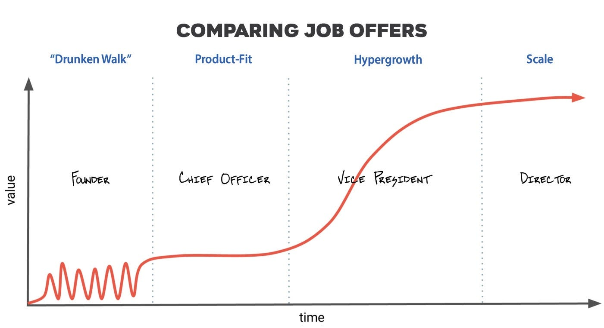
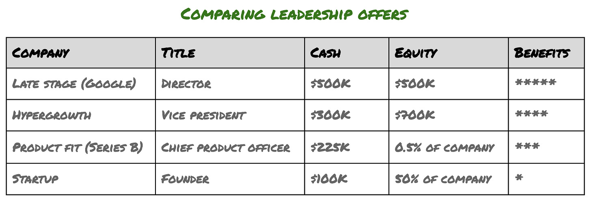

# Tech compensation: Beyond the offer letter

*Tips to ensure you understand and maximize your pay package*

*This is the first of three articles devoted to compensation. This one breaks down the key components of a compensation package, ensures you prioritize what’s most important, and helps you negotiate. The next will be a deep-dive on equity, and the last will help you understand how much you should be making in your current role.*

“Anita” is an example of a leader who has asked me for help in choosing her next role. A highly successful tech leader with some great options, she knows that money isn’t the only factor to consider. But she’s still stressed about how best to compare her offers, particularly because each company is at a different stage.

Anita is considering offers from all four stages of company.

Anita is off to a great start, having organized her offers this way:

Which offer should she accept? Of course, that’s a complicated question. It requires understanding each of the offers in depth, the quality of each company and each role, and her risk profile and career map. In fact, it’s so challenging, I’m sure a full book could be written on the subject. Instead of a book, I’m devoting the next set of articles on how to tackle some of these key questions and how I coach people when comparing offers like these.

In most industries, compensation is predictable and fairly easy to understand. Salary ranges are locked to industry standards; you’re paid by the hour or given an annual salary, and get a stack of benefits. That’s it. But among tech companies, compensation packages consist of several components, all of which are different based on which phase the company is in — from startup to late-stage — as Anita has charted above. But getting this right is essential, because picking the right company and compensation package can translate to millions of dollars and influence your overall career journey.

No matter the job, compensation is tricky to discuss with peers. Most of us don’t share what we are making with family, let alone with friends and co-workers. And we’re told from the beginning that making money is not the primary goal in job selection, so any discussion might sound greedy or myopic. So we usually just hope we’re paid fairly.

I’ve worked at all stages of company and helped hundreds like Anita evaluate and negotiate their compensation, as well as advised companies on how to structure their employee pay. Though there are always distinctions, the vast majority of companies follow a consistent structure. So let’s start by examining how compensation is packaged. And then we’ll look at the key questions Anita should consider to ensure she understands what the company is offering.

Each offer letter contains six key components of compensation. Not all of them will be present, but they all deserve a deeper examination.

*Tech job offers have six important elements you should understand and maximize*

## **Job title and level**

Pretty much every company has a hierarchy, which means every role is assigned to a level, which maps to a title and a compensation range. It’s different for every company and can transform significantly as the company grows.

Usually startups haven’t yet invested in titles. Doing so gets in the way and means little if everyone is doing a bit of everything. In many cases, one person is the manager, and the rest work for that person. So startups use generic titles (product manager or member of technical staff), sometimes even allowing the employee to choose their own. But as the company adds employees, titles help separate managers from individual contributors and distinguish executives from other employees.

#### **Do titles matter?**

If the company doesn’t have a lot of structure around titles, it probably doesn’t matter what yours is, even externally. So I would only care if it’s considered valuable internally and comes with a clear structure and the ability to change title through promotion. Similarly, early in your career, titles aren’t that consequential. In other words, if you are in your first five years of working or you’re at an earlier stage company (say, before Series C), titles don’t matter much.

In contrast, as you become more senior or work for a more established company, a title can carry weight. As an example, the titles Director, Vice President, or Chief Product Officer signal to others that the company values you as a leader and executive. It doesn’t mean that a VP at a big and a small company are equivalent — it just means that you have hit a degree of seniority that signals [Act II](https://theskip.substack.com/p/three-crucial-skills-that-leaders) of your career. So if the company includes this in your package, recognize that it carries some external weight and is career additive.

#### **How does a company set their levels?**

If a company has a structured approach to levels, it’s a big part of the interview process. Remember this when you are being evaluated. Emphasize the size of teams you’ve influenced and the most complicated problems you’ve been a part of solving. And remember, since level determines your compensation package, it’s critical to be as accurate as possible.

Be aware that most companies prefer to “down-level” their new hires. This is particularly true at later stage tech companies. So if you are new to management, realize that they might choose to start you out as a senior individual contributor. Or if you are accustomed to managing a larger team, they might title and level you as an entry-level manager. The company’s likely goal is to ensure that your year 1 has more attainable expectations. And after 9 to 12 months, they can promote you with some momentum. The alternative is that you come in too senior, end up failing to meet expectations, and are stuck in a hole that’s hard to dig out of.

#### Can I negotiate title and level?

Your title will end up adhering to the company norms, so changing the words to merely amp up your LinkedIn profile isn’t advisable. But titles aren’t equal between companies so ensure you understand how it maps to the company level and responsibility — are you an IC, a manager, manager of managers, or an executive? How many others are at this level? How many levels below the CEO are you? This will help you understand seniority and can assist you in comparing offers.

Entry level really matters, since promotion takes 12 to 18 months at most companies. And the more structured the company is, the more difficult promotion can be. So you gain more than a year if you skip a level on entry. So when thinking about negotiating title, consider how long you plan to stay at the company.

If you plan to stay four-plus years in a role, then your entry level isn’t as important as nailing your first year and establishing a strong reputation. So if there is little room to negotiate and you end up with a smaller compensation package and title on day 1, don’t stress out — over a few years you’ll likely make it up. But if your expected tenure is two to three years (which is the [tech industry average](https://www.businessinsider.com/average-employee-tenure-retention-at-top-tech-companies-2018-4)), then pushing hard for a higher level might be wise, perhaps even taking a different offer. Otherwise you might not have much time to return to your norm, and if you take multiple short-tenure jobs, you might actually move backwards in your career.

A final tip on negotiating levels would be to consider setting expectations early in your interview process, probably even before you start formal discussions. If a person interviews with me and says, “Look, I’m really only interested if the company sees me as a vice president,” I don’t consider that to be arrogance. It’s simply what’s required to entice this passive candidate. Now, I might not have a VP role, but if I want to engage, I’ll set that person up with a VP-interview panel. That’s far easier than down-leveling her as a director, in which case the person says, “Well, I’ll take the role, but I’ll need the VP title.” At this point, it’s late in the game, and both impressions and level have been set.

## **Base salary**

Base salary exists in all industries and is the simplest to understand, as it’s clearly outlined in your offer letter. Salaried employees normally receive this payment every two weeks or twice a month, depending on how your company payroll is set up.

#### How does a company determine how much I make?

Most companies try to use a structured approach to determining your overall compensation, of which base salary is a key component. The structure varies, so don’t hesitate to ask for clarification if anything is murky. Usually it’s a combination of the industry levels for your position as well as the company’s philosophy on how aggressive it wants to pay people.

A structured approach is critical to ensure fairness, so you should welcome it. You wouldn’t want the next hire to be paid significantly more simply because they had a competing offer or were an aggressive negotiator, right? In fact, late-stage companies end up using an external data source (like from [Radford](https://radford.aon.com/products/surveys)) to make sure they keep up to date on market changes and can dial in on geography, precise competitors, and exact job titles. Further, they might set their packages at X% to ensure competitiveness in the market. For example, if the company tells you they set their comp at 50% of the market, it means 49 comparable companies pay you more and 50 would pay less at your level. Then, equity-appreciation aside, you should expect middle-of-the-road compensation.

#### Do I have to disclose my current salary?

In many states, such as in California, employers [can’t ask for existing salary data](https://www.hrdive.com/news/salary-history-ban-states-list/516662/). This doesn’t mean they won’t ask in a roundabout way. Though conventional wisdom is to share as little as possible before you see a formal offer, I disagree. I think it’s helpful to share expectations, especially if you think the company will have to stretch to meet them.  
  
As an example, if you currently work for a company with valuable equity, you might be paid above market. Sharing your current earnings proactively, before the offer is formalized, can help create a higher starting offer than if you had kept quiet. Moreover, once an offer is formalized, just as with level, it’s far more difficult to adjust the numbers. The only time I don’t suggest sharing existing salary information is when you are paid below market. Though you might have higher expectations, you won’t have as much grounding to back up those expectations.

#### How is the split between equity and salary determined?

Companies can choose to make your compensation package either very predictable or highly variable. Usually the more senior you are, the more the compensation is variable and tied to company performance. The theory is that junior folks can’t quite influence the trajectory of the company as much as senior leaders. So when you first begin your career, most of your compensation comes from your salary. But then as you move toward becoming a manager and executive, you might receive more of your compensation in equity. In fact, it’s normal for VPs or C-level execs to have 90%-plus of their compensation in equity.

Sometimes companies give their employees a choice. It recognizes that every person’s risk profile and cash flow needs are different and might be loosely correlated to their level. But when people talk about “compensation risk,” it usually is based on the amount of money that is not guaranteed. High variance could lead to huge payouts or levels far below industry — it’s all about how well the company and its stock performs.

#### How should I think about the salary band that I’m in?

If the company has salary bands (most do), it’s worth asking where you fit into the band. Your manager might not be able to share this, but it can be helpful. If you’re on the low side, you might have room to adjust the salary, or at least you can see salary gains without a level adjustment. But if on the high side, then you might be left with little room to negotiate *and* require a promotion to see salary growth.

#### Is my salary fixed, or will it change after I join?

One of the most important things you should know is how often the company plans to adjust your salary. Small companies tend to not revisit salaries until a promotion takes place, and they often have little structure for promotions. So you might be sitting at your salary for years, unlike with late-stage companies, which have annual adjustment periods and structured promotions.

Understanding the size of these adjustments can help you understand your overall compensation package, not just your first-year salary. As an example, if you start at a low baseline but get annual adjustments and frequent chances for promotion, you might end up with more earnings over four years than if you start with a larger package that doesn’t change much over time.

## Signing bonus

A signing bonus is paid in one of your first paychecks when you join a company. It’s a “bonus” because it’s a one-time event—you won’t get it again. Not everyone gets a signing bonus, though some companies routinely offer them. It’s the most inconsistent part of the package from company to company.

#### Why do companies use signing bonuses? Wouldn’t it be simpler to attach it to base salary or a corporate bonus program?

Companies use signing bonuses to spruce up an offer but keep their recurring salary within a consistent band. This can be an effective negotiation tool if used correctly.

In the above example with Anita, Big Tech is offering her $500K and Hypergrowth is offering her $300K. She naturally asks to match, but Hypergrowth has a salary band for VPs that they can’t exceed. So instead, they offer $200,000 in a signing bonus. If she takes the Hypergrowth offer, Anita’s first year will have the same salary as Big Tech’s offer. In year 2 and beyond, she’ll see a drop in salary. So though the $200,000 is up front, it’s not as valuable as the $200,000 bump in base salary. But Hypergrowth argues that year 2 is a long way away — the company might be public and her equity might be worth a lot more than Big Tech, maybe a bonus or promotion might come into play, or even the salary structure might be adjusted.

Regardless, if you have a gap between offers or your new company can’t match your current salary, usually there are far fewer policy restrictions on the size of a signing bonus than there are on recurring salary and equity. You should ask for a signing bonus to bridge the gap instead of leaving the money on the table.

#### What happens to my signing bonus if I leave a company shortly after joining?

Signing bonuses “vest” over a period of time, usually one year. Though you get the money all up front, if you leave before the full term, you technically have to return the bonus. But to be honest, it’s pretty hard for a company to force you to pay it back without suing you. And if the company terminates you without cause, e.g. a layoff, they might let you keep it anyway. But if you leave for a role at another company with a better offer, then in good faith you should return the money as it is owed back to them.

#### Bonus program

Some companies offer a structured bonus program. They use annual or semi-annual cash bonuses as a way to connect individual and company performance to cash rewards. Other companies don’t use (or have eliminated) the bonus, instead simplifying pay with a combination of a base salary and equity.

Though I see the wisdom in commissions and incentives for sales teams, I don’t believe bonuses for technical staff are very valuable. Most employees aren’t motivated by a short-term gain and prefer to see company performance tied to more durable instruments like salary and equity. And personnel and finance departments spend entirely too much time calculating and explaining these incentives. But if your company does have a bonus program, be sure to understand how much is based on company versus individual performance, and who determines your numbers.

#### How should I estimate the bonus portion of my offer?

For the portion of your bonus based on company performance, you can’t predict the future but you can determine how this has been paid historically. You’ll model your future earnings very differently if the company has paid 100% of the bonus each year versus 40%. Some companies see bonus programs almost as a part of base salary (which is why they sometimes do away with the program), while others see it as a key motivator and set it as a stretch goal.

#### If I leave the company before my bonus is paid, will I lose all of it?

If you aren’t employed when the company issues their bonus payment, you will most likely lose the payment. In fact, if you were to give notice ahead of your bonus payout, the company could opt to terminate your employment, in which case you would fail to collect. So to be safe, assume you must be in good standing with the company when the bonus paycheck is due. In fact, this may dictate the timing for your eventual departure or weigh into your signing bonus negotiation for your next company. And given that bonus programs are common among Big Tech companies and that annual bonuses are paid in February, we end up seeing a big shuffle of talent in March.

## Benefits

Benefits vary considerably depending on the size, profitability, and generosity of the company. Google set the bar high with a very lavish set of policies, and many tech companies have followed its lead. These benefits include a family leave plan, transportation to/from work, meals in the office, a sabbatical for tenured employees, and even unlimited vacation.

Benefits are very personal. I find that all of the frills in these benefits of late-stage companies are nice at the beginning but eventually fade to the background. So don’t get fixated on the free meals, subsidized massages, and social events.

I want you to understand which company benefits help extend your tenure, since longer stays in a quality company is career additive. In other words, most of the benefits won’t keep you in the company long term. But a few really are special and worth understanding.

#### Which benefits play a bigger role than we expect?

For any company you are considering joining, be sure to review and understand the family leave and vacation policies. Also, consider the pace of work and your commute. When people decide to start looking for a new role, gaps in one of these four areas come up consistently, especially when burnout hits.

#### Any tips on family leave?

If you think you’ll be adding to your family in the next three to five years, you should add weight to the family leave policy when considering your compensation package. If the policy is generous, that’s four to six months of compensation. If you have two kids, that’s nearly a year of time off. That’s a huge benefit compared with a company offering minimal coverage, and it could tip the balance between offers.

Lots of companies have an official policy dictating when new employees become eligible for family leave, and it’s usually around 6 to 12 months. Note that this can be negotiated. Many employers would consider luring a passive candidate, even if that person is expecting or recently had a child, over to the company and waive the grace period just to invest in the employee long term. So feel free to ask about this during the interview process. At most, they can stick to the policy.

#### How do I avoid burnout?

Burnout is a complicated and critical subject these days, and one that I hope to dedicate a future article toward. Without a doubt, a big factor in burnout is the pace and hours expected to work. Though we usually don’t think about working hours and benefits at the same time, you should. So before you start your job search, determine the relationship you plan to have with your next employer. What are the boundaries you plan to set? Tech work, as you know, will absorb every hour you give it, especially for high performers.

So ensure the pace of your employer matches what you are looking for. Ask your future peers: Are you online in the evenings or catching up over the weekend; and when do meetings take place? All teams say they respect boundaries, but if it’s normal for meetings to start at 8 am or 6:30 pm (often due to global time zones), that might not match your schedule. And if there is little flexibility, you might feel constantly overwhelmed and struggle to prioritize the rest of your life, eventually leading to resentment. So elect to take on these high-intensity roles only if you can sustain them for a few years or if there is enough flexibility to meet your needs.

Related to this, gauge the age group of the employees and the founders. I find that companies have collective empathy with the average age of the employees and that average age is often connected to the founders’ age. For example, in the early days of Facebook and Google, most of the employees didn’t have kids. So it was normal for work and social life to blur and for office hours to go late. But as the employees started families, the culture shifted. If you are joining a company where most of the employees have school-age kids, your co-workers will likely take time off during school breaks, have teams where one or more members are out on family leave, or have occasional commitments that require people to step away during the work day. But be wary of the opposite challenge — you might have external commitments, e.g. family, another board position, an important hobby — and the leaders in the office might struggle with accommodating.

#### I’m a bit embarrassed, but I am struggling and nervous about the commute associated with one of my offers. I know others do it, but I worry I’ll hate it and I won’t be my best at the office.

Don’t be embarrassed if you are having trouble gearing up for a long commute. Commutes are really personal to people, as are most of these benefits. Some people despise them and can never get over the inefficient use of time, or the fear they can’t be with family flexibly. Others come around to them and actually end up using them as a time to catch up on calls or simply disconnect from the back-to-back meetings they might have.

Clearly shorter coummute times are better (30 mins in the San Francisco Bay Area is considered good), but a great role and company can make a longer commute worthwhile. In the first few months, commuting can take a while to get used to, as you’ll have to match the hours of the office with your personal calendar. You’ll also have to map out the most efficient way to arrive and depart from the office. My advice here is to focus less on the initial commute and more on what it might feel like after a year. We are creatures of habit, but if commute time, even if the company is transporting you, causes you low-grade anxiety, it’s worth actively considering before taking a long-term role.

## Equity

Last, equity is ownership in the company. It means you get a portion of the proceeds if the company exits (meaning sold or acquired). A company issues different instruments depending on how mature it is and whether it is private or publicly held. Equity can be worthless, or your company may not choose to issue this to you. But many in tech make their millions from equity, either because they owned startup stock, they received a large grant, or the stock just took off. I’ll devote another entire article in this series toward equity since it’s so complex.

## Risk Profile

As a reminder, here is a summary of Anita’s offer.

Before we start comparing offers, we need to be certain that we understand Anita’s risk profile. Typically early stage companies are more risky, but what does that exactly mean? This article raises key questions describing this job risk. Answering them will help her narrow down her choices.

* **Cash flow requirements**. Anita’s Big Tech offer has both cash and liquid equity (meaning it can be sold in frequent windows throughout the year). That means if she’s looking to buy a house or pay off student loans, this provides needed capital. However, if Anita has savings and no substantial expenses, she can afford to take some risk and bet on the company’s equity. It might not translate into any earnings, or it might result in a life-changing payday.
* **Tenure**. If Anita has held more than three jobs in her first 10 years, perhaps she’s seeking a longer work tenure. Or maybe she wants to start a family or work abroad with expenses paid. Doing so would encourage her to choose a more established company. However, Anita might feel like she’s only worked for a couple of companies and that she’s not growing fast enough. She wants to take some risk before she settles down and knows that it’s unlikely she’ll be at her next employer beyond two or three years—unless the stars line up, of course. So an early stage company makes sense, as it might be the last chance for her.
* **Opportunity cost.** If Anita were to found or join an early stage company and the company didn’t grow or even failed after only a few years, it wouldn’t have the same career uplift as a stay at an established brand or growth company. That’s not to say she won’t learn a ton — in fact, it might teach her things that help her with future roles and drive substantial earnings and impact. But immediately following, employers won’t reward that experience into a bump in compensation. So if she doesn’t have a brand name on her résumé, it might be a bigger risk to hope the startup really establishes itself. But if she has gone to a brand-name school and/or worked for a well-known tech company, this risk is minimal.
* **Relationship with work**. This is not Anita’s first job, and she has commitments in life other than work. Protecting these commitments will assist her in proactively determining what hours and investment she can give to work. Any offer she chooses needs to adhere to these boundaries, otherwise she’ll eventually resent her decision or neglect the other parts of her life.

I’ll devote the next article to evaluating the economics of these offers. But in conclusion, if you do some homework to grasp a deeper understanding of your offer and think through the key risks you are willing to take, you can narrow your options down to one or two stages of company—and make a healthy career decision.

*P.S. If you are working through a question on compensation, please email me. I’d love to follow up this series of articles with more FAQs and tie the materials togethers in some real-world (anonymized) samples.*