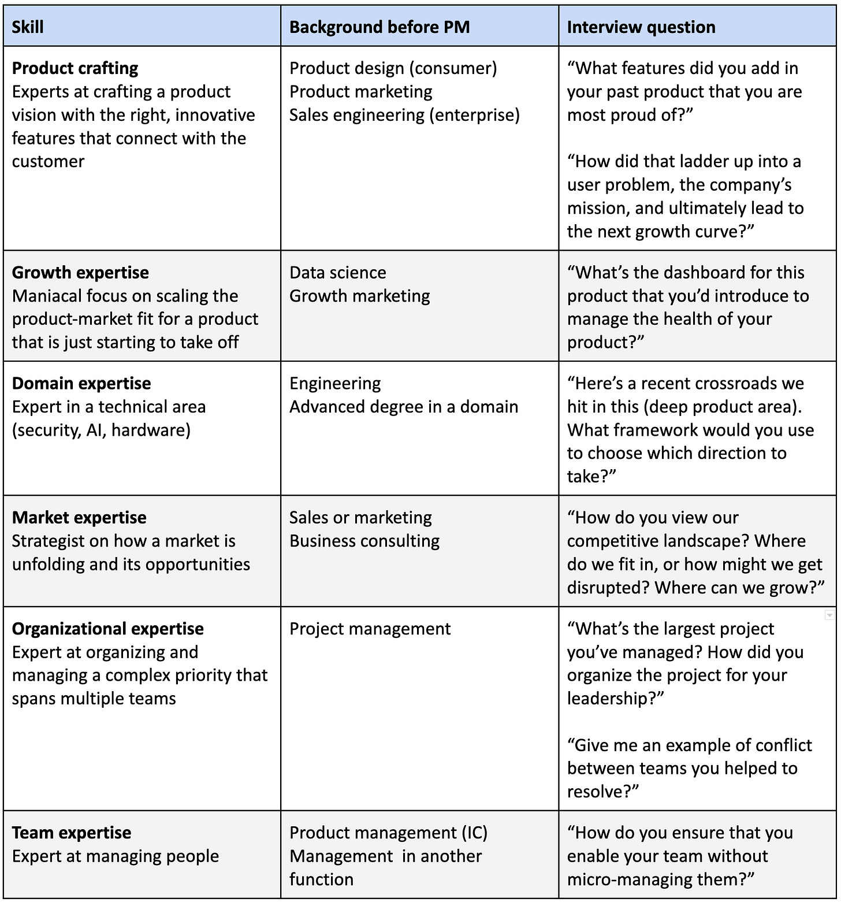

# 6 Superpowers to Seek Out as a Product Manager

*Advancing in today’s environment means honing one or two of these skills*

*This article accompanies the recent Skip Podcast episode, “[Six Superpowers for Product Managers](https://www.skip.show/six-superpowers-for-product-managers/).”*

To paint the past few years as a roller coaster ride isn’t quite right – it’s been more like a roller coaster, plus the tea cups, with a few nauseating turns on the zipper. Frenzied growth was once the be-all and end-all for advancing careers. But, as I’ve discussed recently, other stages of company are worth considering now. With the pedal less on the metal, companies are leaning into ensuring product-market fit for their core product lines, slowing growth, and avoiding expansion. It’s build a better car, not expand the factory. This means roles and skills are changing as well. In particular, in product management there’s been a shift from hiring managers to advancing individual contributors, or ICs, which provide a more hands-on approach to product nurturing.

A change like this might beg the question – how am I going to climb a ladder if it no longer exists? What will a promotion look like? On a non-traditional path, how will I compare against my co-workers? How do we interview for these skills in the team I’m building?

Or perhaps even more basically – what makes someone senior over another? To answer this, I proffer one simple question: *What’s the biggest problem I can give you?* Regardless of title or level, the bigger the problem you can own with minimal supervision, the more senior you are. And in organizations, there are many challenges that exist, not just those that require big teams to solve. Individual contributors are proving themselves as leaders by tackling these bigger, harder, and more complex – and ambiguous (a key word here) – challenges.

As I see it, there isn’t a single “biggest problem” facing leaders in product management, but rather “ambiguities” in six key categories: product, growth, domain, market, organizational, and team. Each category involves a certain set of skills, yet no one can be an expert in *all* categories. The goal, though, is to master one or two, especially if you want an elite career.

I think it’s helpful to define each of these superpowers, here is a brief summary of the six skill sets and the type of interview questions an expert would crush. Many product managers don’t start out as PMs, but instead gain experience through other functions in a company. So I also note the common functions that produce the different types of experts.

**Skill 1: Product crafting**

Let’s begin with the challenge of **product ambiguity**. Wouldn’t every “product manager” need to be excellent at navigating product ambiguity? To some extent, yes. But in a consumer or end-user company, there are experts specifically tasked with figuring out how to get something new off the ground or identifying which new features to add to an existing product. In an enterprise company, this person is deeply connected with the sales team and customer, seeing around corners and knowing how to introduce and refine a product’s capabilities to meet customer needs. These experts are sometimes known as “0 to 1 innovators” – or, simply, crafters. This role requires not only coming up with brilliant product ideas that connect to the company mission overall, but also sweating the small stuff, like how the product mechanically works. Crafters live and breathe product design, which includes analyzing user research and customer requirements. Their proposals and concepts, prototypes, and vision resonate because they are so grounded in the mission and customer need.

**Skill 2: Growth expertise**

So how do you become an expert in managing **growth ambiguity**? Like crafters, these PMs must also dive into the details. But theirs revolve less around features and more around taking an existing product to the next level – to grow it. They need to translate the usage of the product into its growth by getting more people to use the existing product, not changing it as our crafters are asked to do. It’s a highly quantitative function, requiring deep partnerships with marketing and data science and relentless attention to the levers around acquisition, retention, usage, and churn. Cycle times are short, unlike those of crafters. They are impact-driven with clear accountability. Early-stage companies that are still seeking product-market fit don’t have this expertise in their organizations, but mid- and late-stage companies do, even creating separate organizations for just this ambiguity.

**Skill 3: Domain expertise**

Many product areas require specific knowledge of a **domain** to navigate the **ambiguity**. Examples include  artificial intelligence, machine learning, hardware, semiconductors, infrastructure, and Web3. These areas aren’t easy to learn, requiring years of study and perhaps advanced education. Often, these folks come with an engineering background or were former engineers. These days, as tech companies focus on advancing their core products, there is an increased demand for deep experts in an industry. Often, the challenges at one company match another company’s, and domain experts immediately hit the ground running. For companies that have just hit product-market fit, this person can be highly additive because they already know what needs to happen next. And they find that hiring a person with years of experience is a multiplier to the team and business.

**Skill 4: Market expertise**

Market experts, meanwhile, live and breathe complex competitive landscapes. To tackle **market ambiguity** requires envisioning what the “white spaces” look like – where does LinkedIn need to go? How does one disrupt eBay? What does AI plus education look like? Does ChatGPT have a defensible moat?  Closer to crafters than growth or domain experts, these folks must understand where an industry is going and then articulate the product bets that will be most effective. This skill requires far less grasp of the product details and far more understanding of the overall competitive landscape, market dynamics, and technology trends. As a top-down thinker, they are strategic and often able to debate and influence direction alongside the company’s leadership. Yet when it’s time to execute on a direction, this person may not be great at getting into the weeds. Interestingly, they often do very well in interviews because so many tend to probe strategy versus execution. Detailed execution is just very tough to probe in a short discussion. But then when they are hired, strategy is quickly replaced with grinding out details, and it’s possible this expert will struggle. So if you’re building this expertise, ensure that you build depth in another skill because market expertise can get you only so far.

**Skill #5: Organizational expertise**

What happens when a company has big ideas, a strategy that spans multiple business units, and the expectations that come with a top corporate priority? Chaos – unless you have someone who can keep **organizational ambiguity** at bay. This person’s superpower is ensuring collaboration among a company’s many organizations, which often have misaligned or conflicting goals. Organizational experts are large-scale project managers, tasked with coordinating the work of several teams and hundreds of people. They must anticipate points of conflict to minimize internal friction; align disparate priorities and cultures; prevent stalls in the process by providing context and keeping teams focused on the “plot”; be equipped to hold leaders accountable; and ensure the company’s leadership can view the project end-to-end. That’s naming just a few challenges, because internal ambiguity can be as bad as product or market ambiguity. At Meta, we call these specialists “captains,” and they are some of our most valuable and skilled PMs. But most are senior ICs with small teams, or none at all.

**Skill #6: Team expertise**

The last skill set is probably the best known and has to do with managing teams. **Team ambiguity** can hamstring a company’s ability to function at every level. A team expert is a traditional manager in many ways, with a focus on hiring, building, and managing people. But when this person has this superpower, they enable and empower others through direction, whether by effective coaching or fitting one team in with others. To be a team expert, you need to have just enough skills in other areas, like domain and growth, so that you can effectively guide people and know what to value – and when to stay out of the way. As I’ve noted, this skill set gets disproportionate attention – perhaps too much at times – as the only path to growth. It’s true, however, that for most companies this is the skill you will need to rise to the executive level. Given that managing people is similar among functions, successful leaders in data science, engineering, design, research, and other fields make the transition to product management far more easily because team building is a common denominator across the board.

**How should I use these skills?**

So as you review these skills, my first hope is that you’d recognize how different they are from one another. To build an elite career, you need to make at least one of these a superpower. If you are one of the best crafters or org experts, as example, you’ll uplevel any PM team you join, and companies will work hard to acquire, compensate, and retain you.

> However, regardless of whether you can obtain a superpower, it’s best for career growth to ensure that you aren’t weak in *any* of these areas. Appreciate each discipline and take a point of view as to how you would build expertise in each lane. It’s natural for you to gravitate toward one or two, but don’t be deficient in any. If you’re an expert in one, it’ll pull you forward. If you’re deficient in any, that will hold you back. Though there are fewer leadership roles in our industry, if you have built a strong foundation and leaning toward expertise in one or two key areas, you’ll be the first one chosen.

It’s worth noting that organizations also have these superpowers. Meta is known for world-class growth expertise, Apple for best crafters. Google has some of the best AI minds in our industry. Just like for individuals, organizations tend to specialize.

And for those of you in charge of building teams, keep in mind that the best teams are diverse teams. It’s hard to find people who are experts at more than one or two of these skills, let alone all of them. But the larger and more scaled your team is, the more you require all of the skills to be present in your organization. So ensure that your interview and promotion process doesn’t require expertise in all of these areas to advance. Otherwise, you’ll end up hiring generalists and lose on hiring the best and brightest in certain areas. Your goal is to build the Super Friends, not just seek Superman or Wonder Woman.

**Conclusion**

Climbing the ladder is no longer only about tenure or simply “managing.” Career opportunity and growth will instead stem from building skills in each of the six areas I’ve discussed above: product, growth, domain, market, organizational, and team. I suggest becoming an expert in one or two of these areas, while becoming proficient across the board. Ultimately, you want to be able to take on those larger and more complex problems, and then grow into roles that allow you to hire or guide folks who can also do that. Understanding all of the components and having the right vocabulary will equip you with the vision, the motivation, and the practical skills to make this happen.