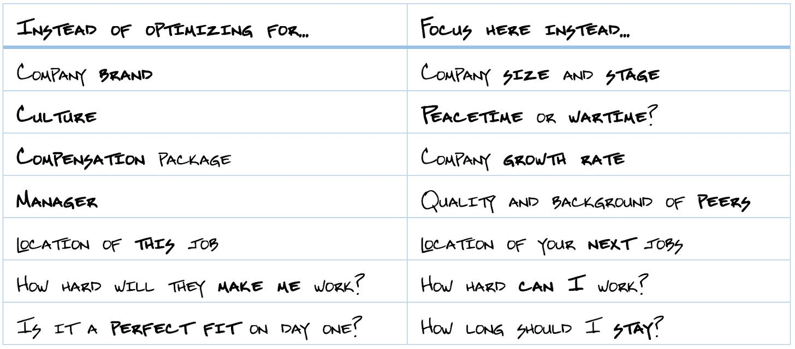
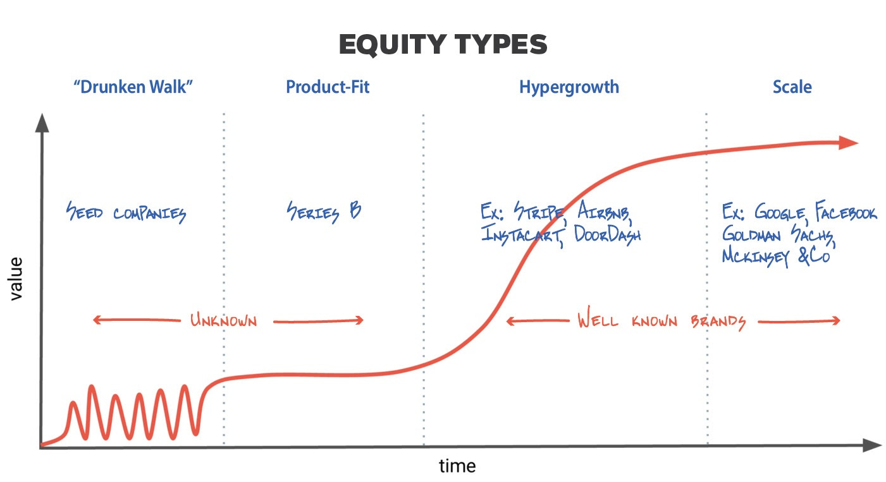
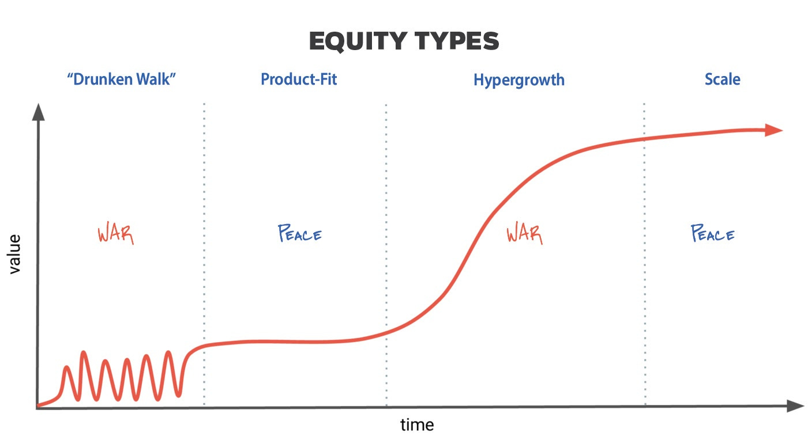
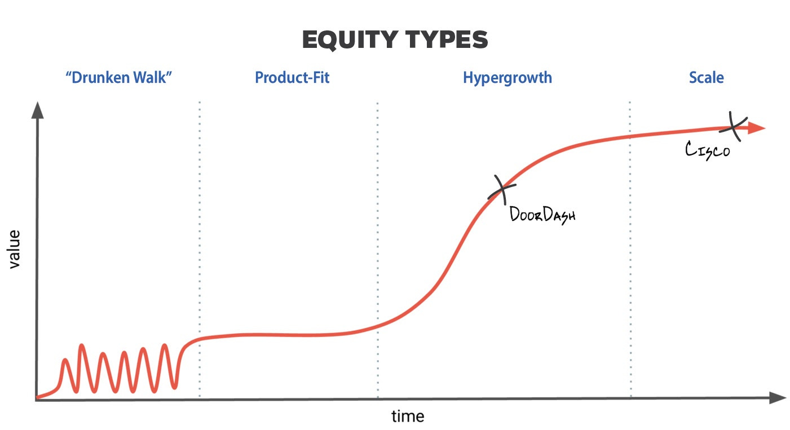
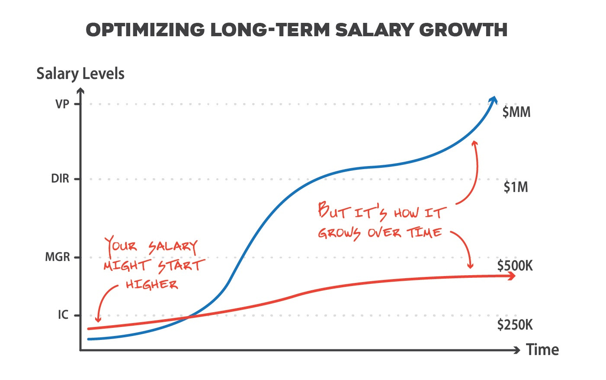
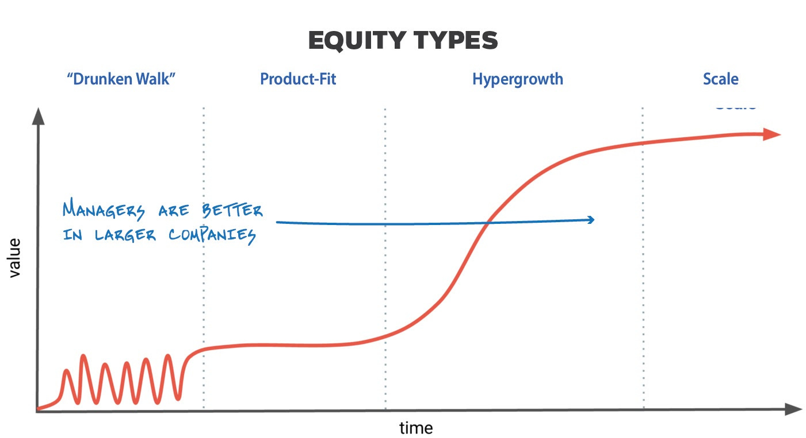
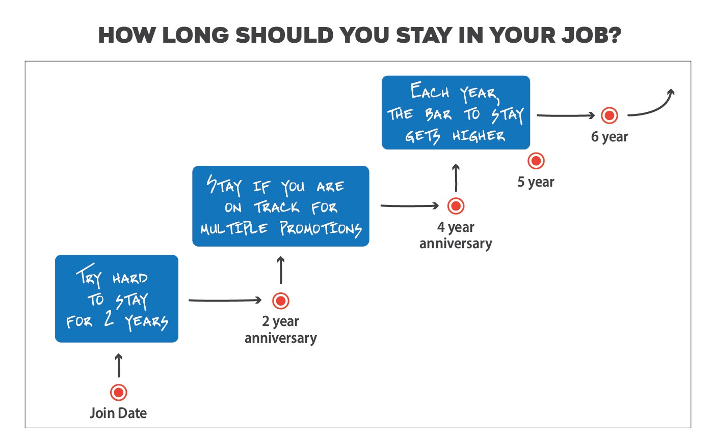

# Seven tips for picking your first (or next) job

*What every college graduate needs to know as they start their career *

*Summary: Read these tips to help you choose the right next job, especially if it’s your first one. Don’t just optimize for culture, compensation, or manager. Instead, focus on things like growth rate, peacetime vs. wartime, and quality of peers to ensure your next job is the best one… for you.*

The 2020 holiday season is a great time to reflect. I’ve really enjoyed writing this newsletter and reading your feedback. But I didn’t expect to hear from recent college graduates who have stumbled across the newsletter and are seeking advice as they start their career. I haven’t focused on this audience yet, but I’d like to devote time to these graduates as well as anyone finding themselves thinking about a new job in the New Year.

Making a job decision is far harder than choosing the right school. There is no top-10 list nor are there any obvious first moves—it’s all very personal to what would fit you best, based on your joy, superpowers, ambitions, and development areas. As a new graduate, this is your first time through this, so you might not have clear answers about what is most important to you, where you want to go, and what you want to achieve.

**Two job journeys: Sherri and Josh**

Let’s start with a couple of fictitious examples that we’ll use as a backdrop for the advice I share in this article.

Take Sherri: Upon graduating, she chose a startup for her first job. But within a year, she realizes the company is a bit stuck trying to find product fit. She can keep pushing hard, but it’s clear that momentum is slipping for the company. So she makes a transition with a few friends who are doing another startup. Sadly, after a few years, the market crashes and she finds herself back in the job market. Though she’s learned a lot, she feels she needs a manager, a brand name, and a more stable environment.

So she answers the recruiter calls from a later-stage company and takes a role on their team working on a new online shopping product. The pay is better, so she can finally make a dent paying back her student loans, but the role is a couple of years away from management, at best. She has learned a lot about two-sided marketplaces from her startups, so she feels she’ll be able to shine in the group she’s joining. And hopefully the combination of early- and late-stage experiences will help her nail down an executive role by her mid-thirties, either at this company or perhaps another one.

Then there’s Josh: He is a bit anxious about his job search, so while he’s in his final year of school, he relies on the recruiters visiting his campus and settles on a job at a big brand name well before the spring. He has a big paycheck coming and is working for a company that everyone’s heard of. However, after his first six months, he feels a bit bored. Though he has a clear project, he doesn’t find it or his team very inspiring. His manager is struggling to give clear guidance, and he finds it hard to build relationships with his teammates, as they don’t share a lot in common. They are older, starting families, and don’t really seem to have the time to connect with him socially. And they leave the office like clockwork at 5 pm, when he wishes everyone would be pushing harder.

Meanwhile, his buddies are having a great time at a growth company that turned out to be the hottest thing. They encourage him to explore more options, so he interviews and takes a role, making a lateral move. After a year, things are finally starting to make sense. However, he’s always wanted to spend a couple of years abroad. He feels that if he doesn’t do it now, it’ll never happen. Sadly, his company only sponsors more tenured employees to make these transitions, so he resigns and heads to London. For visa reasons, he has to make a job decision quickly. So he selects a company desperate for talent since they are in decline. And almost instantly, as he starts to settle in, he misses the peace that his last company provided. He’s forced into working nonstop, so he isn’t enjoying Europe, and he begins to lose a lot of confidence in his abilities as nothing seems to be clicking—neither on his project nor at the company. So after a year, he cuts his stay short, heads back home, and restarts his job search, looking for his fourth job in as many years.

Both Sherri and Josh went through more jobs than they would have liked, but clearly Sherri is in a stronger position. Neither one had great luck, but it’s possible to fare better by finding a better fit out of the gate. Below I examine the decisions that both grads made along their journeys and offer advice on how to ensure that you ask the right questions, stay on as long as you are building career momentum, and leave when you are best positioned for your next role.

**My seven tips**

When I ask recent grads to consider what’s most important in their first job, the answers include brand name, culture, location, compensation, manager, and/or work-life balance. This is a great list! And any of these will help you find something you enjoy that will also be career additive. But these answers aren’t very helpful when you’re making a list of companies to target or coming up with questions to ask during an interview. They are simply too broad and generic and not personalized to your needs.

I offer some alternatives to consider that are equally important—but can be far easier to determine with some research and during your interviews.

**Company brand vs. size and stage**

I see a lot of elite college graduates heading toward brand-name employers. Examples include Facebook, Microsoft, and Google in tech, and maybe Procter & Gamble, Goldman Sachs and McKinsey & Co. in non-tech.

Brand, whether it’s your employer or your alma mater, is a powerful form of endorsement. The thinking is, “It’s hard for me to determine how effective you will be—but I trust the admissions team at Stanford. Or the interview process at Google.” The problem is that for many of you, the best job might be at a company you’ve never heard of. But brand-name companies have college recruiting departments, start their process early, and try to lock you into making a decision before smaller companies even allocate headcount and begin to recruit. So college graduates tend to disproportionately land at brand names. But I encourage you to also add non-brand name companies to your search, as a no-name company today might be a great fit—and household brand tomorrow.

Example of companies that are in different phases of growth. See [previous article](https://theskip.substack.com/p/stage-of-company-not-name-of-company) for more details.

I’ll examine how different stages impact your experiences in the next set of tips.

**Culture vs. peacetime and wartime**

Culture comes up near the top of any job criteria for good reason. Culture helps answer some pretty crucial questions:

* Do people respect you and can you be your true self?
* What habits will you pick up and which ones will you avoid?
* How are decisions made, whether it’s product, engineering, or finance-driven?
* Are decisions made top-down or bottom-up?

A good culture leads to good answers to these questions, helps you feel safe, and assists your onboarding.

As important as it is, culture is really hard to determine during your interview. Every company puts on a good face and ensures you get strong, positive answers to cultural questions. The brochure is always filled with glossy, smiling photos. In my experience, culture lives in the small, not the large. It’s how meetings are run, what behaviors are encouraged, how priorities are made, and what constitutes effective management. You can’t easily determine this subtlety by question and answer, you have to experience it.

However, you can far more easily determine whether the position you are considering will thrust you into an environment of war or peace. A project, division, or company at war requires change—otherwise, they are dead. Or perhaps they are experiencing such rapid growth, they see a limited window to expand their business before growth slows. In war, learning the rules isn’t as important as making an impact. In war, you might have more than one manager in your first year. Your project might change without notice. You might deliver something and then immediately throw it away and pivot to a new direction.

Half of you reading this might believe that sounds exciting, while the other half might see this as the definition of misery. The alternative to war is, of course, peacetime. During peace, things are predictable. Change is not required and meant to be introduced thoughtfully. By default, things will survive and perhaps even thrive. But building momentum with a clear set of rules and process is the name of the game. A company that is just gaining product fit finds themselves installing peace over war. And late-stage companies and products desire peace, as war can artificially upset the balance.

How the culture of a company is impacted by growth

Clues are easy to spot if you start looking for war versus peace when researching and interviewing at the company. The structure of your interview process, the age of the project and team, the experience from graduates who recently joined, and the expectations for the role you are considering are major clues.

In parallel, determine whether you prefer structure, rules, and process, or thrive around change. School is mostly a structured environment—did you love mastering the system and flourish within it, or did you find the structure stifling and often yearn to trudge out on your own? If you are at your best under clear guidance and rules, choose peacetime. If you get bored easily, seek ways to hack the system, and enjoy seeing things change, opt for wartime. Knowing this about yourself and deciphering whether you’ll enjoy facing war or peace will serve you far better than trying to find distinctions in culture between your target companies.

**Compensation package vs. company growth rate**

It’s tempting to optimize for income in your first job. It’s the first time you are making money, and it’s really easy to compare jobs based on how much they might pay you. But in the grand scheme of things, your opening salary will make zero difference to your eventual net worth. It might change the shoes you end up buying on your first day, but your real impact will come when you are 10 to 20 years down the road in your career. As such, avoid selecting a highly paid first job where you aren’t learning or gaining skills that will make you better in the long run.

The easiest way to achieve this is to find a company that’s growing just a little faster than you are capable of growing. I wrote about this [here](https://theskip.substack.com/p/when-do-you-know-its-time-to-leave). Growth is fairly easy to determine in an interview. Look at how the employee count has changed over the past few years or, if available, the sales of the company or number of customers over time. If you are someone who picks up things quickly, wants to push hard in this first job, and wants sizable responsibility, find a very fast-growing company and don’t fixate on your starter pay or benefits.

Where DoorDash and Cisco fit into a company growth curve

So say you have two offers. One is from a late-stage brand—we’ll use Cisco, which was in hypergrowth in the early 2000s but [has remained](https://en.wikipedia.org/wiki/Cisco_Systems) at roughly $50 billion in revenue and had about 75,000 employees since 2013. As a market leader and brand name, the company has developed an effective college internship and recruiting program. It has a good entry compensation package, including full benefits. The hope, of course, is to attract people who are starting their career and keep them for decades, backfilling retiring employees with new grads. If you look to specialize in networking, seek brand, and want a clear, deliberate, and well-lit career path—this might be a strong first step. It might take you five to seven years to move into management and have an impact, but that might be when you are most ready.

In contrast, your other prospect is from a growth company like DoorDash. DoorDash’s valuation has moved from $500 million in 2015 to $16 billion in 2020. The employee count has doubled every year or two, putting it right in the middle of hypergrowth. Though the company may pay competitively, much of the compensation could be tied up in equity and the promise of future growth just to be even with the Cisco offer. It might not have a full college recruiting team, so applying will likely involve working through the interview process and battling it out with more-experienced candidates. But if you were to choose this path, given DoorDash’s growth, in a few years you might be one of the more tenured people in the company. After all, if they continue to double every year, in two years you’ll be more tenured than 75% of your co-workers! That will give you early opportunities to lead or manage, and that’s where your income really starts to change.

It’s not where you start your salary, it’s how you move from an individual contributor (IC) role, to a lead or manager, to director and finally to an executive or VP. Each level represent big shifts in your compensation and are highly dependent on how quickly you master and succeed in your environment.

In the future, I’ll be writing a bit more about compensation levels, but to give you a sense of why it’s important to grow into leadership, in the San Francisco Bay Area tech industry, salaries for individual contributors are roughly capped around $250,000. Managers and team leads shift to $500,000. But managers of managers (say, directors) max out slightly above $1 million annually. And VPs ... well, the sky’s the limit. So if you are getting $110,000 from Company A and $130,000 from Company B, to get the most pay, select the job that will get you to leadership fastest, which is unlikely to depend on whether you had an extra $20,000 in year one ($10,000 after tax, by the way).

**Manager vs. quality and background of peers**

Every single one of you is thinking about your future manager. Get a good one and it could help you navigate your first job. A bad one could derail you. Though that might be true, it’s nearly impossible to know for sure when you are interviewing. Moreover, your first manager is almost always inexperienced. In a typical organization, senior leaders manage other managers. And first-time managers manage those who are starting their career—that’s you. Sometimes you get lucky and find a first-time manager who has great instincts. That person has recently had your role and can guide you with clarity and precision. But all too often, the manager is just learning how to hold the steering wheel loose enough for you to make mistakes but tight enough to avoid you crashing into cars.

Management isn’t a critical skill for a company until it really starts to grow. So if you need a good manager, you should be working in a larger organization.

However, as a company matures, the quality of its managers improves. As a staff gets larger, the company has to organize its teams and invest in teaching and growing the skills of management. So as a graduate, if you are certain that a structured teacher can best unlock your potential, head upstream where you’ll find better managers (and avoid wartime). However, many of you might learn simply by doing. If you have a good project, are surrounded by a supportive team, and are able to get good feedback—you might not need a trained manager.

Though it’s hard to know if you’ll gel with your manager, you can ensure you will fit well with your future co-workers. So assess—are there lots of fresh grads joining the company, or are you one of the few? Having lots of people at a similar career stage means the company will have reasonable expectations from this level and have peers who are going through similar challenges. But you will be compared with their performance, for better or worse. If you are in the minority, maybe the majority will pull you forward quickly—or you’ll find yourself alone. You’ll have to get a feel for this. And expectations will be harder to determine, which again could be an advantage or disadvantage, depending on how quickly you find your footing.

As part of your process, I also suggest you gauge the caliber of your potential co-workers. You can probably determine this by reviewing the backgrounds of your interview panel, project leads, or even management team. Check out their past employers or their alma maters. Sometimes a company focuses on attracting elite talent. It might be tiny or late stage, but its philosophy is to find the very best people, and its great products, high growth, and top pay allow it to attract this talent. If you get a job offer from this company, this could be a huge amplifier for your career. But you might also face a torrid pace and expectations that are hard to exceed. If you are accustomed to being in elite company, go find a company with this peer group. It’ll feel natural, exciting, and push you to be your best.

On the other hand, some companies aren’t looking for the challenges that come with acquiring and retaining this talent. They may set their sights at one or two levels below, perhaps enabling you to find your footing faster and rise to leadership quicker, outworking and outthinking your peer group. Based on your past, determine which best describes you and then seek out the more appropriate path.

**Location of this job vs. your next one**

Picking a job requires choosing not only a company but also a location to live. Some of you may choose a job first, then the city. I think you should choose the city first since your eventual goal should be to establish roots. The longer you are settled in the same spot, the greater your professional “luck” is likely to be. Let me use a few examples.

Some of you will find jobs through a formal search, but after your first one, the most common method is through friends and acquaintances.

* You make friends at work, a buddy leaves to go to a new company, and after a few months, she suggests that the grass is a whole lot greener and her new company is hiring. So you take the plunge.
* You are out with friends, and they start talking about the companies they are seeing, some of which sound far more interesting than your current one. One thing leads to another, and you fall into an interviewing process.
* A few months after updating your LinkedIn with your first job, your email starts to light up with recruiters begging you to meet with them.

These scenarios almost certainly describe how you might find your second job—and note that all of these lucky events have location in common, meaning that if you are working in Denver, these breaks are coming from friends and recruiters *in Denver*. It’s pretty rare for you to stumble upon roles out of an area unless it’s a job that has a lot of travel (consulting) or the company has a national presence. If you plan to settle in Denver but like the idea of taking your first job in New York, think carefully. From strictly a job perspective, it’s better to find your way to your eventual home city as soon as possible. No doubt, life happens and you might end up relocating. My suggestion is to ensure you do it intentionally since location has such an impact on your career.

I see this as a key ingredient in my professional journey. Not only did I go to school in the San Francisco Bay Area, but I also stayed for work and have never left. My classmates ended up working in parallel companies, and as we kept in touch, our luck grew exponentially as we fed off each other, made friends with each other’s friends, and were eventually placed in leadership positions all within an hour of where we went to school and now live. Though the Bay Area is unique in this regard, similar stories are playing out all over the world in new tech hubs. So if you are lucky enough to settle in the same place for two or three or more jobs, you’ll enjoy lots of professional “luck.”

**How hard will they make me work vs. how hard can I work?**

All tech leaders I meet share one thing in common—their work ethic. In fact, nearly all of them are the hardest-working people among their peers. There is simply no substitute for pushing hard to ensure you have maximum impact and get noticed.

When I was in school, that wasn’t always the case. The best students weren’t always the ones that put in the most hours—some students were just gifted. They can do the reading, listen to a handful of lectures, and ace the exam. But there aren’t exams in the workplace. Instead, as you master your project, you don’t want an A+, you want more projects, greater responsibility, impact, and a fast track to leadership.

Some companies have a culture that rewards the top performers with more scope and recognition, regardless of experience or level. Others struggle with this, instead dividing their projects and teams into well-defined areas that can be completed on time and within budget—but are not designed to stray outside the lines.

So instead of focusing on how many hours you will be *required* to work, focus on how many you *can* work. I am not suggesting you erase all boundaries and make work your identity. I’m suggesting you push 20% harder than your team’s average. So if you think you can work 50 hours a week, then try to find a company where people work about 40 hours. And if you can do 60-plus hours, you will find yourself in rare company, outperforming even some of your hardest-working peers.

**Is it a perfect fit on day one vs. how long should I stay?**

In the grand scheme of things, as I described in [this article](https://theskip.substack.com/p/how-many-jobs-are-you-going-to-have), you are likely to have dozens of jobs, especially if you are working in tech. Job tenures are closer to two to three years, not 10 to 15. So in a 50-year career, your first job (or two) is mostly a setup. It doesn’t mean you shouldn’t make a good decision—it just means it doesn’t have to be perfect and fulfill every need. In my experience, it’s more meaningful to have a clear plan as to how long you are going to stay. I find that people spend no time on that question, but all of their time on optimizing their entry point.

Ensure your current job continues to challenge you and keeps you growing. The longer you stay, the more you should keep raising the bar.

* **Years 1 and 2:** Try your best to spend at least two years at any job, unless things are going poorly. It takes 6 to 12 months to fully absorb a new environment, so by the end of the second year, you probably have a very good idea of how much you have learned, what the culture is like, what your growth prospects are, and the level of the ongoing challenges.

* **Years 3 and 4:** At the end of your second year, decide if you want to extend your stay for another two years. Why two years? Because in your four-year tenure, you can rise from individual contributor to a lead (in some companies, you can even become a manager). If you enjoy the work and you feel recognized, it’s not worth starting over. Ideally, you want to show a few promotions, expanded responsibility, progression into leadership, and even a few different projects in one of your first jobs. But if those opportunities seem distant and unlikely, you are better off moving laterally to another company, perhaps one where you are more comfortable and growing at a more compatible rate.
* **Year 5 and beyond:** The opportunity cost of staying is fairly high now. You’ve hopefully accomplished quite a bit and can leverage this success in your next role. So take it one year at a time. Ensure that you are increasingly challenged and heading toward greater leadership, and that the growth of the company matches or is slightly ahead of your own. Note that each year your tenure has less and less value to the outside world. For example, staying for five versus seven years is optically equivalent—it’ll be more important to determine what results you have delivered, if you moved into leadership, and what skills and experiences you’ve mastered.

This plan puts far less pressure on finding a perfect first job. Instead, it ensures that your first two years are solid and then keeps the bar high for your employer, making sure that they are giving you as much as you are giving them. What happens if you choose unwisely? My advice is to cut your losses and find a better situation. Though it’s important to avoid bouncing around jobs with short tenures, it’s far more damaging to be stuck in a role and a company that’s a poor fit, especially early in your career. When you are stuck, you lose confidence and lose career momentum. Everything slows, and your trust and luck diminishes.

Just be clear in your interviews about why you left, and apply these takeaways when you are establishing the criteria for your next job. And, most important, ensure the problem isn’t with your own skills and expectations. I’m not concerned about three jobs in five years—I’m concerned that you are either picking jobs that aren’t meant for you or have development areas that you aren’t recognizing.

**Conclusion**

Let’s go back to the stories of Sherri and Josh.

Sherri chose to take a healthy amount of risk right out of school. Though it led to shorter tenures, it wasn’t her fault, and she gained expertise, particularly in two-sided marketplaces, that helped her find a great role at a later-stage company. Her understanding of company stages and her ability to reflect that “peacetime” would be better than “wartime” for her at this point in her life helped her find a great match. And though she had three jobs in a short amount of time, those experiences were diverse and armed her with lots of experience to draw from as she moved into management and future executive roles.

Josh wasn’t so lucky. His first job also didn’t go well, but if he had interviewed more broadly, he might have become aware of different peer groups and challenges that could have led to a better fit. On the one hand, it’s good that he left quickly, as his second job was far better. On the other hand, he left his second job just as he was starting to get into a rhythm. Perhaps if he had stayed a bit longer, he could have been promoted and built confidence in his work. Changing geographies very much worked against him. He would have been better off starting in London and beginning his career just a few years delayed or waiting until an employer sponsored his move. Ultimately, five years later, and unlike Sherri, he has little more to show for his career than when he first entered the workforce.

In conclusion, ensure that your job is serving you, you are building confidence and learning, you are your true self at work, and you are having fun. Talk to companies at different stages, reflect on the environment and peers that serve you the best, and commit to pushing hard and not being held back by the growth of your company or your desire to find a perfect fit. And, finally, avoid adding things to your career framework that are hard to determine in your research and interviews. Instead, use the tips in the guide and some self-reflection on your successes and setbacks from the past to narrow your job search and close a great first job.

*P.S. I’d be happy to answer questions, especially from upcoming graduations. Please email me or leave a comment. I’ll post a summary of responses in a future article!*