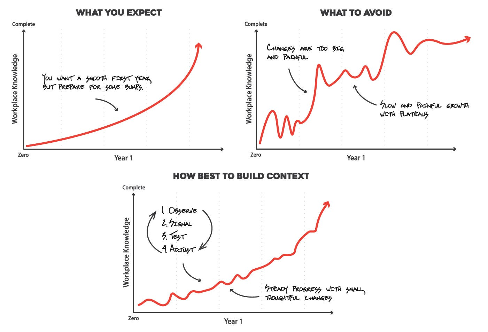
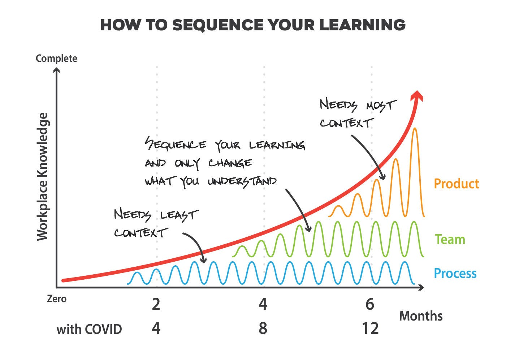

# Tips when starting a new job

*Create two game plans to excel in your new role *

***Summary**: Ensure you start a new job successfully by preparing two game plans. One should be a 100-day plan to make a strong first impression, and the other should be a yearlong plan that focuses on thoughtful change and sets you up for year two.*

Transitioning into a new role—whether it’s at a whole new company or at your current employer—isn’t always easy. Throw COVID-19 and remote working into the mix and it becomes that much trickier. So to make your transition go well, you want to lay out two game plans: one for the first 100 days, and another for the first year. Game plan one will ensure that you make an authentic, positive first impression. Game plan two will give you momentum for success, because your impact, particularly in leadership positions, will be most pronounced in years two and three.

With remote working becoming the new reality for so many of us, I’m surprised we aren’t hearing more about its impact on bringing new employees into the fold at a company, a process often referred to as "onboarding." These days, starting a new job is taking two to three times as long. And this is just one way in which expectations are being tested. If you are embarking on this onboarding process, keep in mind that most people at your company joined well before you did. They probably have forgotten their first year, so their expectations are vague to begin with. And their onboarding certainly involved whiteboards and coffee chats, all impossible with COVID. Getting to know colleagues and coming to understand the inner workings of a company over video calls and through emails is intensely challenging and exhausting—it’s hard not to feel isolated, difficult to get the right context, and nearly impossible to get accurate feedback. So you’ll need an even more deliberate and exacting plan to nail year one.

Let’s start with game plan one—ensure you make a strong first impression by considering these three questions.

**Are you ready to start working again?**

*“I wanted a month off between roles. My last role was so intense that I ended up giving everything I had all the way to the end. But when I found this great new position, I started immediately. They needed the help, and I was used to pushing hard. And it was fine for the first few months… but eventually I found myself burning out again. I had underestimated the amount of energy it takes to start a new job, and how much anxiety my focus on work has caused in other parts of my life.”*

Every employer wants you to start ASAP. Once they’ve decided to hire you, they’ll want to get you cranking. “The sooner, the better” from their perspective. And your previous employer will want you to stay as long as possible, perhaps even informing your teams at the last possible instant. So naturally, they’ll want your transition time to be as brief as possible.

Don’t fall into this trap. Starting a new job requires a ton of energy and disciplined, steady pacing. Everything is new—from the names of your co-workers, the cultural norms and processes, and, of course, the subject matter. If you’re assuming a leadership position, it’s even more daunting as some people will immediately look for answers from you. Year one is a bit like using a laptop when the fan has kicked on—it works, but it’s clear the machine is breathing hard to perform even the most basic tasks.

So a few weeks of hiatus won’t make much of a difference to your employers, but this time can be essential to your new role. And based on my experience, it’s usually a rare time to relax when there is nearly nothing professionally to stress about. In my last transition, I used my time to catch up on sleep, take care of long-overdue household chores, reconnect with my family and friends, and even rediscover hobbies like coaching and writing. In effect, opt to reduce that low-grade anxiety that subsists when you can’t be all things to all people. So when I did start, I was actually a bit bored with not working and ready for my next adventure.

**Photo by [Adam Winger](https://unsplash.com/@awcreativeut?utm_source=unsplash&utm_medium=referral&utm_content=creditCopyText) on [Unsplash](https://unsplash.com/s/photos/start?utm_source=unsplash&utm_medium=referral&utm_content=creditCopyText)**

**Do you have something to work out from the past?**

*“I left my last role fairly abruptly. In the end, relationships had frayed, my superpowers were hidden, and people told me I was struggling in areas that I simply didn’t agree with. Leaving was definitely the right decision, and in my new role I felt I had something to prove. At my six-month review, my new manager told me that I’m far too tightly held in my opinions—avoid starting sentences with **‘**this is the way,’ she said. Yikes. I have realized I should be a better listener instead of unintentionally trying to prove something.”*

Before you start your next role, ensure you have time to reflect on the past. Make a list of (a) your strengths and development areas as you understand them and, (b) where you might have been misunderstood. For your strengths and development areas, consider signaling these to your manager in your first 100 days. But for areas where you feel you are misunderstood, find a way to put those to rest. Every situation is different, and the best part about a new role is that you have the chance to start with a clean slate. Unfortunately, all too often people use their new job to needlessly prove their past employer was wrong.

As an example, let’s say in your last role, your manager claimed you were struggling to drive strategy and direction. You were fine at getting things done when the direction was clear, but when ambiguous, they claimed you struggled. This was frustrating, as you believe strategy is your strength, and they just couldn’t see it. So in your new role, you prove this out by setting strategy quickly. You do this without context, however. So though going slow is crucial to starting successfully, you rush and receive the same signal as in the past—that you are struggling to set direction.

**What type of impression do you want to start with?**

*“I am ready to start my new role and prove to everyone I’m the right hire. In short, I’m here to impress and blow them away. First in the office, last to leave. And drive as much impact as quickly as I can.*

*“Sadly, after six months, I’ve stepped on a few landmines. It’s not all bad—I’ve definitely impressed many and had a few wins. Because I moved fast, I didn’t realize that my ideas had been tried (unsuccessfully) in the past. So if I would have slowed down and asked more questions, I could have avoided these failures.*

*“I also let go of a few people on my team—they just seemed really unqualified. I’ve worked with great people in the past that could have run circles around these folks. So I transitioned them out and started recruiting. But it’s taking longer to fill these roles, I’m really short-staffed, and I’m losing trust that I’m solving problems instead of creating new ones.”*

“It’s a marathon, not a race.” You’ve heard it before, and it very much applies to starting a new role. Everyone wants to have a quick start, shed their [impostor syndrome](https://en.wikipedia.org/wiki/Impostor_syndrome#:~:text=Impostor%20syndrome%20(also%20known%20as,exposed%20as%20a%20%22fraud%22.), and find rhythm.  But by moving too fast, you may end up missing opportunities and leaving poor impressions. To avoid rushing through your first months, my suggestion is to carefully sequence your onboarding as I suggest here.

When you start, you think you’ll get settled quickly and steadily. But avoid the big setbacks that can come with moving too fast. Instead, find small wins by making careful changes and constantly testing how things are landing.

**How do you pace yourself?**

Every new leader feels the pressure to become the best leader as fast as possible. It’s compounded by the fact that your company is in need of your services and wants results from you urgently. But when you join, you also hear, “Take time to learn the ropes, onboarding is tough, everything takes longer than you can expect, and you should signal for help.” How do you navigate this contradiction?

And as a new leader, you largely are hired to offer fresh ideas and bring change. On day one, you have zero context and low levels of bidirectional trust, yet you want to prove your abilities as a leader. Whatever change you bring is how you are measured, so you lean in to change. Your peers and manager encourage you to be opinionated, be an agent of change, and propel the company to the next level. **Yet in those first weeks and months is when you are the least capable of suggesting thoughtful change.** You are faced with a choice: Stay in the library, remain academic, and tell people you aren’t there to avoid stepping on toes; or start instituting change, hope you are right more than you’re wrong, and assume people give you the benefit of the doubt.

As I look back at my year-one experience at Credit Karma, I realize I made too many changes far too quickly. Some worked out well (our focus on mobile, for example), but in most cases, they came just too fast. Everything was well-intentioned since I wanted to prove that I had good judgment and could produce real results. But as an example, if I had understood the business better, we would have invested more in the core product versus new investments. We would have used data more than qualitative research, since we had plenty of product usage. And we would have invested far more heavily in prioritization and staffing.

What advice would I have given to my former self in those first few months?

1. **Only make changes on things you fully understand.**
2. **It’s okay to have strong opinions, but hold them loosely.**
3. **Signal what you’re learning.**
4. **Get feedback on any changes before making them.**

Instead of following this advice, I was trying to improve everything and anything that my experience told me could be better. This come-in-like-a-tornado approach was unpredictable and confusing to many people, leading to needless thrash, and it slowed my ability to build trust.

I realized this in my later years at Credit Karma, and I took this to heart when I joined Facebook. The News Feed is a complicated, extremely well-run product area, so making radical change based on what had worked in my past would have been even more foolish. Instead, I divided my onboarding into three areas: **process, people, and product**.

Most leaders can spot opportunities to improve processes with fairly little context. As an example:

* Is information flowing effectively back and forth between leadership and the team?
* Is the team working effectively with other partner teams?
* Are priorities and goals clear and measurable?
* Are the meetings effectively run?
* Do the values of the company come through in how the team operates day-to-day?

You might even glean some answers to these questions in your interview itself. But in your first few months, focus here. Every company and team can improve here, so it’s where your first wins may come from. Ask questions to determine how effectively work is being facilitated. Become the best administrator you can, leveraging your past experience and shining a light on problem areas. Then suggest change as a set of “experiments,” so if they don’t land well you can adjust them openly as you learn.

After about three months (maybe six months during COVID), you’ll start to get a sense of the people you have around you. After dozens of interactions with your team and peers, your opinions will start to solidify. You can now ask:

* Do you have enough resources, and where are the real gaps?
* How efficiently are people working? Do they maintain effective boundaries?
* Are the senior leaders effectively delegating and scaling?
* Do you think your high performers are excited about staying?
* Is the team managing low performers effectively?
* What’s the quality of the feedback in the organization? Is it mostly formal, informal, or non-existent?
* Does your team know what it takes to be promoted?
* Does the company effectively and fairly gauge performance?

First impressions are not lasting impressions and your opinion will shift considerably in your initial months. Keep your perspectives open until you have those dozens of interactions and a couple of quarterly performance cycles.

That doesn’t mean you wait six months before suggesting any team changes. Just do it in areas where there are consistent shortcomings and backed my assessments from other leaders who have more context. If you aren’t sure, continue to observe, signal what you are seeing, and avoid major shifts.

Once you are comfortable with how the team works and the people you have, you can start to answer the questions “you were hired to solve.” This may sound unreasonably slow and inefficient. But imagine the alternative—driving change without sufficient context is like changing the destination for your car without knowing how to steer. In my role as a product executive, this is having an opinion on where the product line should go, how to balance scale versus innovation, and how to drive growth and expand the culture of the team.

Ultimately, ensure that you are mentally ready when you start a role. You aren’t finishing the last mile of a marathon—you are starting a new race. You are excited about your fresh start and are intentional about the impression you are creating for yourself. Pace yourself by considering what problems you are best suited to solve when you have little context. Or maybe even more interestingly, think about which opinions are best formed when you know little about the existing operations of a company.  These are excellent choices for you to tackle early, especially if struggling with communication, prioritization, and execution. Pull these forward, push the other strategic solutions back. Though this might be slower than you like, a well-designed intentional plan to drive impact will result in a better transition.

P.S.  Forward to people whom you know starting a new job!