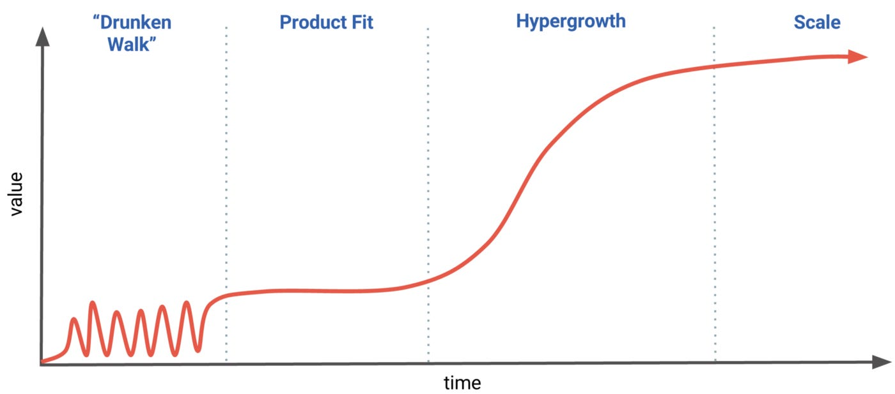
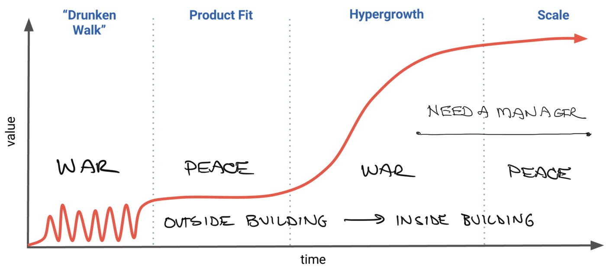

# Stage of company, not name of company

*Summary: When choosing your next company, first determine which stage (pre-product fit, post-product fit, growth, or scale) is the best match. Usually only 1 or 2 stages make sense for any given job search.*

When you are considering a career move, as I’ve advised many of the people I’ve mentored over the years, certain core factors will undoubtedly drive your decision on where to go: Workplace culture, co-workers, compensation, and the potential impact of your role are among them. But there’s another element that I think needs more attention. It’s not just where you are in your career, but also where each company is in its development that could make or break this leap for you.

Over the past 20 years, the US tech industry has grown like gangbusters, and the result is *too* many jobs for the talent pool. This isn’t a bad problem to have, particularly these days. But when it comes time to decide which job to consider, you need a framework beyond factors like workplace culture and impact, or LinkedIn requests or what’s currently hot. By the way, roles at most of those places aren’t better than your current one. It’s one step back, one step forward, trading in one set of problems for another. Remember your goal: Each job you take should function as a step in a long career, enabling a new set of skills, expanding your brand, and building your confidence.

Let’s first divide companies according to four stages. Where a company is in its development should play a crucial role in your consideration of how you might be a match.

**Stage 1: Pre-product companies** are still doing the so-called drunken walk—which is figuring out whether people want their product. It’s all about rapid experimentation, fast fails, and operational scrappiness. (Example: seed and Series A startups.)

**Stage 2: Post-product fit companies** have finally found something that works, perhaps after years of experimentation. The last thing they want to do is lose this fragile discovery. This stage requires process and structure, and overnight the company needs to shift from experimentation to protection and stability. (Example: Series B companies with dozens of employees, a handful of customers, and a single product.)

**Stage 3: Growth companies** are rare, as few companies get to this point. Demand for the product is exploding, and the company can’t keep the shelves stocked. It’s an exciting and chaotic time for the employees, as they’re expanding product lines and adding customers as quickly as possible, while also expanding as a team. Good companies at this stage are managing to innovate even as they navigate ambiguities in structure and scaling. But hypergrowth hides problems and introduces lots of cracks and anxieties within the company. (Example: Stripe is this company today; Uber, Pinterest, Airbnb, and Square are examples from the past.)

**Stage 4: Scaled companies** are market leaders—think Big Tech (aka FAANG: Facebook, Apple, Amazon, Netflix, Google). We can include Oracle, Microsoft, and Salesforce in this list, too. These companies likely have many hit products, layers of successful management, a finely tuned process for managing and operating at scale, and many employees who have been there for five or even 10-plus years. These companies are durable and are successful whether you join or not.

Each time a company graduates to the next stage, it changes what exactly it’s offering and how it is delivering its products and services.

**Pre-product companies** are for entrepreneurs who aren’t interested in building things for scale … yet.

* Don’t join a company in this phase if you want a strong manager, thrive with structure, like to introduce or work on process, or like to build for scale.
* This phase is chaotic and ideal for entrepreneurs who love the uncertainty, rapid learning, and embrace change.
* If you join during this phase, you might have little to show if this company struggles or folds. But if the company finds product-market fit, the experience could be life-changing; if your blue-sky ideas find customers, that could lead to dramatic financial wins.

**Post-product fit companies** need functional experts who can introduce stability.

* People who thrive here can introduce the right amount of structure and process without frustrating founders and entrepreneurs.
* Growth is taking place slowly and consistently, and many areas of expertise are completely missing and unstaffed.
* If you are five to 10 years into your career, you are unlikely to be a director or executive in a late-stage company. But at this phase, if you get hired, you might be more experienced than anyone in the company and can lead a team. It’s the trade-off between being a crew member on an ocean liner versus captain of a small vessel.

**Growth companies** are rare and favor resilient people who thirst for change.

* Entrepreneurs see opportunities to expand the business without focusing on distribution.  The company needs to expand and has a limited window.
* People who like to introduce processes at scale also find a home, as the core business is quickly moving to market dominance.
* But the company is not used to doing many things in parallel, early employees are frustrated by all of the change, and the leadership team is coming together and possibly rebooting.
* Chaos creates opportunities but the constant thrash can be frustrating for some.

**Scaled companies** are the largest employers in our industry.

* When joining this stage, keep in mind these companies are larger and have different subcultures. These subcultures make it difficult to validate statements like “Google is X and is a good/bad ‘culture’ fit.”
* The closer to the center of the business, the more consistent and stable it is.
* If your project doesn’t work out, you can find another role far more easily than doing a job search in the market.
* Management is much better at this stage and the name benefits your brand.
* But things move slowly, tenured employees have an edge, and it’s hard for you to move the needle on the company.

I can’t tell you which stage is best, as they are all different. But that’s the point—they are *different*. You can see how unrealistic it would be to assume that your discipline remains static through these phases.

If you appreciate and thrive with structure and in peace time, stages 2 and 4 are better choices. If you love war time, and unstructured, constantly changing environments, stages 1 and 3 are for you. If you want a high-performing, experienced manager, don’t look at stages 1 and 2. If you can’t stand convincing people inside the building of your ideas, stay away from phases 3 and 4. If you like to build stuff … all phases could be for you.

My advice is that you should try to experience all four stages at one point in your career. It’ll develop the broadest set of skills, help you determine where you fit best, and give you the maximum chance for impact and earnings. But in any job search, a good place to start is to think about what stage of company best fits how you want to approach your day-to-day, where your superpowers will shine, and how it will set you up for your next job.