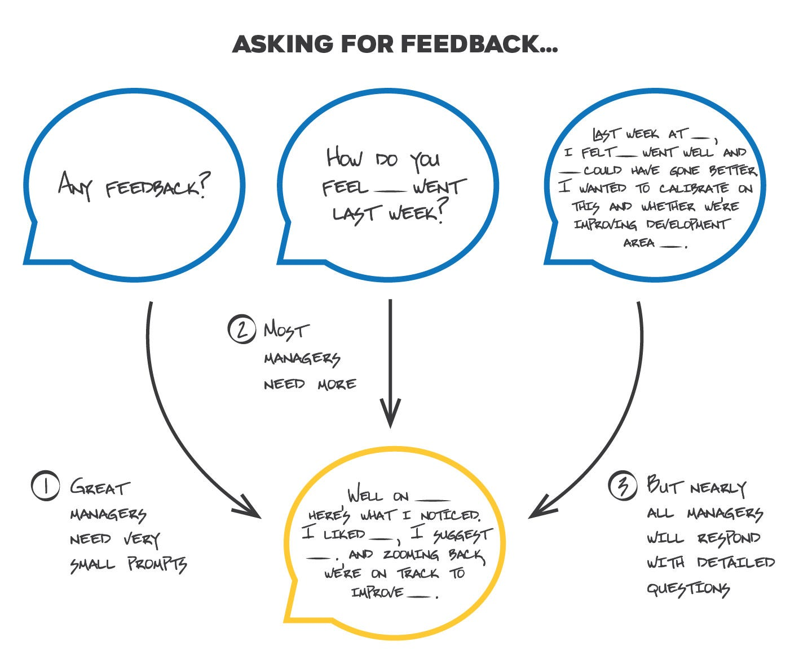

# Tips to receive 10x more feedback

*Summary: Feedback is crucial to career development but you need to take control. Don’t expect others to provide this to you automatically. Pick 2-3 examples each week and frame up precise questions to your key stakeholders to gain deeper insight.*

My first few postings have focused on building a career framework.  We’ll come back to that in a few weeks, but in the meantime, I want to switch focus to building out a critical career skill: **getting feedback**.

Most of you reading this post probably get little to no useful feedback.  In fact, based on the conversations with the many people I mentor, getting constructive feedback is something our industry is exceptionally poor at prioritizing.  And I don’t think leadership spends enough time ensuring the company has the necessary training and skills to pull feedback effectively.  Most larger companies have a formal review process, but it’s usually skewed towards promotion and leveling, not feedback — even with lots of documentation, those employees complain they get little actionable and timely feedback.  And if you are a top performer, it’s even worse.  Managers often end up spending far too much time with their challenging teammates, skipping the best people and just telling them to keep doing what they are doing.

Yet feedback is the crucial ingredient for accelerating growth.  Feedback is about providing people with positive reinforcement along the way for what they are doing well, as well as providing clarity around opportunities for development.  Positive feedback is crucial as it builds confidence and encourages risk, helps combat imposter syndrome in new people, and makes work generally more fun and pleasant.  Development feedback helps explain why your successes of the past don’t translate to your current environment or more broadly, why what’s gotten you here may not be getting you there.  And most importantly, it is the starting point to a conversation where you can respond and shift perspectives that are being formed without you.

Good feedback, for me, is best described as “pinches”, not “punches”.  To correct, learn and respond - I’d prefer a series of light taps on the shoulder, not a smack in the gut.  Development areas are subtle as you get more senior, engrained in shadows of your superpowers, not huge gaping holes you’ve managed to cover up.  So feedback that takes place every six months is too infrequent, often too high level, or surprising.  Instead, you want an almost constant set of examples on how you’re doing, what’s working, what’s not.

*Don’t assume your manager will just magically give you feedback. Pinpoint questions to ensure you pull relevant feedback constantly.*

But here’s the key point.  This is up to you.  You will almost never get feedback automatically.  You have to develop the skill to pull this naturally from the people around you.  Let’s start with your manager.   You can start with “do you have any feedback for me?”, but I suspect you’ll get very little back.  Instead, in every 1:1 pick 1-2 important things that happened last week and get your manager’s take.

* “I presented last week a plan for [X].  My sense is this went well, yet [Y] could have been better.  What’s your read?  Did I assess this correctly?”
* “I’m trying to build a relationship with [X].  I view it as important for [Y] reason.  I’ve seen success [here] but challenge [there].  What’s your take?  Do you see this as important and worth the priority that I’m giving it?  And do you agree with the angle i’m taking and my strategy?”
* “I want to get feedback on my priorities.  [Here] is the top three on my list.  More importantly, [here] are the things I’m not spending time with but are in my court.  I wish I could avoid starving these, but want to get your take as well as set accurate expectations.”
* “Last week you made a point in our team review that I am going to repeat back to ensure I understand.  I heard you say [X], and I interpreted it [this way].  Is this right?  This feedback is really helpful so please keep it coming.”
* “Let’s zoom back a bit.  We are working through the following strategy on our project.  We’re worried about [X] risks and hope it hits [Y] goals in [Z] time.  I’d love to trade notes on how this lands with you - anything you’d add or subtract?”
* “You’ve given me feedback that I should be more opinionated in group discussions.  I’ve been working on it and tried it last week.  I’m wondering if you heard me.  Is this a good example of what you’d like to see from me?”
* “I lost my composure last week and didn’t feel great about it.  Though I still believe in what I was trying to communicate, the tone was off.  Here’s what I would do next time and wanted to get your take.  From what you are hearing, is that a reasonable interpretation and go forward plan?”

If you stop and think about it, there are probably hundreds of these micro-moments in a given year.  This gives you a genuine opportunity to get feedback from your manager.  But do this same exercise with your peers, your team and other leaders in the organization.  *Anyone working with you will have an opinion if you ask them genuinely*.  Opening the door gives them safe passage to tell you what they think, focusing the conversation, and avoids abstract, high-level, delayed observations.

So build out this skill and harness the power of knowing how all of your key stakeholders think about your priorities, projects, progress and performance.  Imagine the confidence this will give in you, the speed in which you can correct, and the ability to address your own development shortcomings.  All by asking the right questions to the right people… at the right time.

*[Credit for illustration above [here](https://www.vecteezy.com/free-vector/discuss).]*