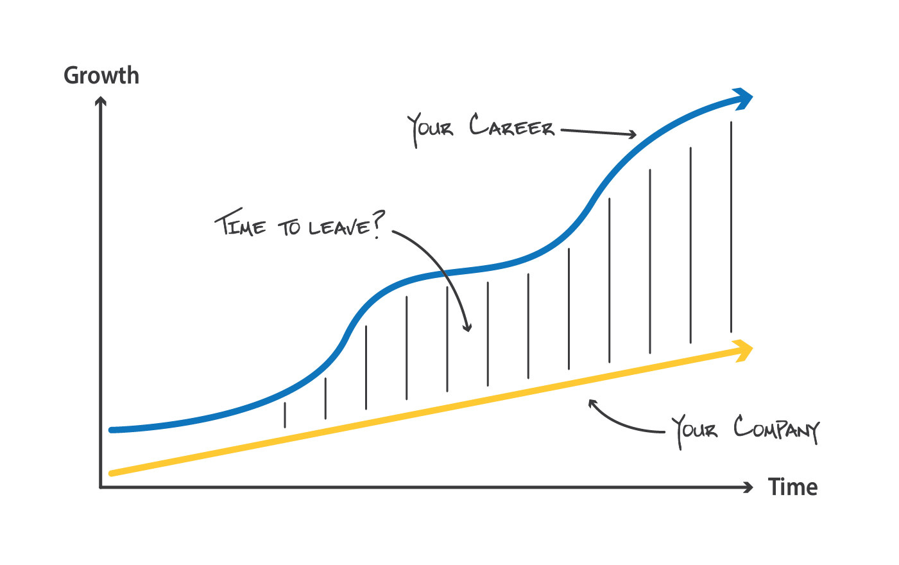
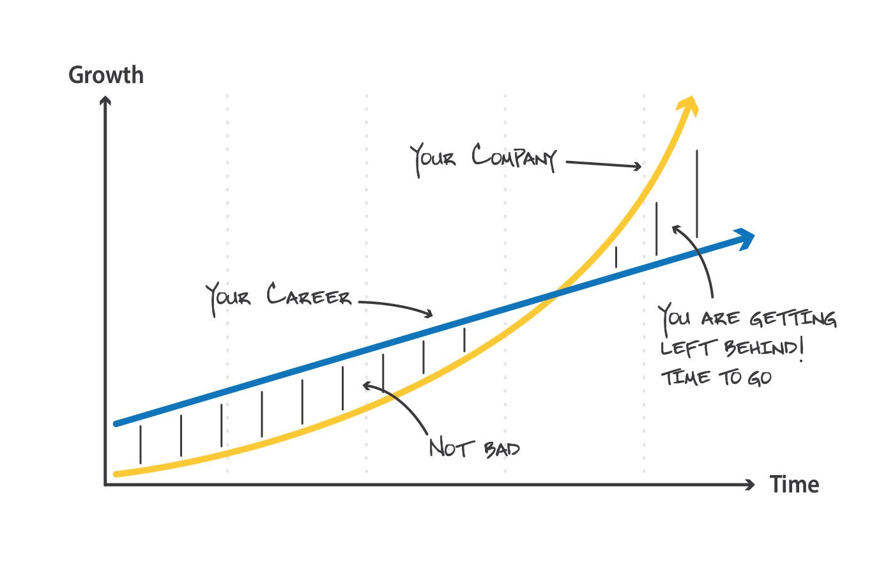
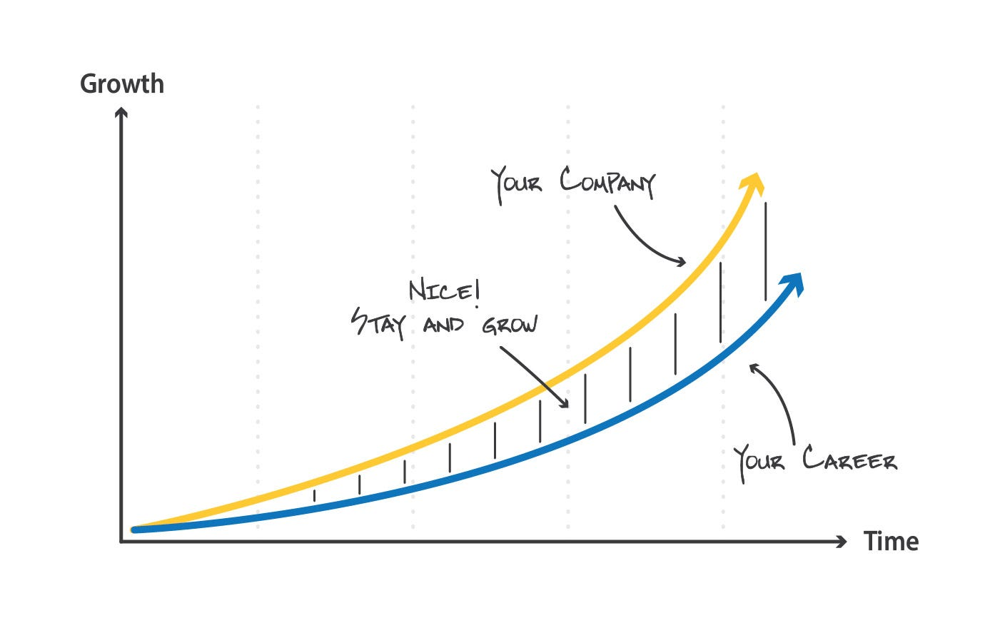

# When do you know it's time to leave your job?

*Summary: You should stay at your employer as long as you are growing at a similar rate as the company.  Leave if its growth is holding you back.  And also leave if you are getting left behind.*

As I’ve mentioned in earlier notes, it’s important for you to have a career framework.  Not only do career frameworks help you decide on future jobs, but they can also shed light on how long you should stay in your current role.  A key element in this framework is your own growth and also your employer’s growth.  Ideally, the two growth rates match as much as possible.  If they start to splinter, it’s likely time to leave.

Let’s start by defining what growth looks like for you and for a company.  Most of the growth in a company is pretty evident: more customers, more employees, increasing revenue & profits, and a higher valuation.  And that requires multiple products, layers of management, processes, experienced leaders, a recognized brand, and demonstrated impact on an industry.

When you start your professional career, it begins with a well-defined scope with plenty of guardrails around you.  Then as you grow, your scope will increase and you become skilled at navigating ambiguity and complexity in the workplace.  This might mean moving from a feature to a project or a product to a product line.  In parallel, you receive less guidance but are asked to solve bigger problems.  Big things in a company have greater potential for impact but come with more constraints and substantial “inside the building” challenges, requiring you to navigate through conflicting priorities, goals, and agendas.  Growth also translates into moving from an individual contributor to a manager to a manager of managers resulting in in senior titles and greater compensation.

Now let’s examine how company growth and professional growth intertwine.

When you are growing faster than your company

Some of you are incredibly quick studies.  You might not have many years of experience yet, but you learn things quickly and move from beginner to expert in a matter of months.  This is an important skill and can lead to promotion and accolades.  It also puts a lot of pressure on management to challenge you and fuel your growth with more responsibility and new, complex  problems.  To feed your career, you need more projects, more people to manage, and increasingly interesting problems.  When you first join a company, it might take a few quarters to find your rhythm, but eventually for the fast-growers, you need the company to grow at least as fast as you are growing, or ideally at a slightly faster rate.

If you want more responsibility and the company isn’t ready, don’t bolt for the exits.  You might think you are ready, but your manager might not.  Exit when it’s a constraint the company’s growth is placing on you, not a difference of opinion on your performance.  And keep in mind, your growth won’t be linear or exponential.  Some skills take longer to comprehend, like management or soft skills.  There are years that feel like you are crushing it, other years which may seem like a struggle.  But if your company doesn’t have more customers to satisfy, more team members to manage, or products to deliver - you’ll eventually need to leave.  Your company is holding your career back.

When your company is growing faster than you

Consider the opposite situation.  You are working on a project and work for the head of your department - all of a sudden the company starts to grow aggressively.  You aren’t quite ready for senior management and in a matter of a few quarters, hiring has you surrounded by new team members, a different process, and you just feel unsettled.  This happened when I joined Credit Karma and inherited a dozen PMs.  They were early in their career, had joined before the company had begun to grow aggressively and were all trying to find their place.

In the case above, the company is simply growing faster than you are.  There is no shame here, it’s just that it’s probably not the best environment for you.  In the Credit Karma scenario, 2/3 of the team ended up leaving in the 18 months after we hit hypergrowth.  Most left for jobs at earlier stage companies.  Since it was the phase we had just exited, they were experienced at navigating product-fit and early scale.  So they joined their new companies at senior levels, while those that stayed at Credit Karma were able to keep up with the pace of growth, as we see next.

When you are growing as fast as your company

The ideal situation is shown here.   For your tenure, your hope is you keep learning and getting challenged by a growth rate that’s slightly faster than your own, pulling you forward.  That might last a few years or could be much longer.  At Facebook, several of my co-workers have crossed their 10-year anniversary.  This is a great milestone, as it shows they were skilled enough to scale with the many years of hypergrowth, and both the company and person benefited greatly.

So avoid advice like “don’t move around too much - you should stay for two years minimum”.  It’s important to deliver something meaningful, but if your company is growing slowly and you are ready for responsibility - time to look for your next.  Likewise, “don’t stay for too long - leave after five years”.  Instead, keep the bar high on each subsequent year - ensure your growth is getting fueled, not hampered by the company.  Matching growth curves isn’t easy and might be great one year, and then off another.  Don’t jump at the first sign of trouble, but also don’t feel bad when things are consistently off - if you need to leave, embrace it as an opportunity.  Once you find the right speed - hang on and enjoy it!