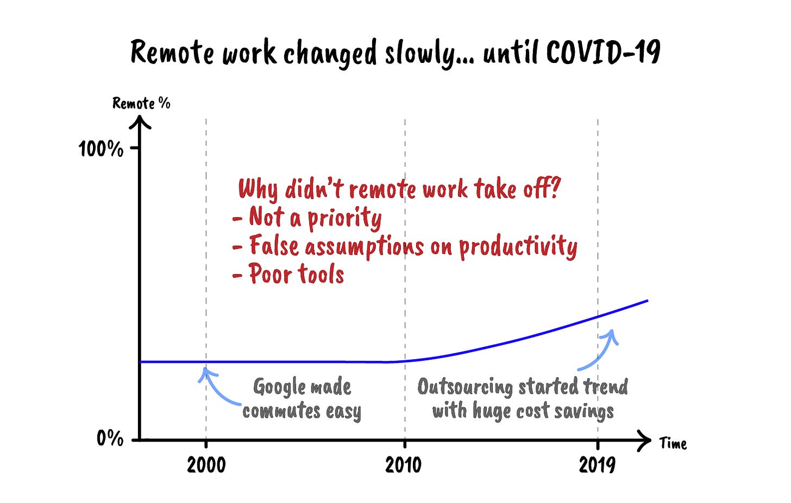
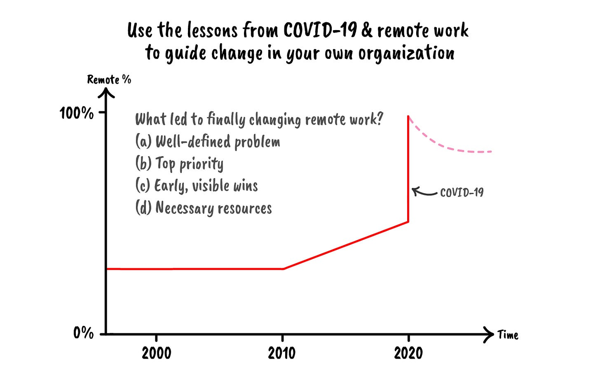
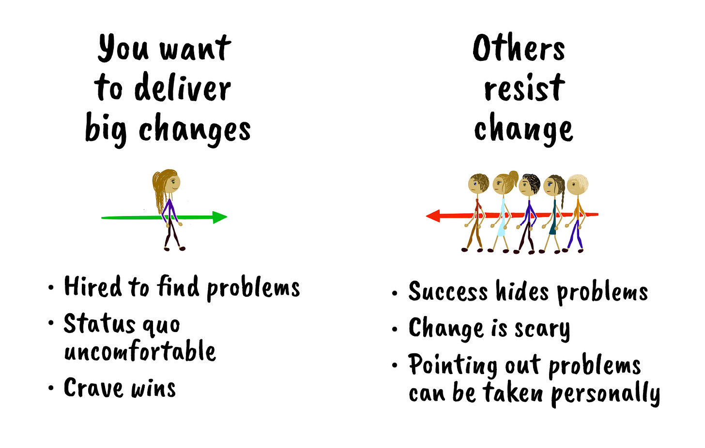
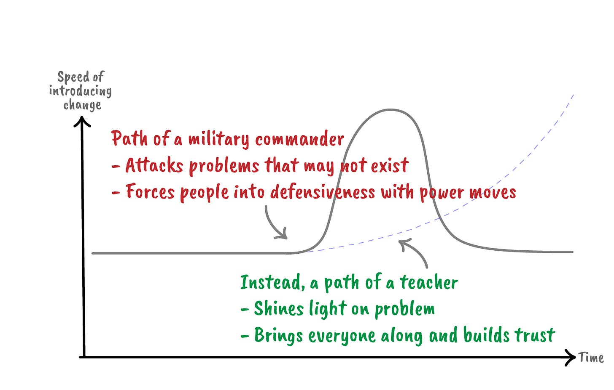
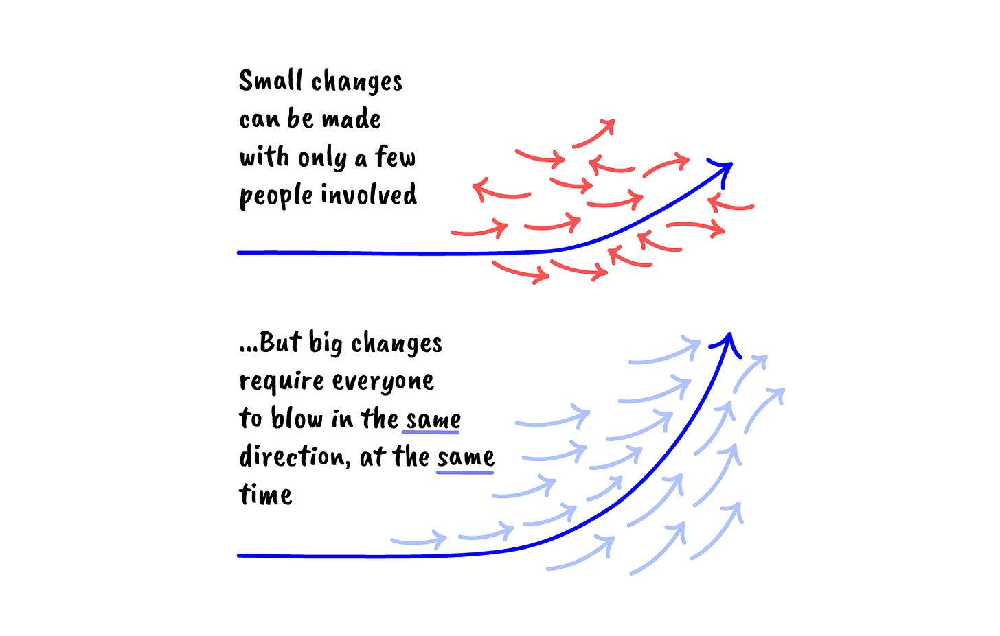
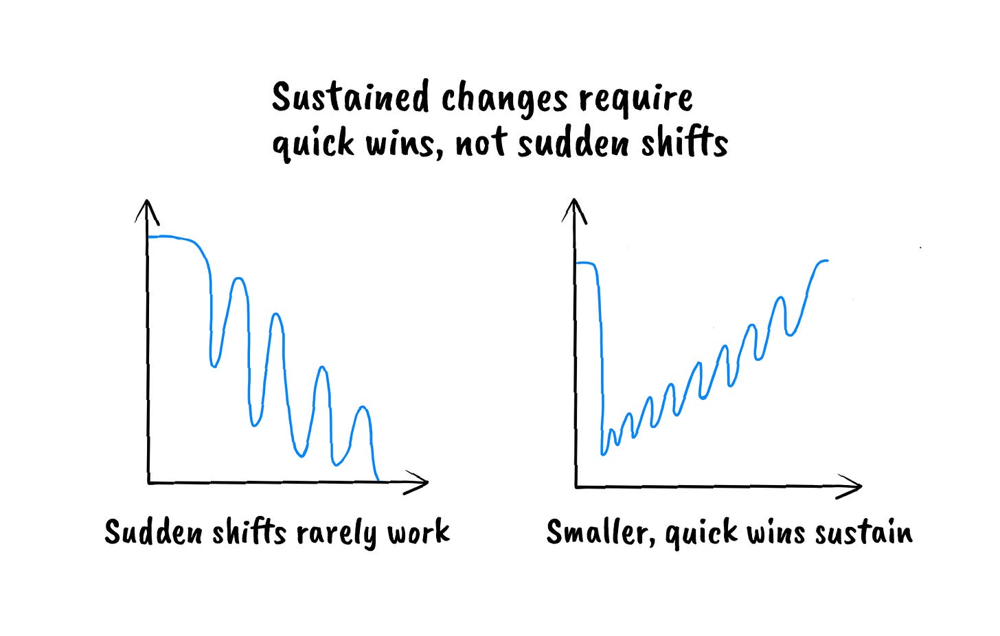
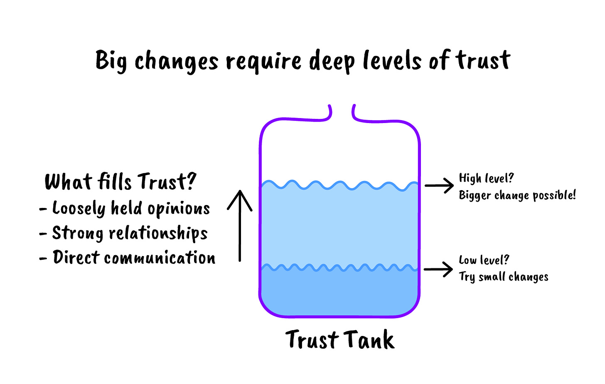
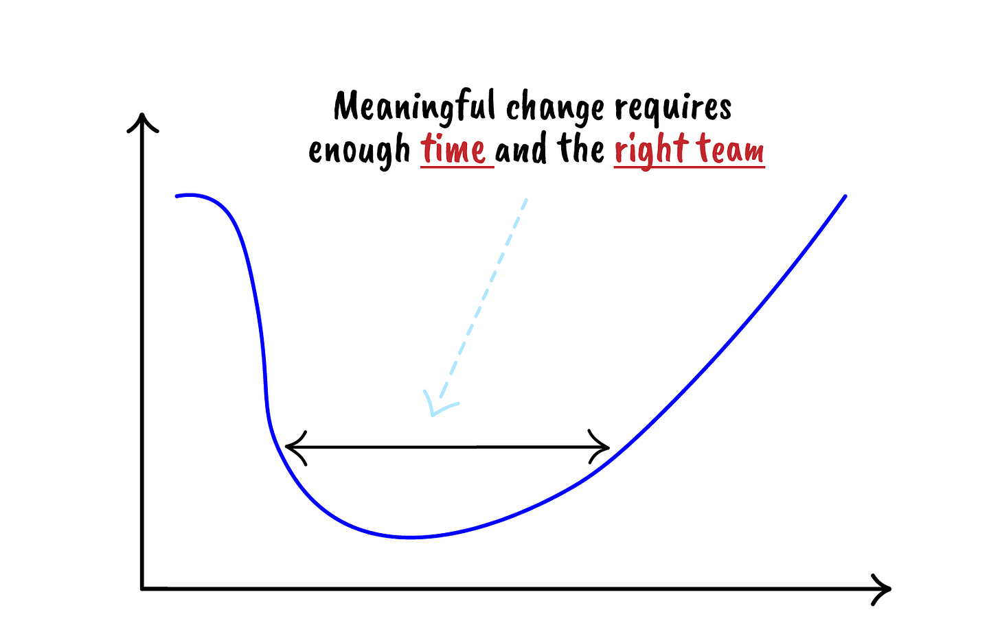

# What needs to change? That’s easy. How and when is the hard part.

*Four key ingredients to successfully time meaningful change in your organization*

*Timing is everything.* Most of us realize that whether it’s meeting that special someone, buying or selling an investment, or just picking the right job opportunity, timing matters. A lot. In fact, as I’ve gotten older, I’ve come to realize that timing and luck play all-important roles in a person’s professional and personal success.

What’s surprising is that most leaders I speak with don’t start by asking when and how to make important changes; they focus more on the change itself. Consider Anita, a fictitious example of someone I coach or manage. Anita recently joined Hooli to lead the product team. She comes to me, frustrated with her company and the project they’ve assigned to her. “This company is so broken,” she tells me. “Growth has hidden so many fundamental issues. They hired me for my expertise, and I’ve pushed for a dozen changes to try to institute real improvements, but I just keep hitting brick walls. I’m running out of energy fighting with leadership. Worse, my team doesn’t trust me either. They see me as an outsider. In fact, I’m having second thoughts on the job decision. Maybe I picked the wrong company, or they picked the wrong gal. But this isn’t working.”

Have you ever felt this way? I can relate. In my first job after college, the company I worked for went through an acquisition, and I became really frustrated. The combined company didn’t have a clear strategy or execution cadence. I wanted to move fast, fix the problems we identified, and build and iterate on great products. My bosses agreed with my ideas and proposed changes. But then told me to wait patiently, which just fueled my frustration. I waited 100 days while leadership made a dozen changes. And on day 100 I submitted my resignation, citing little to no progress. As I look back, I realize I should have either quit on day 1 or given it more time and helped solve the big problems alongside the management team. **Problems are easy to spot in any company. What’s hard is to time and coax meaningful change, which is an advanced blend of art and science.**

This article isn’t designed to tell you to slow down or lower your expectations. Instead, it identifies how and when to initiate your solutions to deliver meaningful change in your organization.

### Case study: remote work

For decades, industries have experimented with how to most effectively enable their workforce. Before COVID-19, two meaningful shifts took place in how the tech world sought to organize its teams. Google introduced the first one with the decision to bus employees into their offices instead of just subsidizing their commutes. It’s often believed that the best products require everyone working shoulder to shoulder, but Google focused on reducing the commute pain to a minimum. The second shift was as tech talent cropped up worldwide, more companies chose to split their workforce globally, outsourcing key parts of their products to cheaper and more concentrated talent.

No matter the type of experimentation, companies have pretty much remained focused on the same goals — to create a more cost-effective, distributed, and flexible workforce. There is far more demand for tech talent than supply, especially in Silicon Valley. Office space is a huge cost for growth and late-stage companies. And employees demand higher salaries due to the cost of living and housing. If anyone had found a way to unlock talent around the world, allow employees to work away from a central office, and save substantial dollars, companies would have instantly been on board for the changes. Yet every morning for decades, most of us spent our day commuting to be with one another to solve problems together. Until COVID-19 hit.

The pandemic forced us to work remotely over video calls from home, and our workplace will not return to “normal” even as we return to the office. Yes, the pandemic initially forced this scenario on us, but how is such a widespread and permanent change taking hold when previous efforts failed? Perhaps it’s easier to examine what prevented a clearly valuable idea from being adopted.

* **Lack of priority.** Though intellectually interesting, wholesale shifting the workforce to remote friendly or fully remote was simply too risky to attempt for most companies. Every company had a few experiments running, but it was never a top priority to change something that was already working. Until shelter-in-place. Without a crisis of this magnitude, the industry would have taken decades, not months, to make comparable progress.
* **False assumptions**. Remote work was always viewed as a luxury, and never justifiable given the costs. Sure, it would enable more flexibility for the employee, but it would result in a substantial drop in productivity. Yet as shelter-in-place became a standard for most companies, they actually saw productivity gains, not losses, in remote work almost immediately, shattering this myth.
* **Insufficient resources.** Imagine COVID-19 spreading before the internet, personal computers, or even video calling and cloud computing. How would we have worked? The timing for a solution to remote work was just about perfect. All of the ingredients to solve the problem existed at work and at people’s homes. But even five years prior, we would have failed to solve the problem because we would have lacked the adequate infrastructure.

Said another way, reinventing the workforce required the weather to be just right. Delivering lasting change is a bit like planting a new tree. Before you start, you have to verify that the weather and soil are ready. No matter how solid your sapling is, if the weather is bad or the soil doesn’t have the right nutrients, your plant will fail to grow.

When I look at the challenges that previously prevented remote work from taking off, and why the weather was perfect in 2020, I see four key reasons: **(a) a well-defined problem that everyone understood, (b) top prioritization, (c) early, visible wins, and (d) the necessary resources**. Let’s hope that we don’t have to tackle such a profound challenge as a pandemic again. But we can apply these lessons to improve how we enact lasting change in our organizations.

### Why is change so hard?

Before diving into these four areas, let’s take a closer look at the mentality around change. The bigger the change, the harder it is to deliver.

Consider these three reasons:

* **Success hides problems**. Consider a successful organization. If a product and business are a success, the people, process, and culture must also be successful, right? Broken things in a successful company are often considered not broken, simply because the overall organization is winning. So most changes, even for very suboptimal practices, start with skepticism.
* **Change is scary.** Change means venturing into the unknown, leaving what’s working well for the promise of something greater. Doubt can give way to fear as change unfolds.
* **Pointing out problems can be taken personally.** When a company starts to win, the people who got it there feel like winners. But those winners can take it personally when others, especially someone not part of the journey, point out problems. It might signal to a person that they are flawed, they need to change, or even that their identity requires a substantial pivot.

It’s no wonder that changing successful organizations and leaders is never easy and usually doesn’t happen.

Now consider someone like Anita, who thrives on change because, based on her past experiences, she knows it can lead to improvements and a better company overall. Her mindset is the opposite of the incumbents’. If she is able to implement successful changes that lead to big wins, it will signal to everyone that she belongs and is the right person for the job. So she actually *prefers* change to the status quo, perhaps even pushing for as many changes as quickly as possible.

As you can see, combining the two mindsets has the potential to be explosive. Organizations fear change and can accept it in only measured quantities. New leaders thirst for change, early and often. So in the example above, unless Anita is deliberate about the extent, timing, and type of changes to make, the company and team will reject her. She needs to flip her mindset from, *This is so broken — there is clearly a better way, and I’m frustrated that we aren’t moving to fix it*, to, *This is so antiquated, and I know there is a better way — let me think about the right way to introduce a plan and set it into motion given all of the constraints I see around the building*.

Change can certainly apply to process, culture, and organizations, which need to adapt with growth. But they can also apply when coaching and managing people. I’ll focus this article on changing companies and a future article on fundamental shifts in people.

### **Tip 1: Agreement on the problem that needs solving**

*Example: Hooli’s product has atrophied over the years, leading to several good features but few great ones. Their customers are increasingly frustrated with product quality and are shifting to competitors. Anita thinks the company and product strategy are solid, but she’s concerned that there isn’t a clear set of goals and priorities that allow each team to focus and support one another. So in her first 100 days, she introduces OKRs, a goal-setting process her last company used, as a way to address the problem.*

*Though this solution seemed obvious to her, the company revolted. The employees saw her new process as a way to add bureaucracy and slow execution. Her peers saw her attempt at prioritization as a direct assault on their pet projects. So several employees, including the founder, pushed back on OKRs as the solution, citing alternative ways of goal-setting based on what they’d experienced or read. What started out as a simple yet crucial tactic became a company-wide battle.*

What was Anita’s error? Shouldn’t everyone agree that without clear goals and priorities, a company cannot scale? Maybe not. Hooli got pretty far despite not having a well-defined process for setting priorities. And the company wasn’t understanding how product quality relates to focus and goal-setting. Not surprisingly, moving quickly to a solution on a problem that isn’t fully understood can lead to friction, perhaps even disaster.

When the company didn’t understand the challenge raised by Anita, she should have thought less like a commander and more like a teacher. Someone in her situation needs to shine a light on the problem, using data, stories, and examples, to ensure everyone has empathy for the problem. In this example, Anita could have first identified the top few customer complaints regarding quality. She could then lay out how well-known the organization understood these complaints, how long they had subsisted, how the company was (or was not) prioritizing a solution, and how well-staffed they were to find a resolution. Presenting this can reveal, of course, that there are problems within each step along the way. Just like a teacher brings the classroom along together, she can then suggest how OKRs address some of these issues.

This takes longer, but the extra time is worth it. It builds trust with the other leaders in the company and allows everyone to fine-tune a solution, ensuring that the proposal matches the exact problem. Upon success, a newcomer will have a deeper understanding of the company, and others will trust that person’s judgment and intentions, which bodes well for addressing the next issue.

### Ingredient 2: A collective sense of urgency

*When Anita started with Hooli, the company had one megahit product and wanted to use its leadership position to develop other hit products. This was a rare opportunity, so Anita was excited to tackle the challenge but soon realized that the core product was full of holes. Its foundation was developed to support thousands of users, not millions. Half of the people on the technical team spent their time fixing bugs or coordinating releases, not investing in new product development. But on the flip side, her VP of sales and VP of marketing had built teams dedicated to launching new businesses and needed support.*

*Using insight from her past roles, Anita knew that the earlier the investment in fundamentals, the better. Her last company never could keep pace with its competitors, launching a new batch of features annually while competitors crushed them with new capabilities every quarter. She hated feeling perpetually behind, so she was determined to never again work for a company with shoddy technology.*

*So at Hooli, Anita decided to focus all of the product roadmap on beefing up the infrastructure, which meant delaying new product investment. Though her peers acknowledged the problem, they believed they could reach a balance by investing in new and old businesses in parallel. After all, the core business, despite its flaws, was growing at a blistering pace. They felt that if they didn’t expand now, they’d lose their window. And her hardline stance seeded a concern that she was not the right person to expand the business.*

Anita struggled with the predicament. She assessed that the company, without immediate fixes, was going to hit a wall. She understood there was a balance, but a six-month investment could pay off massively down the road, possibly saving years and ensuring market dominance. She knew the company was still growing, so it had time to get it right.

The other execs agreed, but none shared the same level of urgency. What was the solution? It’s hard to get people to prioritize things they don’t understand — and even harder to change priorities on things they’ve already considered.

*Anita felt so strongly about this that she stuck to her decision and kept the roadmap focused on fixing the fundamentals.After a couple of weeks of arguing, the other leaders in the company forced an escalation to the CEO. After carefully considering the pros and cons, the CEO decided to delay building out a new platform, instead focusing a team on plugging holes in the current system while enabling half of their resources to invest in new businesses. Anita was frustrated and a bit embarrassed by the decision, as it was a public rebuke of her judgment.*

Though Anita was right to follow her instincts, she needed more tact (and perhaps more time) for everyone to come to the same conclusion. In this case, it had become Anita versus the rest of the management team. In such situations, one side is going to lose, which is never great in the long run. The idea should be to win the war, even if it means losing a few battles. And when making substantive change, it’s important to avoid putting anyone (including yourself) on the defensive.

*Six months later, growth in the core business stalled. The company missed its numbers for the first time. The two new businesses still being formed were quarters away from contributing to the business. Suddenly, everyone was discussing suspending the new products in favor of strengthening their main business. Anita felt vindicated but remained angry and frustrated. The company chose not to listen to her, and if they had respected her, they would have backed her decision. She began to worry not only that they would struggle to trust her, but also that she might struggle to trust them.*

Anita predicted this. She had conviction that the business was on shaky ground, and though growth hid most problems, it would eventually bite the company. But to make such a substantive and controversial decision, everyone needed to buy in and act with urgency. Clearly this didn’t happen. So instead of forcing the issue, Anita should have focused on how to bring urgency to the matter. Imagine if Anita had said, “Look, I think waiting to invest is going to come back and haunt us. But I recognize that it’s hard to not take advantage of our growth to start some new businesses. I’m okay with focusing on emerging products for a quarter or two, but at the first sign of decline in the core, let’s agree to revisit. We can even signal this now so it won’t feel thrashy to the teams if they have to pivot suddenly.”

In this case, Anita concluded that until there is a bit of a crisis, the company won’t act with urgency. And without urgency, a large investment in a long-term, less visible solution just can’t happen. So in a case like Anita’s, when you’re getting frustrated about not being heard, it’s best to just time your approach and recognize that not everyone will take your world on faith. Often, this isn’t even about respecting someone’s judgment. It’s about listening to what a leader is saying.

### **Ingredient 3: Quick wins**

*As Anita learned Hooli’s business, she came to believe that in the short term, the business was fine. But in the long term, fewer people would use Hooli’s service. Hooli was founded just as the web browser became ubiquitous. But more and more users were coming to the internet using only a mobile phone, not a desktop computer. They spent their time in apps, where Hooli didn’t have a presence. So Anita convinced the leadership team they needed to invest in new lines of business that were mobile, focused on an app-based strategy, not a browser-based one.*

*She was thrilled with the decision, as everyone not only saw the same problem she identified, but also shared in the urgency to tackle it. And if she could pull off this pivot, it would be career defining. After the board decision, they immediately went to work on an ambitious product roadmap. They started to hire mobile engineers as well as build out a new brand, interaction design for the new app, and work through a migration plan for the existing business. Every function in the company was pivoting its strategy, but with such a substantive change, it would take quarters to fully land. After a quarter the board asked for an update, and Anita was excited to present. So much of the company was working on this new direction! But halfway through the meeting, the board seemed uneasy. They were hoping to see results, and Anita thought they were foolish. How could anyone be expected to show any progress in such a short period of time?*

Was the board right to expect a quick result? Maybe. If the board expected a major shift in strategy to fully land between board meetings, they were foolish. Executing big changes at successful companies takes time. But it’s reasonable to expect evidence in short order that the new strategy is directionally accurate. And Anita should have baked these quick wins into her plan.

As an example, instead of delivering a completely new product, Anita could have wrapped her existing product in a mobile wrapper and tested adoption rates for new users and existing users. She could have taken the most popular features and built an app just around that. Or she could have done marketing or user research tests to validate user pain points. These wins create momentum, demonstrate progress, and build trust with the team and strategy.

Big tech companies have made big pivots in the past, but they follow a pattern of incremental learnings and small wins before the bigger, more visible changes. Consider Google’s acquisition of YouTube, one of the largest and boldest acquisitions at the time. It didn’t come out of the blue. When that acquisition happened, Google was working on a video search product called Google Videos. Google saw that more content was shifting to video, and built the product to take advantage of this trend. As this effort unfolded, they realized they needed more than a search engine, they needed content. And the market was moving faster than Google could keep up with. So to accelerate matters, Google acquired YouTube, instantly adding talent and getting a massive head start on the product. I’m not sure they would have reached this decision had they not tried to pilot their own solution.

So in Anita’s case, instead of focusing on the home run, she should have thought through how to get on base. This might have required her to pilot a small project, retrain her staff, or make a small acquisition. She needed consistent, quick wins to assure the company, her team, and herself that she was on the right track.

### **Ingredient 4: Required resources to deliver change (the three T’s)**

When the stakes aren’t quite so high as working through a pandemic, change is exponentially more difficult. Though the old ways might not be optimal, they are still working. So you’ll need Trust, Team, and Time to ensure success.

#### **Trust**

*Soon after Anita joined Hooli, she brought in a couple of leaders from her past job to lead two of her groups. As all three of them settled into the company, they independently concluded that Hooli’s engineering process was holding back progress. They were strict followers of Agile development, and they concluded there was far too much time spent in needless meetings and unnecessary structure. They needed fewer coaches, more managers, and better engineers. And they were limiting their talent pool by focusing so much on engineers with Agile experience. They felt Agile was borderline religion at Hooli, and they needed to loosen up.*

*Anita went to the VP of engineering and the CEO and suggested a substantial reorg. They could save headcount, drive engineering efficiency and improve team morale. She and her team were confident that within a quarter they’d soon see measurable improvements. Sadly, the engineering team didn’t agree. They argued that every process has its pros and cons, but that the product management team should spend less time worrying about their eng process and work on clearer roadmaps, and stop debating methodology that was largely working. The CEO didn’t have an opinion, but did worry that Anita was out of position.*

Let’s assume that Anita was correct. As an outsider, her fresh perspective was quite valuable, and in this case, the engineering team hadn’t realized that their process was holding them back from scaling. The trouble was that Anita and her team were still viewed as outsiders, and as such, any suggestions would be viewed as a political move, not as helpful advice. But this isn’t necessarily the time to go in blasting, or biting your tongue. In this type of environment, it’s important to gauge the level of trust that’s been established to then determine how aggressively to suggest change. If it’s only the first few months, as in Anita and her team’s case, this is the time to fill the trust tank, not deplete it. Suggestions should be framed as “tips,” not mandates, and it’s important to keep in mind that changes could take months to unfold.

For Anita, instead of going to the CEO, she should have approached the VP of engineering: “Hey Mark, I know I’m early here, but I’m wondering how you feel about the software development process we use at Hooli. Though there is no perfect solution, I believe it’s holding us back. A few of my leads also made the same note and I’d love to share a few specific notes and get your take.”

Anita wasn’t looking for a change immediately. But she knew that, outside of this concern, each month her team could be building trust and solving key issues for the company. And she needed to make these wins public and known to other leaders. So after four months, she could return to Mark with, “I’m thinking it’s time we look at our software development process. It hasn’t improved and the issues we discussed are just getting worse. It’s not my decision, but hopefully you are seeing the same things I am.” If Mark is on the same page, she’s successfully used time and trust to persuade him. If he’s still holding tight, she can use the opportunity to really understand his perspective. The four months gave them both plenty of time to gather data out in the open with their teams. And in both cases, they were working the problem as peers, avoiding any notion that Anita was playing politics.

Another common pitfall is to identify a problem, as Anita had done, but to be tightly held in a suggested course of action. It’s far more likely for you to be right about a problem than the exact solution. And if you are unwavering in a solution, you run the risk of the problem remaining unsolved and your credibility and trust waning. In fact, the organization might conclude that the problem wasn’t a problem after all. So in Anita’s case, she could have suggested a new development process for one or two teams, then openly compared notes and ensured she was seeing progress, fine-tuning before a broader rollout, and giving herself wiggle room to build trust, not deplete it.

#### Time

*Part of Anita’s responsibility was to lead the Hooli enterprise product line, a set of products targeted at businesses, not consumers. Hooli’s consumer brand propelled sales for the B2B product line, and profit margins were through the roof. One of the key reasons she joined was to accelerate this business. Though as she reviewed its strategy, she worried about its focus. The sales and marketing team had focused on huge global companies that had long sales cycles and were less excited about ease of use and its brand name. Big customers wanted all of the bells and whistles, unlike smaller companies, which could quickly make a purchase decision and preferred a simpler, more nimble product. The decision to switch strategies was huge, requiring a lower price point, shifting the sales and marketing teams, and abandoning their existing customer base.*

*Though she expected to meet a lot of resistance, Anita framed the discussion well, and the company eagerly explored the new strategy. Turns out the board was also asking for a revised strategy, so within a few months, to Anita’s delight, her plan was adopted and everyone was on the same page.*

*Yet after a quarter, Hooli’s core business was doing so well, the board began to ask if the enterprise business was a distraction. This left Anita and the exec team to determine if they should continue with the strategy pivot, go back to the old strategy, or just shutter the business.*

*Then a quarter later, early quick wins from the new strategy started to pay off — small businesses loved the product and pricing, and it was clear they had a hit on their hands. The CEO decided to stay the course and re-accelerate the new business.*

*A few months later, the GM of the enterprise business and a few of the key lieutenants left the team, spooked by the back and forth and lack of commitment to the project. So the exec team had to replace them and started to question whether it was worth rebooting the leadership team, versus just calling it quits. Exasperated, even Anita started to question whether the company could land a change like this without more time and conviction.*

Though this example is fictitious, I suspect you’ve witnessed this type of thrashing. Organizations need to give enough time for substantive change to unfold. Furthermore, the bigger the change, the more time is required. There is little that someone in Anita’s position can do if the company switches focus every 90 days. The choice is either to maintain the current strategy and stay reactive to the needs of the company or ensure there is enough time to deliver on a meaningful new direction. Getting caught in the middle will ultimately dissatisfy everyone.

#### **Team**

Let’s go back to the example in which Anita wanted to move quickly to a new mobile strategy. We assumed that after she gained buy-in she had the leadership team to pull off the mobile strategy. But what if she didn’t, which is far more common?

*As soon as she sold the vision on a new mobile strategy, Anita needed to recruit people with experience delivering mobile apps, which were hard to find and mostly absent from her company. What’s worse, the clock was ticking, and within two quarters she had barely assembled the team, let alone built anything substantive. Everyone was impatient and, more concerning, started to question the strategy. Not only was she disappointed, but her credibility was shot with the board and the CEO.*

How could this be avoided? Anita chose to prioritize a strategic pivot but should have anticipated that a sudden change would come with high expectations for her current staff. Since Anita didn’t have the team yet, she needed to soften expectations on the pivot and build a team to execute a pilot in parallel. Always recognize that a gap in hiring is going to slow down delivering any change, so ensure you set expectations accordingly.

### Summary

I’ve introduced four ingredients required to both time and shape big changes in your organization effectively. As I mentioned, I think these apply just as much to changes in people as it applies to companies and businesses. So stay tuned for a future article on how we can apply these tips to create lasting change in teams.

When you find yourself looking to change an organization, think more like a teacher of bright, capable students and less like a captain of a reluctant army. A teacher has empathy and ensures everyone clearly understands the lesson plan. Ideas are presented with context. A teacher is patient in unfolding a solution and checks that everyone is on the same page before moving to the next lesson, sprinkling in quick wins that build confidence with the class. A teacher recognizes that every class is a bit different; the lesson plans that worked in a previous class might require adjustment for the next. And even when tightly held to the subject matter, a teacher tweaks how to land the material. And most important, she knows that some subjects take months, or even the full term, to unfold. So she’s patient with the class, and herself. Time is used as a weapon of change, not as a deterrent.

I look forward to hearing how you are unfolding changes in your company!