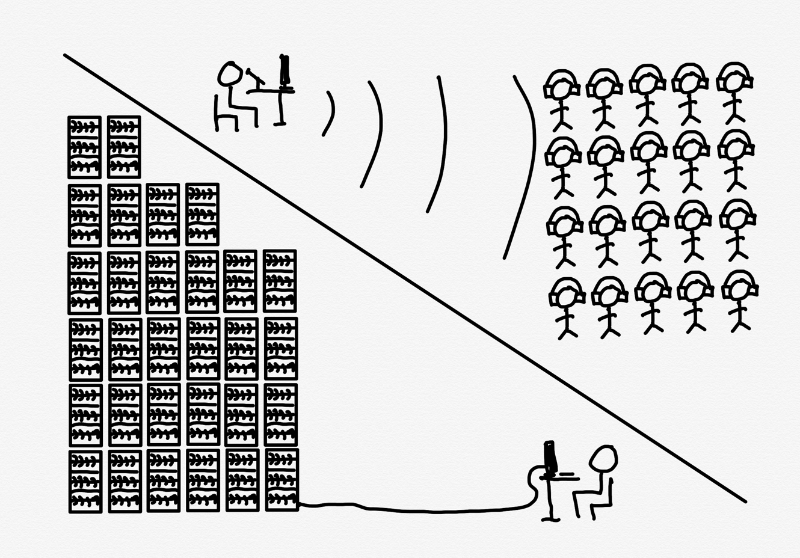

# Stratechery Article

**Source URL**: https://stratechery.com/2026/ai-and-the-human-condition/

---

**Listen to this**post** :**

[Log in to listen](https://stratechery.com/wp-json/passport/v1/oauth/authlogin?signup_redirect_uri=https%3A%2F%2Fstratechery.com%2Fverify-your-email%2F)

Pity the paradox of the content producer in the age of AI. On one hand, AI is one of the greatest gifts ever in terms of topics to cover. The [2025 Stratechery Year in Review](https://stratechery.com/2025/the-2025-stratechery-year-in-review/) was, just like [2024](https://stratechery.com/2024/the-2024-stratechery-year-in-review/) and [2023](https://stratechery.com/2023/the-2023-stratechery-year-in-review/) (plus a few bangers in [2022](https://stratechery.com/2022/the-2022-stratechery-year-in-review/)) completely dominated by AI; my [Sharp Tech](https://sharptech.fm/member) co-host Andrew Sharp wrote [The Definitive Ranking of Tech Company Takeability](https://sharptext.net/2025/the-definitive-ranking-of-tech-company-takeability/), and OpenAI was number one with a bullet:

> OpenAI may or may not be the most important company of the future. There can be no doubt, however, that we are witnessing one of the most takeable enterprises in the history of the world. From the day it was founded — with a non-profit corporate structure that sought to build AGI and then control it themselves “to ensure artificial general intelligence benefits all of humanity” — this company has divided the audience and invited either passionate support or aggressive eye-rolls.

On the other hand, LLMs in particular are quite literally content producers! What’s the point of writing analysis when ChatGPT or Gemini or Claude will deliver analysis on demand, about any topic you want? Is this one of those situations like the early web, where [the possibility of reaching everyone seemed like a boon but was actually a ticking time bomb for the viability of the traditional publishing model](https://stratechery.com/2014/economic-power-age-abundance/)?

I’m actually pretty optimistic about Stratechery Plus’ fortunes for reasons I laid out in last year’s [Content and Community](https://stratechery.com/2025/content-and-community/):

> So, are existing publishers doomed? Well, by-and-large yes, but that’s because they have been doomed for a long time. People using AI instead of Google — or Google using AI to provide answers above links — make the long-term outlook for advertising-based publishers worse, but that’s an acceleration of a demise that has been in motion for a long time.
> 
> What I think is intriguing, however, is the possibility to go back to the future. Once upon a time publishing made countries; the new opportunity for publishing is to make communities. This is something that AI, particularly as it manifests today, is fundamentally unsuited to: all of that content generated by LLMs is individualized; what you ask, and what the AI answers, is distinct from what I ask, and what answers I receive. This is great for getting things done, but it’s useless for creating common ground…
> 
> Stratechery, on the other hand, along with a host of other successful publications, has the potential to be a totem pole around which communities can form…There is a need for community, and I think content, whether it be an essay, a podcast, or a video, can be artifacts around which communities can form and sustain themselves, ultimately to the economic benefit of the content creator. There is, admittedly, a lot to figure out in terms of that last piece, but when you remember that content made countries, the potential upside is likely quite large indeed.

This might, to be fair, be wishful thinking: maybe I’m doomed, but if I’m doomed, probably everyone else is too, particularly when you think about the very long run.

### Capital in the 22nd Century

It’s the very long run that a fellow content producer, Dwarkesh Patel, considered alongside Philip Trammell in a widely discussed post over the winter break entitled [Capital in the 22nd Century](https://philiptrammell.substack.com/p/capital-in-the-22nd-century):

> In his 2013 [Capital in the Twenty-first Century](https://www.amazon.com/Capital-Twenty-Century-Thomas-Piketty/dp/067443000X/), the socialist economist Thomas Piketty argued that, absent strong redistribution, economic inequality tends to increase indefinitely through the generations — at least until shocks, like large wars or prodigal sons, reset the clock. This is because the rich tend to save more than the poor and because they can get higher returns on their investments.
> 
> As many noted at the time, this is probably an incorrect account of the past. Labor and capital complement each other. Wealthy people can keep accumulating capital, but hammers grow less valuable when there aren’t enough hands to use all of them, and hands grow more valuable when hammers are plentiful. Capital accumulation thus lowers interest rates (aka income per unit of capital) and raises wages (income per unit of labor). This effect has tended to be strong enough that, though inequality may have grown for other reasons, inequality from capital accumulation alone has been self-correcting.
> 
> But in a world of advanced robotics and AI, this correction mechanism will break. That is, though Piketty was wrong about the past, he will probably be right about the future…If AI is used to lock in a more stable world, or at least one in which ancestors can more fully control the wealth they leave to their descendants (let alone one in which they never die), the clock-resetting shocks could disappear. Assuming the rich do not become unprecedentedly philanthropic, a global and highly progressive tax on capital (or at least capital income) will then indeed be essentially the only way to prevent inequality from growing extreme. Without one, once AI renders capital a true substitute for labor, approximately everything will eventually belong to those who are wealthiest when the transition occurs, or their heirs. Or more precisely, it will belong to the subset of this group who save most and most invest with a view to maximizing long-run returns.

There is an aspect to this argument that is of the dorm room discussion variety: even if we are approaching the point where AI can create AI (Claude Opus 4.5 appears to be a major leap forward in coding capability in particular), there is still a lot of work to do in terms of making it possible for AI to break out of its digital box and impact the real world via robotics. Part of the thinking, however, is that once AI can create AI, it can rapidly accelerate the development of robotics as well, until robots are making robots, each generation more capable than the last, until everything humans do today — both in the digital but also the physical world — can be done better by AI.

This is the world where capital drives all value, and labor none, in stark contrast to the approximately 33% share of GDP that has traditionally gone to capital, with 66% share of GDP going to labor. After all, you don’t pay robots for marginal labor: you build them once…check that, they build themselves, from materials they harvested, not just here on earth but across the galaxy, and do everything at zero marginal cost, a rate with which no human can compete.

### Reasons for Skepticism

I get the logic of Patel and Trammell’s argument, but I — perhaps, once again, over-optimistically — am skeptical about this being a problem, particularly one that needs to be addressed right here right now before the AI takeoff occurs, especially given the acute need for more capital investment at this moment in time.

First, the world Patel and Trammell envisions sounds like it would be pretty incredible for everyone. If AI can do everything, then it follows that everyone can have everything, from food and clothing to every service you can imagine (remember, the AI is so good that there are zero jobs for humans, which implies that all of the jobs can be done by robots for everyone). Does it matter if you don’t personally own the robots if every material desire is already met?

Second, on the flipside, this world also sounds implausible. It seems odd that AI would acquire such fantastic capabilities and yet still be controlled by humans and governed by property laws as commonly understood in 2025. I find the AI doomsday scenario — where this uber-capable AI is no longer controllable by humans — to be more realistic; on the flipside, if we start moving down this path of abundance, I would expect our collective understanding of property rights to shift considerably.

Third, it’s worth noting that we have seen dramatic shifts in labor in human history. Consider both agricultural revolutions: in the pre-Neolithic era zero percent of humans worked in agriculture; fast-forward to 1810, and 81% of the U.S. population worked in agriculture. Then came the second agriculture revolution, such that 200 years later only 1% of the U.S. population works in agriculture. It’s that decline that is particularly interesting to me: humans were replaced by machines, even as food became abundant and dramatically cheaper; no one is measuring their purchases based on how much food cost in 1700, just as they won’t measure their future purchases on the cost of material goods in a pre-robotics world.

That’s because humans didn’t just sit on their hands; rather, entirely new kinds of work were created, which were valued dramatically higher. Much of this was in factories, and then, over the last century, there was the rise of office work. All of that could very well be replaced by AI, but the point is that the history of humans is the continual creation of new jobs to be done — jobs that couldn’t have been conceived of before they were obvious, and which pay dramatically more than whatever baseline existed before technological change.

Like, if I might be cheeky, professional podcaster! Podcasts didn’t even exist thirty years ago, and yet here is Patel — and me! — accumulating capital simply by speaking into a mic and taking advantage of the Internet’s zero marginal cost of distribution, a concept that itself was unthinkable fifty years ago.

### Humans Want Humans

It’s possible, of course — and to return to my perhaps self-interested and potentially misplaced optimism above — that robots will be better at podcasting than Patel or I. I’m skeptical, though: my experience — and I’ll only speak for myself here — is that the human element is essential in creating compelling content. Sure, sometimes I say “uhm” or “like” or “sort of”, or I get facts wrong, but that’s a feature, not a bug: what I have to say is by definition unique to me, and that is interesting precisely because I am flesh-and-blood, not a robot.1

Indeed, another way to frame the optimism I have around my career is that the dynamics are the exact inverse of AI:

Right now it is individual humans who are uniquely capable to reach audiences at scale; AI, on the other hand, is about scaling compute to deliver results to individuals. Patel and Trammell were, to be sure, talking about the 22nd century, while this is a depiction of the first quarter of the 21st, but I think the desire for a communal experience will persist, and I think those experiences will continue to be organized around other humans, not machines.

More generally, I don’t think that this will be limited to podcasting (if such a concept even exists in one hundred years). Consider the most base example: sex. I have no doubt that there will be human-like robots with which you can have sex; I also have even stronger conviction that the overwhelming preference of humans will be to have sex with other humans. And that, by extension, means that all of the courtship and status games that go into finding a lover will persist, and that that itself will be an entire economy all its own. One will not impress a partner with commodity robot-generated goods, no matter how objectively perfect they might be: true value will come from uniqueness and imperfections that are downstream from a human.

In fact, I have great optimism that one potential upside of AI is a renewed appreciation of and investment in beauty. One of the great tragedies of the industrial era — particularly today — is that beauty in our built environment is nowhere to be found. How is it that we built intricate cathedrals hundreds of years ago, and forgettable cookie-cutter crap today? That is, in fact, another labor story: before the industrial revolution labor was abundant and cheap, which meant it was defensible to devote thousands of person-years into intricate buildings; once labor was made more productive, and thus more valuable, it simply wasn’t financially viable to divert so much talent for so much time. Perhaps it follows, then, that the devaluing of labor Patel and Trammell warn about actually frees humans up to once again create beauty? Yes, robots could do it too, but I think humans will value the work of other humans more. Indeed, I think this is coming sooner than you might think: I expect the widespread availability of high quality AI art to actually make human art more desirable and valuable, precisely because of its provenance.2

It’s also worth noting the relative popularity of human-generated content versus AI-generated content. Sora is down to 59 in the App Store, and I count double-digit human-denominated social apps that rank above it. Yes, I get the argument that this is the worst that AI will ever be, but it also will never be human, which is what humans want most of all.

### The Problem With Inequality

This gets at what I found the most frustrating about Patel and Trammell’s point of view: the core assumption undergirding their argument was also about the human condition; it just happened to be negative.

Louis C.K., in an October 2008 appearance on _Late Night with Conan O’Brien_ , delivered one of the most incisive and eternal observations about human nature: “Everything is amazing right now and nobody’s happy.”

You’ve almost certainly seen this clip, but if not, it’s worth watching in full; Louis C.K. focuses on three incredible technological innovations and how quickly we took them for granted: smartphones, Internet access on planes, and the act of flying itself. It’s certainly a sentiment I can relate to: just in the last 72 hours I have chafed at slow airplane WiFi, complained about jet lag from having literally traversed the globe, and gotten frustrated at an iPhone bug that is sapping my battery. It’s all so terrible, until I remember I have access to anything everywhere, can be anywhere anytime, and oh yeah, can achieve both simultaneously.

If anything, you can make the case that technological innovations, by virtue of conferring their benefits on everybody, has actually had the perverse effect of making everyone _feel_ worse off. When I was a child growing up in small town Wisconsin, I had some sort of vague sense that there were rich people in the world, but from my perspective taking my first airplane flight around the age of ten was a source of great wonder, and even provided a sense of status; after all, many of my friends had never flown at all. That was the comparison set that mattered to me.

Social media — or, more accurately, user-generated content feeds, which are increasingly not social at all — has completely changed this dynamic. All I or anyone else needs to do is open Instagram to see beautiful people on private jets or on beaches or at fancy restaurants, living a life that seems dramatically better than one’s dull existence in the suburbs or a cramped apartment; never mind that the means of achieving that insight is a level of technological wealth that would have been incomprehensible to the richest person in the world fifty years ago.

To put it another way, what Louis C.K. identified in this clip was the extent to which human happiness is a relative versus absolute phenomenon: what we care about is not how much we have, but how we compare. That, by extension, is what drives the technological paradox I noted above: more capabilities, more broadly distributed, has tremendously enriched the world on an absolute basis; the end result, however, has been the dramatic expansion of our comparison set, making us feel more immiserated than ever.3

This, writ large, is what Patel and Trammell seem to be worried about: sure, everyone may have all of their material needs met, but that won’t be good enough if the price of that abundance is the knowledge that someone else has more. This might not be rational, but it certainly is human!

If you assume that the negative parts of humanity will persist in this world of abundance, however, then you must leave room for the positive parts as well, the ones that I wrote about above. Even if AI does all of the jobs, humans will still want humans, creating an economy for labor precisely because it is labor. You can’t make the case that the potential for jealousy ought to drive authoritarian capital controls while completely dismissing the possibility that the prospect of desirability gives everyone jobs to do, even if we can’t possibly imagine what those jobs might be — beyond podcasting, of course.

* * *

* * *

  1. If you want a specific example, consider the rapturous response to [Bill Simmons’ 50 Most Rewatchable Movies of the 21st Century](https://open.spotify.com/episode/7dAku1CIUUjMxmrRq8pQrC?pi=mGWjFgKQTsCm-) episode, which was delightful precisely because it was pure Bill ↩

  2. This isn’t idle talk: I’m encouraging [my daughter](https://www.instagram.com/07artchronicles/) to pursue art; granted, I’m also working quite hard to build up a store of capital for her as well! ↩

  3. As an aside, this is why galaxy exploration would be a positive, not a negative: out of sight, out of mind, just like it used to be. ↩

### Share

  * [ Share on Facebook (Opens in new window) Facebook ](https://stratechery.com/2026/ai-and-the-human-condition/?share=facebook)
  * [ Share on X (Opens in new window) X ](https://stratechery.com/2026/ai-and-the-human-condition/?share=twitter)
  * [ Share on LinkedIn (Opens in new window) LinkedIn ](https://stratechery.com/2026/ai-and-the-human-condition/?share=linkedin)
  * [ Email a link to a friend (Opens in new window) Email ](mailto:?subject=%5BShared%20Post%5D%20AI%20and%20the%20Human%20Condition&body=https%3A%2F%2Fstratechery.com%2F2026%2Fai-and-the-human-condition%2F&share=email)
  *