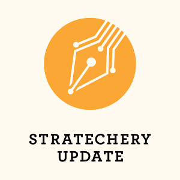
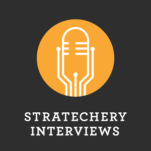

# Stratechery Article

**Source URL**: https://stratechery.com/2026/oracle-earnings-oracles-cloud-growth-oracles-software-defense/

---

Oracle crushed earnings in a way that not only speaks to the secular AI wave they are riding but also to Oracle’s strong position

* * *

# 

**Subscribe to Stratechery Plus for full access.**

Already subscribed? 

[Log in](https://stratechery.com/wp-json/passport/v1/oauth/authlogin?signup_redirect_uri=https%3A%2F%2Fstratechery.com%2Fverify-your-email%2F)

**$15** / month _or_ **$150** / year

[Subscribe to Stratechery Plus](https://stratechery.passport.online/member/plan/4ycW4SE71Cy6ryrijywbTG)

With Stratechery Plus you get access to the subscriber-only [Stratechery Update](https://stratechery.com/category/daily-email/) and [Stratechery Interviews](https://stratechery.com/topic/events/interview/), and the Sharp Tech, Sharp China, Dithering, Greatest of All Talk, and Asianometry podcasts.

**Stratechery Update**  
Substantial analysis of the news of the day delivered via three weekly emails or podcasts.

**Stratechery Interviews**  
Interviews with leading public CEOs, private company founders, and discussions with fellow analysts.

**Dithering**  
A twice-weekly podcast from John Gruber and myself: 15 minutes an episode, not a minute less, not a minute more.

**Sharp Tech**  
Andrew Sharp and myself discuss how technology works and the ways it impacts our lives.

**Sharp China**  
A weekly podcast from Andrew Sharp and Sinocism’s Bill Bishop about understanding China and how China impacts the world.

**Greatest Of All Talk**  
A twice-weekly podcast from Andrew Sharp and Ben Golliver about the NBA, life, and national parks.

**Asianometry**  
Audio and transcripts of the [Asianometry YouTube channel](https://www.youtube.com/@Asianometry), the best source for learning about how tech works.

**Sharp Text**  
Sharp Text is an extension of GOAT, Sharp Tech and Sharp China, where Andrew writes about basketball, technology, and US-China relations with weekly posts.

_Stratechery Updates are also available via SMS, RSS, or on this site. Please see the[Stratechery Update Schedule](https://stratechery.com/daily-update/daily-update-schedule/) for more details about delivery times and planned days-off. Please note that all subscriptions auto-renew monthly/annually (but can be [cancelled](https://stratechery.passport.online/member/account/subs) at any time). If you are interested in ordering and managing multiple subscriptions for your team or company, please fill in the form [here](https://stratechery.com/daily-update/group/)._

#### Frequently-Asked Questions

How do I subscribe to the Stratechery Podcast?

Once you are subscribed, please visit your [Delivery Preferences](https://stratechery.passport.online/member/) where you will find easy-to-follow instructions for adding Stratechery Podcasts to your favorite podcast player.

Can I read Stratechery via RSS?

Yes! [Create a Stratechery Passport account](https://stratechery.com/podcasts/), go to Delivery Preferences, and add your personalized RSS feed. Free accounts will have access to Weekly Articles, while subscribers will have access to the Daily Update as well.

Can I share a Stratechery Update subscription with a friend?

No, the Stratechery Update and Stratechery Podcast are intended for one subscriber only. Sharing emails, using shared inboxes, or sharing RSS feeds is a violation of Stratechery’s [Terms of Service](https://stratechery.com/terms-of-service/), and your account may be suspended or your RSS feed reset. Of course occasional forwarding of the Stratechery Update to interested friends or colleagues is totally fine.

Can I buy a subscription for my team?

Yes! You can [purchase a team subscription here](https://stratechery.passport.online/member/team/4ycW4SE71Cy6ryrijywbTG). 

Can I switch to an annual plan?

Yes! Just go to [your account page](https://stratechery.passport.online/member), choose the ‘Subscriptions’ tab, and click the Annual upgrade button. You will be charged immediately, with a prorated discount applied for the remainder of your current monthly plan.

Do you offer a student discount?

Stratechery is purposely kept at a low price — thousands of dollars less than other analyst reports or newsletters — to ensure it is accessible to everyone, including students.

Can you create a custom invoice that meets my government/company requirements?

I am happy to create an invoice to your specification for annual subscribers; however, it is simply not viable for me to offer this service to monthly subscribers. Therefore, if you need a custom invoice please subscribe or switch to an annual subscription and [contact Stratechery](mailto:blog@stratechery.com).

_June 1, 2021 Update: We are hoping to add native support for custom invoices to[Passport](http://stratechery.com/2021/passport); you can subscribe to [Passport Updates](https://stratechery.passport.online/member/plan/DVyjHmbLQQtRZKE8scgZBh) to be notified when it is available._

Can I give a subscription as a gift?

Yes! To send a gift [visit the gifts page](https://stratechery.passport.online/member/gift).

### Share

  * [ Share on Facebook (Opens in new window) Facebook ](https://stratechery.com/2026/oracle-earnings-oracles-cloud-growth-oracles-software-defense/?share=facebook)
  * [ Share on X (Opens in new window) X ](https://stratechery.com/2026/oracle-earnings-oracles-cloud-growth-oracles-software-defense/?share=twitter)
  * [ Share on LinkedIn (Opens in new window) LinkedIn ](https://stratechery.com/2026/oracle-earnings-oracles-cloud-growth-oracles-software-defense/?share=linkedin)
  * [ Email a link to a friend (Opens in new window) Email ](mailto:?subject=%5BShared%20Post%5D%20Oracle%20Earnings%2C%20Oracle%27s%20Cloud%20Growth%2C%20Oracle%27s%20Software%20Defense&body=https%3A%2F%2Fstratechery.com%2F2026%2Foracle-earnings-oracles-cloud-growth-oracles-software-defense%2F&share=email)
  *