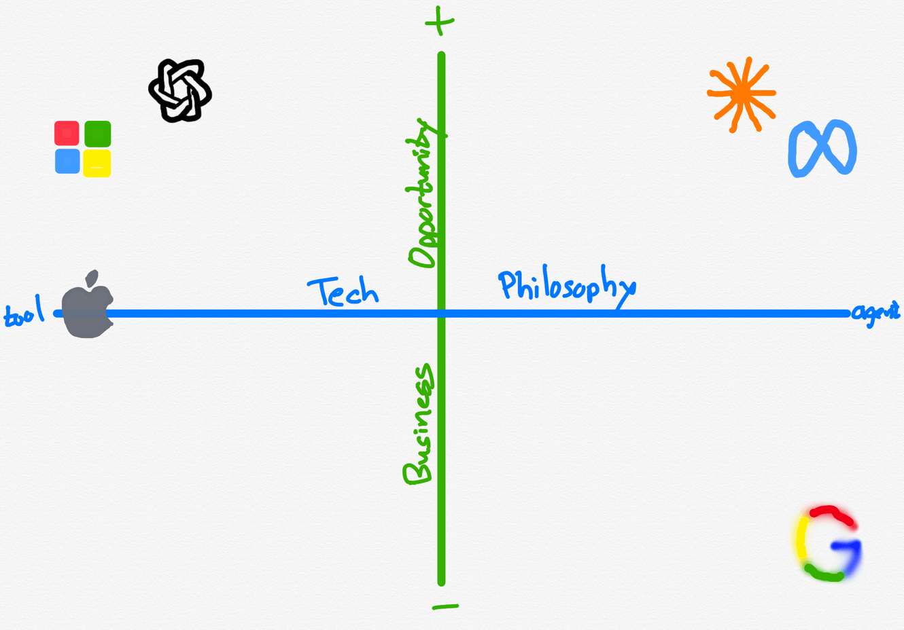
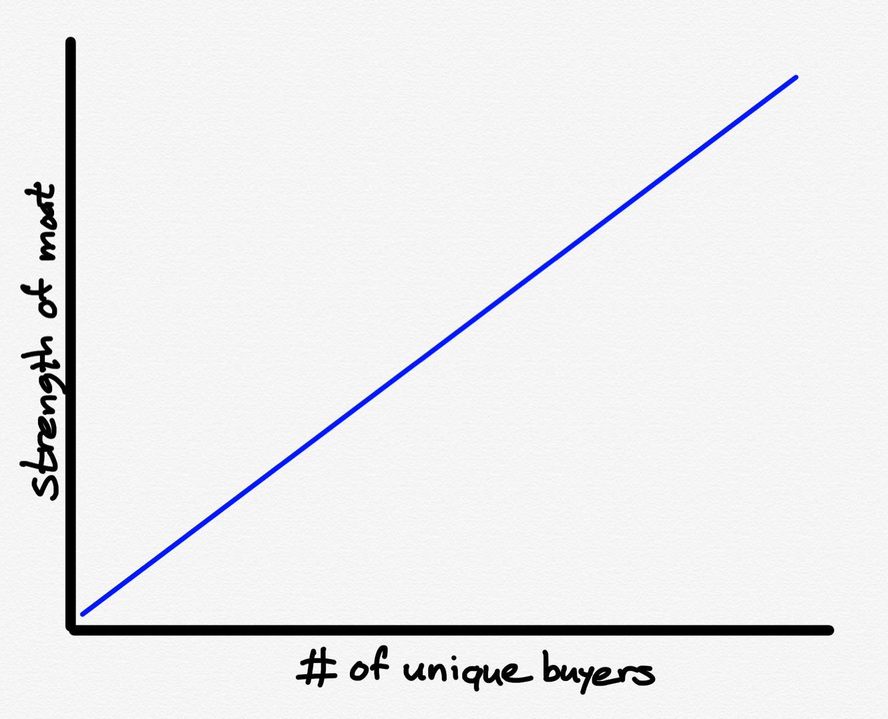
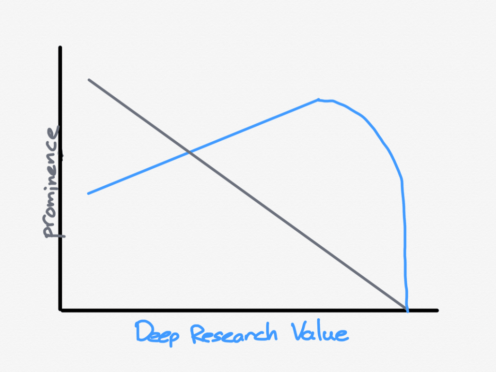
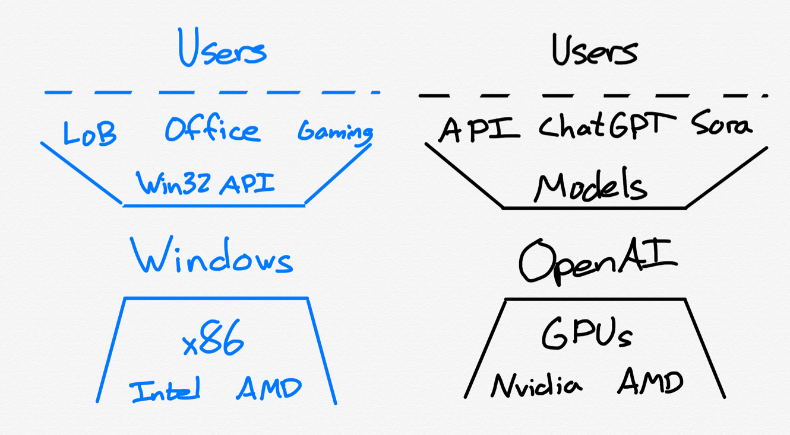
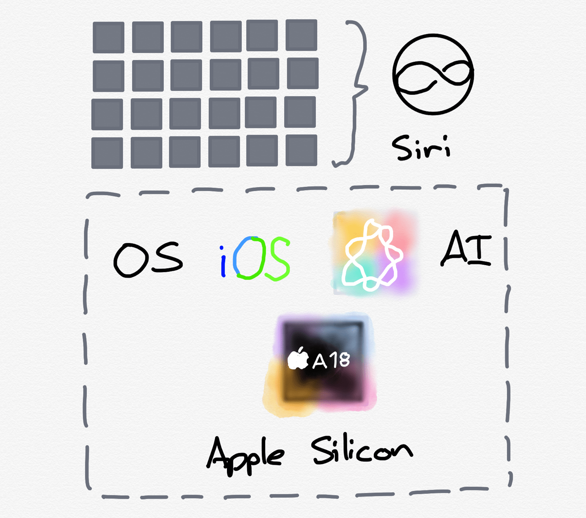
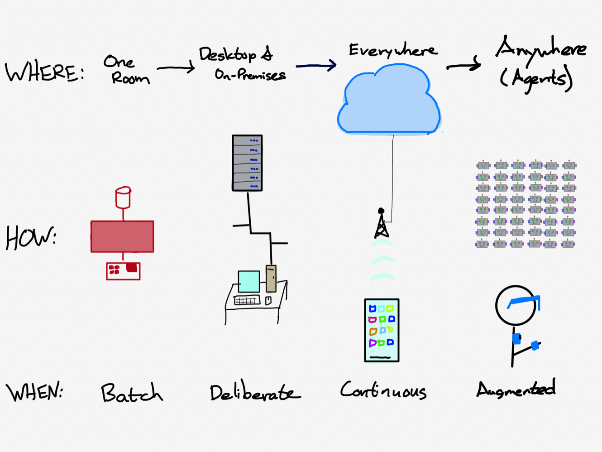
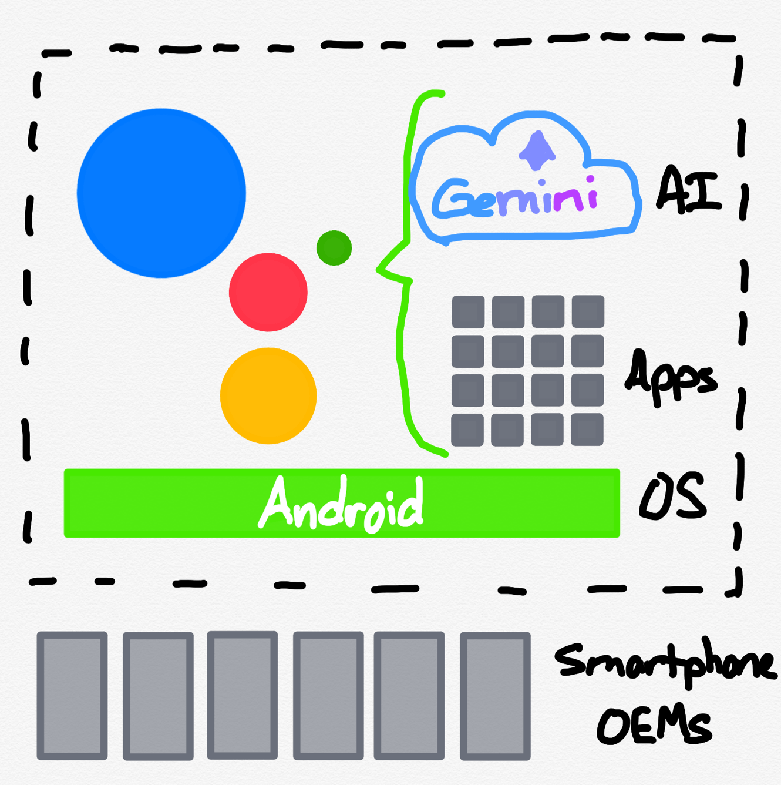
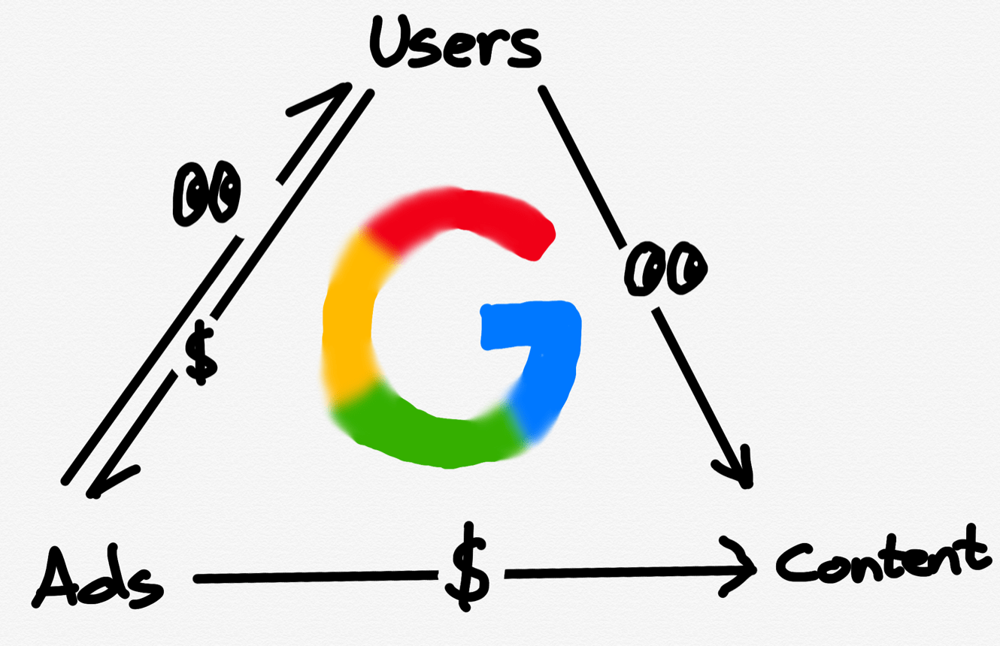

# Stratechery Article

**Source URL**: https://stratechery.com/2025/the-2025-stratechery-year-in-review/

---

While I started Stratechery in 2013 while living in the United States, within months [I moved back to Taiwan](https://stratechery.com/2013/independence/), which means the vast majority of Stratechery content was written from the other side of the world from the companies I covered most closely. The big event this year is that [I moved back](https://stratechery.com/2025/a-personal-update-and-vacation-break/): Stratechery, now in its 13th year, is once again a U.S.-based publication.

Here are the Taiwan 12 Years in Review:

[2024](https://stratechery.com/2024/the-2024-stratechery-year-in-review/) | [2023](https://stratechery.com/2023/the-2023-stratechery-year-in-review/) | [2022](https://stratechery.com/2022/the-2022-stratechery-year-in-review/) | [2021](https://stratechery.com/2021/the-2021-stratechery-year-in-review/) | [2020](https://stratechery.com/2020/the-2020-stratechery-year-in-review/) | [2019](https://stratechery.com/2019/the-2019-stratechery-year-in-review/) | [2018](https://stratechery.com/2018/the-2018-stratechery-year-in-review/) | [2017](https://stratechery.com/2017/the-2017-stratechery-year-in-review/) | [2016](https://stratechery.com/2016/the-2016-stratechery-year-in-review/) | [2015](https://stratechery.com/2015/the-stratechery-2015-year-in-review/) | [2014](https://stratechery.com/2014/stratechery-2014-year-review/) | [2013](http://stratechery.com/2013/stratechery-2013-year-review/)

This year was once again dominated by AI, particularly in the context of big tech companies; another consistent theme, however, was the opposite of progress: concern about the United States’ competitive position in manufacturing in particular. It’s striking, but perhaps not surprising, that these two issues are rising in prominence at the same time. Will AI save America, and can America build what it needs to truly reap AI’s benefits?

This year Stratechery published 26 free [Articles](https://stratechery.com/category/articles/), 109 subscriber [Updates](https://stratechery.com/category/daily-email/), and 39 [Interviews](https://stratechery.com/category/interviews/). Below is a summary of most of the Articles, Interviews, and a selection of my favorite Updates of the year.

### The Five Most-Viewed Articles

The five most-viewed Articles on Stratechery according to page views:

  1. [DeepSeek FAQ](https://stratechery.com/2025/deepseek-faq/) — DeepSeek has completely upended people’s expectations for AI and competition with China. What is it, and why does it matter?
  2. [Google, Nvidia, and OpenAI](https://stratechery.com/2025/google-nvidia-and-openai/) — OpenAI and Nvidia are both under threat from Google; I like OpenAI’s chances best, but they need an advertising model to beat Google as an Aggregator.
  3. [The Agentic Web and Original Sin](https://stratechery.com/2025/the-agentic-web-and-original-sin/) — Microsoft is putting forth compelling proposals for the Open Agentic Web. However, the proposal needs digital payments, which will be key to creating a new content marketplace for AI.
  4. [U.S. Intel](https://stratechery.com/2025/u-s-intel/) — The U.S. taking an equity stake in Intel is a terrible idea; it also happens to be the least bad idea to make Intel Foundry viable.
  5. [The Benefits of Bubbles](https://stratechery.com/2025/the-benefits-of-bubbles/) — We are in an AI Bubble: the big question is if this bubble will be worth it for the physical infrastructure and coordinated innovation that result?

### Analyzing AI and Its Impact on Society

Nearly every Article on Stratechery touched on AI; these Articles took a broader view than just one company.

  * [AI’s Uneven Arrival](https://stratechery.com/2025/ais-uneven-arrival/) — o1/o3 points the way to AGI, which is AI that can complete tasks; it may take longer for most companies to adopt them than you might think: just look at digital advertising.
  * [Deep Research and Knowledge Value](https://stratechery.com/2025/deep-research-and-knowledge-value/) — Deep Research is an AGI product for certain narrow domains; its ability to find anything on the Internet will make secret knowledge all the more valuable.
  * [Checking In on AI and the Big Five](https://stratechery.com/2025/checking-in-on-ai-and-the-big-five/) — A review of the current state of AI through the lens of the Big Five tech companies.
  * [Tech Philosophy and AI Opportunity](https://stratechery.com/2025/tech-philosophy-and-ai-opportunity/) — Positioning AI contenders — and losers — by their tech philosophy and business potential.
  * [Content and Community](https://stratechery.com/2025/content-and-community/) — The old model for content sprung from geographic communities; the new model for content is to be the organizing principle for virtual communities.

### Big Tech

The companies spending the most on AI — and with the most to potentially lose — are the biggest tech companies. Plus, the implication of self-driving cars and the end game in Hollywood.

  * [Facebook is Dead; Long Live Meta](https://stratechery.com/2025/meta-earnings-meta-turns-the-dial-social-network-r-i-p/) — Meta delivered blowout earnings the same quarter that Mark Zuckerberg doubled down on AI; I don’t think it was a coincidence. _See also:_ [Sora, AI Bicycles, and Meta Disruption](https://stratechery.com/2025/sora-ai-bicycles-and-meta-disruption/) — Sora is going viral, suggesting there is a big opportunity in unlocking creativity. If that’s true, that’s good for humanity — and bad for Meta.
  * [The YouTube Tip of the Google Spear](https://stratechery.com/2025/the-youtube-tip-of-the-google-spear/) — I’ve come to appreciate Google’s amorphous nature; what makes me bullish is the clarity of YouTube’s AI opportunity.
  * [OpenAI’s Windows Play](https://stratechery.com/2025/openais-windows-play/) — OpenAI is making a play to be the Windows of AI: the all-encompassing platform that controls both hardware supplier and software developers.
  * [Robotaxis and Suburbia](https://stratechery.com/2025/robotaxis-and-suburbia/) — Robotaxis are poised to further close the delta between suburbs and the city; the city (and Uber) might never recover.
  * [Netflix and the Hollywood End Game](https://stratechery.com/2025/netflix-and-the-hollywood-end-game/) — Netflix is driving the Hollywood end game, likely confident it can increase the value of IP, and fend off YouTube.

### Apple and AI

One big tech company received special focus this year: Apple, which stumbled in its initial attempt to build AI.

  * [Apple AI’s Platform Pivot Potential](https://stratechery.com/2025/apple-ais-platform-pivot-potential/) — Apple AI is delayed, and Apple may be trying to do too much; what the company ought to do is empower developers to make AI applications.
  * [Apple and the Ghosts of Companies Past](https://stratechery.com/2025/apple-and-the-ghosts-of-companies-past/) — Apple is not doomed, but for the first time in a long time its long-term fortunes are cloudy; the time to make change is now.
  * [Apple Retreats](https://stratechery.com/2025/apple-retreats/) — Apple’s WWDC was a retreat from not just last year’s WWDC, but potentially a broader reset for the company. That’s why it was a great presentation.
  * [Paradigm Shifts and the Winner’s Curse](https://stratechery.com/2025/paradigm-shifts-and-the-winners-curse/) — When paradigms change, previous winners have the hardest time adjusting; that is why AI might be a challenge for Apple and Amazon.
  * [iPhones 17 and the Sugar Water Trap](https://stratechery.com/2025/iphones-17-and-the-sugar-water-trap/) — Apple’s iPhone announcement was impressive, but no one was impressed, because Apple is increasingly peripheral to what is changing the world.

### American Challenges

America is leading the way in AI, but is finding itself behind in manufacturing; policy makers have to consider the implications of both.

  * [AI Promise and Chip Precariousness](https://stratechery.com/2025/ai-promise-and-chip-precariousness/) — The AI industry is more exciting than ever, but the chip situation is very precarious and requires drastic action.
  * [American Disruption](https://stratechery.com/2025/american-disruption/) — A new take on Trump’s tariffs, including using a disruption lens to understand the U.S.’s manufacturing problem, and why a better plan would leverage demand, not kill it.
  * [Resiliency and Scale](https://stratechery.com/2025/resiliency-and-scale/) — Decreasing transportation and communications costs increases resiliency in theory, but destroys it in practice. The only way to have resiliency is through less efficiency.

### Stratechery Interviews

Every week (except July and August) I post a Stratechery Interview — in podcast and transcript form — with public company executives, private company founders, and other analysts.

#### Public Company Executive Interviews

ServiceNow CEO [Bill McDermott](https://stratechery.com/2025/an-interview-with-servicenow-ceo-bill-mcdermott-about-enterprise-ai-agents/) | Uber CEO [Dara Khosrowshahi](https://stratechery.com/2025/an-interview-with-uber-ceo-dara-khosrowshahi-about-aggregation-and-autonomy/) | Snowflake CEO [Sridhar Ramaswamy](https://stratechery.com/2025/an-interview-with-snowflake-ceo-sridhar-ramaswamy-about-data-and-ai/) | Google Cloud CEO [Thomas Kurian](https://stratechery.com/2025/an-interview-with-google-cloud-platform-ceo-thomas-kurian-about-building-an-enterprise-culture/) | Meta CEO [Mark Zuckerberg](https://stratechery.com/2025/an-interview-with-meta-ceo-mark-zuckerberg-about-ai-and-the-evolution-of-social-media/) | SAP CEO [Christian Klein](https://stratechery.com/2025/an-interview-with-sap-ceo-christian-klein-about-enterprise-ai/) | Nvidia CEO [Jensen Huang](https://stratechery.com/2025/an-interview-with-nvidia-ceo-jensen-huang-about-chip-controls-ai-factories-and-enterprise-pragmatism/) | Cloudflare CEO [Matthew Prince](https://stratechery.com/2025/an-interview-with-cloudflare-founder-and-ceo-matthew-prince-about-internet-history-and-pay-per-crawl/) | YouTube CEO [Neil Mohan](https://stratechery.com/2025/an-interview-with-youtube-ceo-neal-mohan-about-building-a-stage-for-creators/) | Booking CEO [Glenn Fogel](https://stratechery.com/2025/an-interview-with-booking-ceo-glenn-fogel-about-travel-and-aggregation/) | Asana Founder [Dustin Moskovitz](https://stratechery.com/2025/an-interview-with-asana-founder-dustin-moskovitz-about-ai-saas-and-safety/) | Unity CEO [Matthew Bromberg](https://stratechery.com/2025/an-interview-with-unity-ceo-matthew-bromberg-about-turnarounds/) | Atlassian CEO [Mike Cannon-Brookes](https://stratechery.com/2025/an-interview-with-atlassian-ceo-mike-cannon-brookes-about-atlassian-and-ai/) | Rivian CEO [RJ Scaringe](https://stratechery.com/2025/an-interview-with-rivian-ceo-rj-scaringe-about-building-a-car-company-and-autonomy/)

#### Startup Founder Interviews

Anduril CEO [Brian Schimpf](https://stratechery.com/2025/an-interview-with-anduril-co-founder-and-ceo-brian-schimpf-about-paradigm-shifts/) | Manna CEO [Bobby Healy](https://stratechery.com/2025/an-interview-with-manna-founder-and-ceo-bobby-healy-about-drone-delivery/) | Tailscale CEO [Avery Pennarun](https://stratechery.com/2025/an-interview-with-tailscale-co-founder-and-ceo-avery-pennarun/) | OpenAI CEO Sam Altman in [March](https://stratechery.com/2025/an-interview-with-openai-ceo-sam-altman-about-building-a-consumer-tech-company/) and [October](https://stratechery.com/2025/an-interview-with-openai-ceo-sam-altman-about-devday-and-the-ai-buildout/) | Plaid CEO [Zach Perret](https://stratechery.com/2025/an-interview-with-plaid-founder-and-ceo-zach-perret-about-plumbing-trust/) | Cursor CEO [Michael Truell](https://stratechery.com/2025/an-interview-with-cursor-co-founder-and-ceo-michael-truell-about-coding-with-ai/) | Sierra CEO [Bret Taylor](https://stratechery.com/2025/an-interview-with-sierra-founder-and-ceo-bret-taylor-about-ai-agents-and-tech-history-lessons/) | Flighty CEO [Ryan Jones](https://stratechery.com/2025/an-interview-with-ryan-jones-about-flighty-and-building-apps-in-2025/)

#### Analysts

[Jon Yu](https://stratechery.com/2025/an-interview-with-jon-yu-about-youtube-and-making-semiconductors/) on YouTube and semiconductors | [Daniel Gross and Nat Friedman](https://stratechery.com/2025/an-interview-with-daniel-gross-and-nat-friedman-about-models-margins-and-moats/) on AI | [Matthew Ball](https://stratechery.com/2025/an-interview-with-matthew-ball-about-the-gaming-slump/) on gaming | [Benedict Evans](https://stratechery.com/2025/an-interview-with-benedict-evans-about-ai-unknowns/) on AI unknowns | Michael Nathanson on streaming in [March](https://stratechery.com/2025/an-interview-with-michael-nathanson-about-the-streaming-endgame/) and [December](https://stratechery.com/2025/an-emergency-interview-with-michael-nathanson-about-netflixs-acquisition-of-warner-bros/) | [Dan Kim and Hassan Khan](https://stratechery.com/2025/an-interview-with-dan-kim-and-hassan-khan-about-chips/) on CHIPS, and [Dan Kim](https://stratechery.com/2025/an-interview-with-dan-kim-about-intel-nvidia-and-the-u-s-government/) on Intel and Nvidia | Eric Seufert on digital advertising in [April](https://stratechery.com/2025/an-interview-with-eric-seufert-about-digital-advertising-during-political-uncertainty/) and [November](https://stratechery.com/2025/an-interview-with-eric-seufert-about-advertising-and-ai/) | [Patrick McGee](https://stratechery.com/2025/an-interview-with-apple-in-china-author-patrick-mcgee/) on [Apple In China](https://appleinchina.com/) | [Ben Bajarin](https://stratechery.com/2025/an-interview-with-ben-bajarin-about-ai-infrastructure/) on AI Infrastructure | [Gracelin Baskaran](https://stratechery.com/2025/an-interview-with-gracelin-baskaran-about-rare-earths/) on rare earths | [Michael Morton](https://stratechery.com/2025/an-interview-with-michael-morton-about-ai-e-commerce/) on e-commerce

### The Year in Stratechery Updates

Some of my favorite Stratechery Updates from 2025:

  * [January 8](https://stratechery.com/2025/meta-changes-moderation-policies-zuckerbergs-journey-and-mine-the-audacity-of-copying-well/): Meta Changes Moderation Policies, Zuckerberg’s Journey — and Mine, The Audacity of Copying Well
  * [February 4](https://stratechery.com/2025/apple-earnings-openai-deep-research-the-unbundling-of-substantiation/): Apple Earnings, OpenAI Deep Research, The Unbundling of Substantiation
  * [February 19](https://stratechery.com/2025/encryption-and-the-uneasy-compromise-netflix-earnings-the-aggregators-compounding-advantage/): Encryption and the Uneasy Compromise, Netflix Earnings, The Aggregator’s Compounding Advantage
  * [March 3](https://stratechery.com/2025/microsoft-eols-skype-skypes-founding-microsofts-skype-charity/): Microsoft EOLs Skype, Skype’s Founding, Microsoft’s Skype Charity
  * [March 5](https://stratechery.com/2025/alexa-a-brief-history-of-alexa-amazon-and-apples-mistake/): Alexa+, A Brief History of Alexa, Amazon — and Apple’s — Mistake
  * [March 19](https://stratechery.com/2025/nvidia-gtc-and-asics-the-power-constraint-the-pareto-frontier/): Nvidia GTC and ASICs, The Power Constraint, The Pareto Frontier
  * [April 15](https://stratechery.com/2025/meta-v-ftc-the-three-facebook-eras-video-slop-and-market-forces/): Meta v. FTC, The Three Facebook Eras, Video Slop and Market Forces
  * [May 14](https://stratechery.com/2025/airbnbs-new-app-experiences-and-services-cheskys-founder-mode/): Airbnb’s New App, Experiences and Services, Chesky’s Founder Mode
  * [May 21](https://stratechery.com/2025/google-i-o-the-search-funnel-product-possibilities/): Google I/O, The Search Funnel, Product Possibilities
  * [June 3](https://stratechery.com/2025/nike-on-amazon-nikes-disastrous-pivot-inevitability-intentionality-and-amazon/): Nike on Amazon; Nike’s Disastrous Pivot; Inevitability, Intentionality, and Amazon
  * [June 24](https://stratechery.com/2025/talent-wars-nba-money-ai-money/): Talent Wars, NBA Money, AI Money
  * [July 14](https://stratechery.com/2025/google-and-windsurf-stinky-deals-chestertons-fence-and-the-silicon-valley-ecosystem/): Google and Windsurf, Stinky Deals, Chesterton’s Fence and the Silicon Valley Ecosystem
  * [July 16](https://stratechery.com/2025/cloudflares-content-independence-day-googles-advantage-monetizing-ai/): Cloudflare’s Content Independence Day, Google’s Advantage, Monetizing AI
  * [July 28](https://stratechery.com/2025/tsmc-earnings-a16-and-tsmcs-approach-to-backside-power-intel-earnings-architecture-and-ai/): TSMC Earnings; A16 and TSMC’s Approach to Backside Power; Intel Earnings, Architecture, and AI
  * [July 30](https://stratechery.com/2025/figma-s-1-the-figma-os-figmas-ai-potential/): Figma S-1, The Figma OS, Figma’s AI Potential
  * [August 27](https://stratechery.com/2025/kpop-demon-hunters-sonys-risk-the-netflix-aggregator/): KPop Demon Hunters, Sony’s Risk, The Netflix Aggregator
  * [September 9](https://stratechery.com/2025/spacex-buys-spectrum-spectrum-specifics-spacexs-big-bet/) and [November 11](https://stratechery.com/2025/spacex-buys-more-spectrum-spacexs-pivot-why-apple-and-spacex-should-partner/) on SpaceX’s foray into terrestrial spectrum
  * [September 24](https://stratechery.com/2025/youtube-restores-suspended-accounts-free-speech-and-cultural-mores-platform-power/): YouTube Restores Suspended Accounts, Free Speech and Cultural Mores, Platform Power
  * [November 3](https://stratechery.com/2025/google-earnings-meta-earnings-the-cost-of-reality-labs/): Google Earnings, Meta Earnings, The Cost of Reality Labs
  * [December 10](https://stratechery.com/2025/trump-allows-h200-sales-to-china-the-sliding-scale-a-good-decision/): Trump Allows H200 Sales to China, The Sliding Scale, A Good Decision

 

* * *

I am so grateful to the subscribers that make it possible for me to do this as a job. I wish all of you a Merry Christmas and Happy New Year, and I’m looking forward to a great 2026!

### Share

  * [ Share on Facebook (Opens in new window) Facebook ](https://stratechery.com/2025/the-2025-stratechery-year-in-review/?share=facebook)
  * [ Share on X (Opens in new window) X ](https://stratechery.com/2025/the-2025-stratechery-year-in-review/?share=twitter)
  * [ Share on LinkedIn (Opens in new window) LinkedIn ](https://stratechery.com/2025/the-2025-stratechery-year-in-review/?share=linkedin)
  * [ Email a link to a friend (Opens in new window) Email ](mailto:?subject=%5BShared%20Post%5D%20The%202025%20Stratechery%20Year%20in%20Review&body=https%3A%2F%2Fstratechery.com%2F2025%2Fthe-2025-stratechery-year-in-review%2F&share=email)
  *