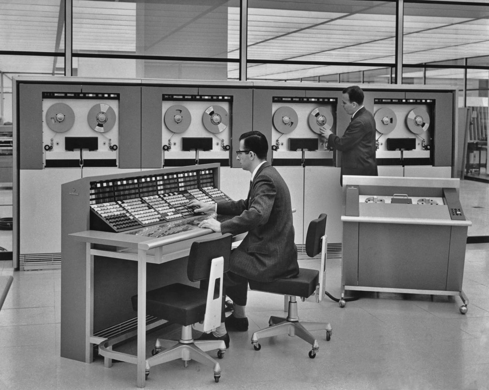
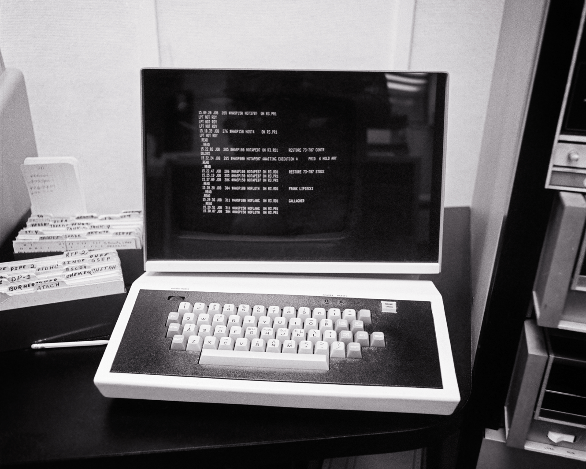
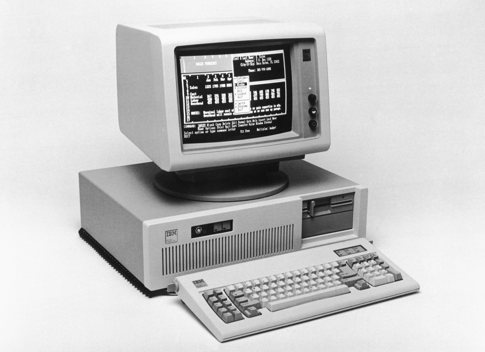
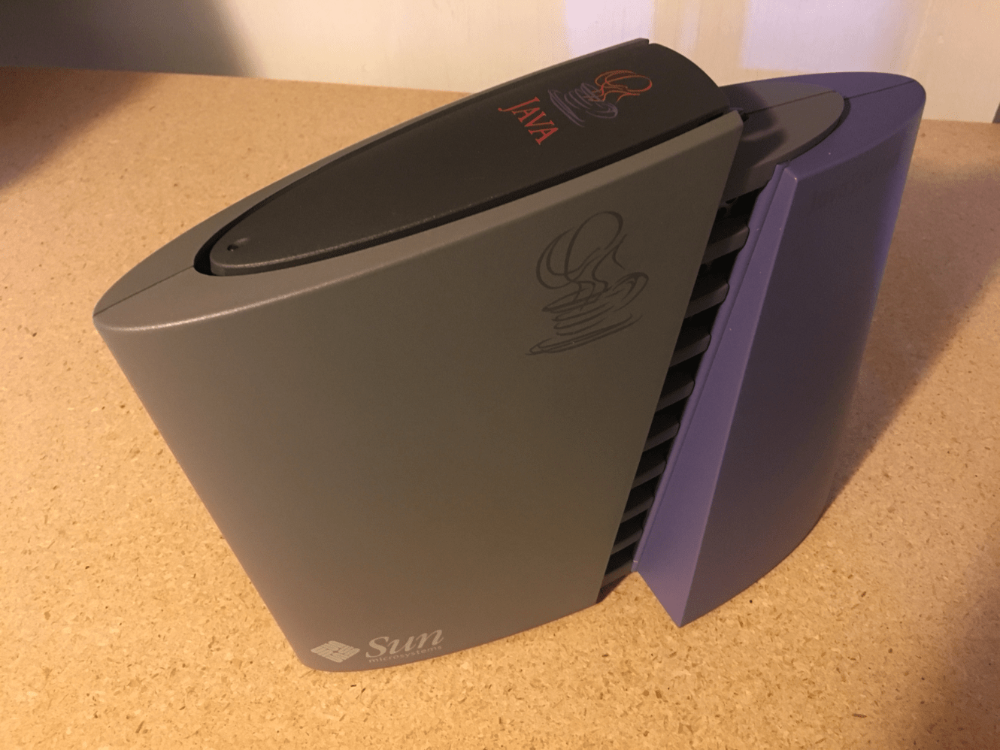

# Stratechery Article

**Source URL**: https://stratechery.com/2026/thin-is-in/

---

**Listen to this**post** :**

[Log in to listen](https://stratechery.com/wp-json/passport/v1/oauth/authlogin?signup_redirect_uri=https%3A%2F%2Fstratechery.com%2Fverify-your-email%2F)

There was, in the early days of computing, no debate about thick clients versus thin:

When a computer was the size of a room, there were no clients: you scheduled time or submitted jobs, and got back the results when it was your turn. A few years later, however, thin clients in the form of a monitor and keyboard arrived:

There is no computer in this image; rather, this is a terminal connected to a mainframe. That’s why it’s called a “thin” client: it’s just an interface, with all of the computing happening elsewhere (i.e. in another room). By the 1980s, however, “thick” clients were the dominant form of computing, in the form of the PC. All of your I/O and compute were packaged together: you typed on a keyboard connected to a PC, which output to the monitor in front of you.

A decade later, and Sun Microsystems in particular tried to push the idea of a “network computer”:

Adrian Cockcroft, CC-SA 4.0

This was a device that didn’t really have a local operating system; you ran Java applications and Java applets from a browser that were downloaded as they were used from a central server. Sun’s pitch was that network computers would be much cheaper and easier to administer, but PCs were dropping in price so quickly that the value proposition rapidly disappeared, and Windows so dominant that it was already the only platform that network administrators wanted to deal with. Thick clients won, and won decisively.

If you wanted to make a case for thin clients, you could argue that mobile devices are a hybrid; after all, the rise of mobile benefited from and drove the rise of the cloud: nearly every app on a phone connects to a server somewhere. Ultimately, however, mobile devices are themselves thick clients: they are very capable computers in their own right, that certainly benefit from being connected to a server, but are useful without it. Critically, the server component is just data: the actual interface is entirely local.

You can make the same argument about SaaS apps: on one hand, yes, they operate in the cloud and are usually accessed via a browser; on the other hand, the modern browser is basically an operating system in its own right, and the innovations that made SaaS apps possible were the fact that interactive web apps could be downloaded and run locally. Granted, this isn’t far off from Sun’s vision (although the language ended up being JavaScript, not Java), but you still need a lot of local compute to make these apps work.

### AI vs. UI

The thick-versus-thin debate felt, for many years, like a relic; that’s how decisive was the thick client victory. One of the things that is fascinating about AI, however, is that the thin client concept is not just back, it’s dominant.

The clearest example of this is the interface that most people use to interact with AI: chat. There is no UI that matters other than a text field and a submit button; when you click that button the text is sent to a data center, where all of the computation happens, and an answer is sent back to you. The quality of the answer or of the experience as a whole is largely independent of the device you are using: it could be a browser on a PC, an app on a high-end smartphone, or the cheapest Android device you can find. The device could be a car, or glasses, or just an earpiece. The local compute that matters is not processing power, but rather connectivity.

This interaction paradigm actually looks a lot like the interaction paradigm for mainframe computers: type text into a terminal, send it to the computer, and get a response back. Unlike mainframe terminals, however, the user doesn’t need to know a deterministic set of commands; you just say what you want in plain language and the computer understands. There is no pressure for local compute capability to drive a user interface that makes the computer easier to use, because a more complex user interface would artificially constrain the AI’s capabilities.

Nicolas Bustamante, in [an X Article about the prospects for vertical software in an AI world](https://x.com/nicbstme/status/2023501562480644501?s=48), explained why this is threatening:

> When the interface is a natural language conversation, years of muscle memory become worthless. The switching cost that justified $25K per seat per year dissolves. For many vertical software companies, the interface was most of the value. The underlying data was licensed, public, or semi-commoditized. What justified premium pricing was the workflow built on top of that data. That’s over.

Bustamante’s post is about much more than chat interfaces, but I think the user interface point is profound: it’s less that AI user interfaces are different, and more that, for many use cases, they basically don’t exist.

This is even clearer when you consider the next big wave of AI: agents. The point of an agent is not to use the computer for you; it’s to accomplish a specific task. Everything between the request and the result, at least in theory, should be invisible to the user. This is the concept of a thin client taken to the absolute extreme: it’s not just that you don’t need any local compute to get an answer from a chatbot; you don’t need any local compute to accomplish real work. The AI on the server does it all.

Of course most agentic workflows that work tread a golden path, but stumble with more complex situations or edge cases. That, though, is changing rapidly, as models become better and the capabilities of the chips running them increase, particularly in terms of memory. When it comes to inference, memory isn’t just important for holding the model weights, but also retaining context about the task at hand.

To date most of the memory that matters has been high-bandwidth memory attached to the GPUs, but [future architectures will offload context to flash storage](https://stratechery.com/2026/nvidia-at-ces-vera-rubin-and-ai-native-storage-infrastructure-alpamayo/). At the same time, managing agents is [best suited to CPUs](https://stratechery.com/2026/intel-earnings-the-agentic-opportunity-intels-mistaken-pessimism/), which themselves need large amounts of DRAM. In short, both the amount of compute we have, and the capability of that compute, still isn’t good enough; once it crosses that threshold, though, demand will only get that much stronger.

This combination of factors will only accentuate the dominance of the thin client paradigm:

  * First, if compute isn’t yet good enough, then workloads will flow to wherever compute is the best, which is going to be in large data centers.
  * Second, if larger models and more context makes for better results, then workloads will flow to wherever there is the most memory available.
  * Third, the expense of furnishing this level of compute means that it will be far more economical to share the cost of that compute amongst millions of users; guaranteeing high utilization and maximizing leverage on your up-front costs.

Yes, you can run large language models locally, but you are limited in the size of the model, the size of the context window, and speed. Meanwhile, the superior models with superior context windows and faster speeds don’t require a trip to the computer lab; just connect to the Internet from anywhere. Note that this reality applies even to incredible new local tools like OpenClaw: OpenClaw is an orchestration layer that runs locally, but the actual AI inference is, by default and in practice for most users, done by models in the cloud.

To put it another way, to be competitive, local inference would need some combination of smaller-yet-sufficiently-capable models, a breakthrough in context management, and critically, lots and lots of memory. It’s that last one that might be the biggest problem of all.

### The Memory Crowd-Out

From [Bloomberg](https://www.bloomberg.com/news/articles/2026-02-15/rampant-ai-demand-for-memory-is-fueling-a-growing-chip-crisis):

> A growing procession of tech industry leaders including Elon Musk and Tim Cook are warning about a global crisis in the making: A shortage of memory chips is beginning to hammer profits, derail corporate plans and inflate price tags on everything from laptops and smartphones to automobiles and data centers — and the crunch is only going to get worse…
> 
> Sony Group Corp. is now considering pushing back the debut of its next PlayStation console to 2028 or even 2029, according to people familiar with the company’s thinking. That would be a major upset to a carefully orchestrated strategy to sustain user engagement between hardware generations. Close rival Nintendo Co., which contributed to the surplus demand in 2025 after its new Switch 2 console drove storage card purchases, is also contemplating raising the price of that device in 2026, people familiar with its plans said. Sony and Nintendo representatives didn’t respond to requests for comment.
> 
> A manager at a laptop maker said Samsung Electronics has recently begun reviewing its memory supply contracts every quarter or so, versus generally on an annual basis. Chinese smartphone makers including Xiaomi Corp., Oppo and Shenzhen Transsion Holdings Co. are trimming shipment targets for 2026, with Oppo cutting its forecast by as much as 20%, Chinese media outlet Jiemian reported. The companies did not respond to requests for comment.

The memory shortage has been looming for a while, and is arguably the place where consumers will truly feel the impact of AI; [I wrote in January](https://stratechery.com/2026/nvidia-at-ces-vera-rubin-and-ai-native-storage-infrastructure-alpamayo/) in the context of Nvidia’s keynote at CES:

> CES stands for “Consumer Electronics Show”, and while Nvidia’s gaming GPUs received some updates, they weren’t a part of [Nvidia CEO Jensen] Huang’s keynote, which was focused on that Vera Rubin AI system and self-driving cars. In other words, there wasn’t really anything for the consumer, despite the location, because AI took center stage. This is fine as far as Nvidia goes: both the Vera Rubin announcement and its new Alpamayo self-driving system are big deals. It is, however, symbolic of the impact AI is having on technology broadly, and that impact is set to impact consumer electronics in a major way. Specifically, not only is all of the energy and investment in the tech sector going towards AI, but so is the supply chain.
> 
> A big story over the last few months has been the dramatically escalating cost of memory as the major memory manufacturers shift their focus to high-bandwidth memory for AI chips in particular. What that means is that everything else is going to get a lot more expensive: memory is one of the most expensive components in nearly everything tech-related, and given the competitive and commoditized nature of the industry those costs will almost certainly be passed on to the end users.
> 
> This AI crowd-out dynamic arguably started with the hyperscalers, who diverted ever increasing parts of their budget to GPUs in place of CPU purchases, but now it’s coming for everything from grid power to turbines and now to components, and it’s only going to increase and become more impactful to end users. In other words, Nvidia may not have talked about consumer electronics at the Consumer Electronics Show, but they are having the biggest impact on the industry by far.

The downsides of this crowd-out effect are obvious; I pity anyone trying to build their own PC, for example, but soon their pain will be everyone’s pain as prices inevitably rise on everything that needs RAM.

At the same time, I think the reported PlayStation delay is telling: apparently the PS5 is “good enough” for Sony to wait for more memory capacity to come online, and they’re probably right! Thick clients — of which consoles like the PS5 are the ultimate example — have long since reached the point of diminishing returns when it comes to hardware improvements. I think you could make the same case for PCs and phones as well: what we already have is already more than sufficient for almost any task we want to do.

Moreover, the plateau in thick client capability is happening at the same time that the need for any capability at all is disappearing, thanks to these entirely new AI workflows that happen in the cloud. Yes, it sucks that AI is making memory scarce and personal computers of all kinds — from PCs to phones to consoles — more expensive; it’s also making them less important than ever.

* * *

Of course thick clients could make a comeback, particularly since local inference is “free” (i.e. the user pays for their own electricity). As I noted above, however, I’m skeptical about local inference in the near term for performance reasons, and the memory crunch is going to make it uneconomical for the foreseeable future. And, by the time local inference is a viable alternative, path dependency downstream of these few years may have already led to many workflows moving to this new paradigm.

It will, to be clear, be a transition: UI isn’t just about how to use a computer, it also, as [Benedict Evans noted on a recent Interview](https://stratechery.com/2026/an-interview-with-benedict-evans-about-ai-and-software/), embeds critical aspects of how a business works. Open-ended text prompts in particular are a terrible replacement for a well-considered UI button that both prompts the right action and ensures the right thing happens. That’s why it’s the agent space that will be the one to watch: what workflows will transition from UI to AI, and thus from a thick client architecture to a thin one? Current workflows are TBD; future workflows seem inevitable.

* * *

### Share

  * [ Share on Facebook (Opens in new window) Facebook ](https://stratechery.com/2026/thin-is-in/?share=facebook)
  * [ Share on X (Opens in new window) X ](https://stratechery.com/2026/thin-is-in/?share=twitter)
  * [ Share on LinkedIn (Opens in new window) LinkedIn ](https://stratechery.com/2026/thin-is-in/?share=linkedin)
  * [ Email a link to a friend (Opens in new window) Email ](mailto:?subject=%5BShared%20Post%5D%20Thin%20Is%20In&body=https%3A%2F%2Fstratechery.com%2F2026%2Fthin-is-in%2F&share=email)
  *